# 📜 Azure Firewall Policy – The Brain of the Firewall

## 🛑 **Problem** – Why Firewall Policy Exists

Originally, when Azure Firewall first came out:

- **Rules were configured directly inside each firewall resource**.
- If you had multiple firewalls (hub-spoke, multi-region, DR), you had to **duplicate rules manually**.
- Updating rules across environments was **slow and error-prone**.

## ✅ **Solution → Firewall Policy**

- A **separate, centralized configuration object** that holds rules, threat intelligence settings, and other behaviors.
- Can be **attached to multiple firewalls** to keep them in sync.

---

## ⁉️ **What is a Firewall Policy?**

Think of the **Azure Firewall** as the **"engine"** 🔥 and the **Firewall Policy** as the **"brain"** 🧠.

- **Firewall Resource** → Does the actual filtering.
- **Firewall Policy** → Stores the logic, rules, and inspection settings.
- One policy can control **many firewalls**.

---

## 🖼️ **Firewall Policy Hierarchy**

```mermaid
graph TD
    Root[Parent Firewall Policy 🌐] --> Child1[Child Policy - Europe]
    Root --> Child2[Child Policy - US]
    Child1 --> AF1[Azure Firewall EU Region]
    Child2 --> AF2[Azure Firewall US Region]
```

<div align="center">



</div>

---

**Key Points:**

- You can create **Parent** and **Child** policies.
- **Parent policy** holds common rules for all firewalls (e.g., company-wide blocklist).
- **Child policies** hold regional-specific rules (e.g., EU privacy compliance).
- Child policy rules are **evaluated first**, then parent rules.

---

## 🧩 **Firewall Policy Components**

| Component                       | Purpose                                     | Example                             |
| ------------------------------- | ------------------------------------------- | ----------------------------------- |
| **Rule Collections**            | Group of rules with same priority & action. | "Allow-App-Traffic" collection.     |
| **Application Rule Collection** | FQDN/URL filtering.                         | Allow `*.contoso.com`               |
| **Network Rule Collection**     | IP/protocol filtering.                      | Allow TCP 1433 to SQL server        |
| **NAT Rule Collection**         | Public ↔ Private IP mapping.                | DNAT public:443 → private:443       |
| **Threat Intelligence Mode**    | Block/alert on known malicious IPs/domains. | Alert & Deny for botnet IPs         |
| **TLS Inspection Settings**     | (Premium) Decrypt HTTPS to inspect.         | Inspect traffic to `*.download.com` |

---

## 🪜 **Rule Evaluation Order in Firewall Policy**

1. **NAT Rules** (inbound translation)
2. **Network Rules** (IP, port, protocol)
3. **Application Rules** (HTTP/S, FQDN)
4. **Threat Intelligence** check

---

## 🖇️ **Attaching a Firewall Policy Steps**

1. **Create Firewall Policy** in Azure Portal (or CLI).
2. Define **rule collections** (Application, Network, NAT).
3. Set **Threat Intelligence** mode.
4. (Optional) Add **Child Policies** for region-specific rules.
5. Go to **Azure Firewall** → **Configuration** → Attach Firewall Policy.

---

## ✍🏻 **Example** – Multi-Region Firewall Setup

**Scenario:**

- You have firewalls in **East US**, **West Europe**, and **Japan East**.
- You want **company-wide rules** + **region-specific exceptions**.

**Parent Policy – Global Rules:**

```plaintext
Application Rule: Allow *.microsoft.com
Network Rule: Allow TCP 443 to 52.0.0.0/8
Threat Intelligence: Alert & Deny
```

**Child Policy – Europe:**

```plaintext
Application Rule: Block *.example.eu
```

**Child Policy – Japan:**

```plaintext
Application Rule: Allow *.gaming.jp
```

📌 Result → One central policy updates all firewalls instantly.

---

## ✅ **Benefits** of Firewall Policy

- ✅ **Centralized management** – One policy updates many firewalls.
- ✅ **Hierarchy** – Parent/child policies for shared vs. local rules.
- ✅ **Version control** – Easier to audit and export.
- ✅ **Automation** – Deploy via ARM, Bicep, Terraform.
- ✅ **Consistency** – All firewalls get the same security baseline.

---

## ✍🏻 **CLI Example** – Creating Firewall Policy

```bash
az network firewall policy create \
  --name CorpPolicy \
  --resource-group RG-Network \
  --location eastus \
  --threat-intel-mode AlertAndDeny
```

---

## ⚖️ **Firewall Policy vs. Firewall Rules-in-Resource**

| Feature                  | Firewall Resource Rules | Firewall Policy |
| ------------------------ | ----------------------- | --------------- |
| Centralized Mgmt         | ❌                      | ✅              |
| Multi-Firewall Sync      | ❌                      | ✅              |
| Parent/Child Inheritance | ❌                      | ✅              |
| Easier Automation        | ⚠️                      | ✅              |
| Rule Storage             | Inside Firewall         | Separate Object |
