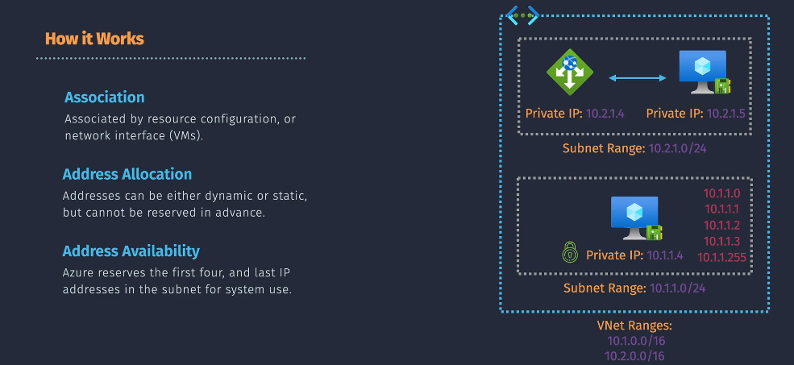
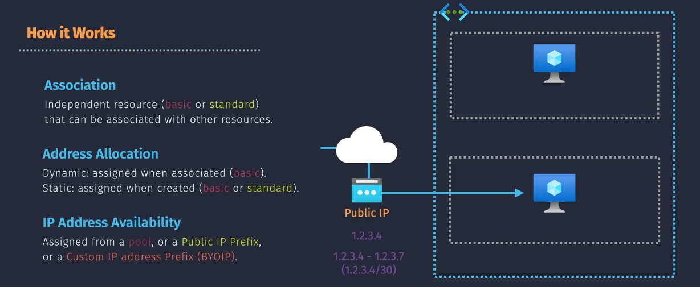
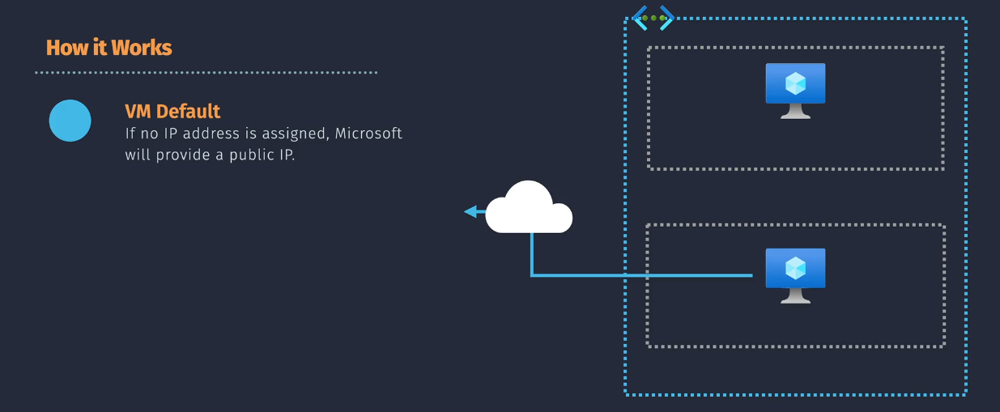
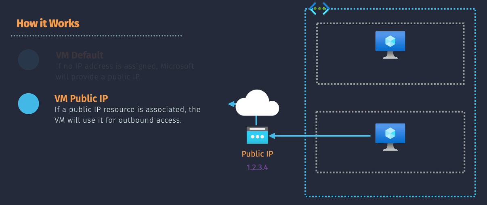
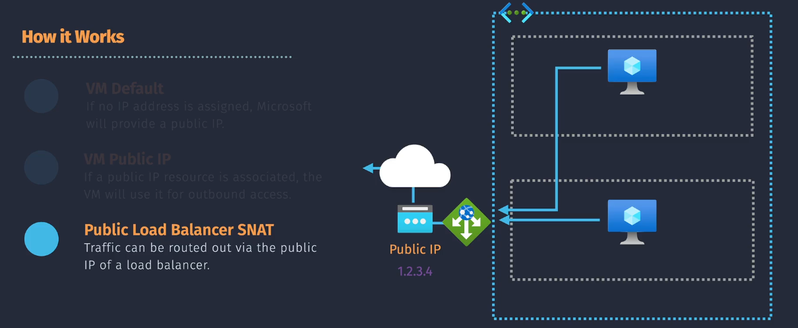
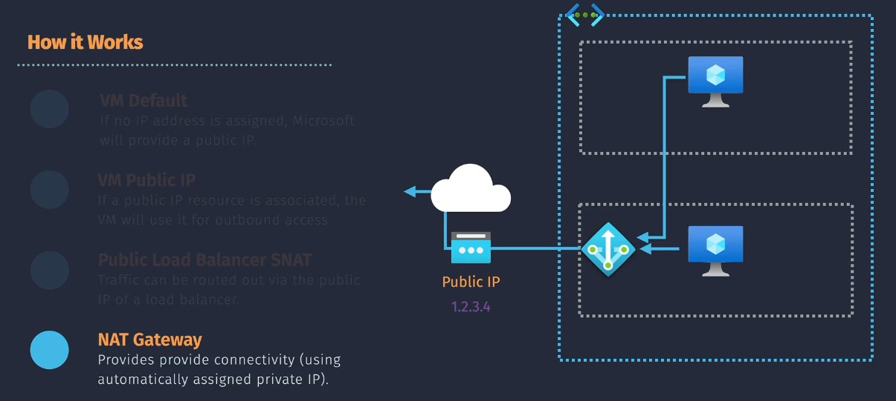

# 🌐 Azure IP Addressing

Azure IP addressing enables secure communication between resources inside a VNet and with the outside world. It’s split into two major categories:

- 🛡️ **Private IP Addressing** – For internal traffic within Azure
- 🌍 **Public IP Addressing** – For reaching or being reached from the internet

Let’s break them down and then go deep into **outbound connectivity options** like NAT Gateway and Load Balancer SNAT.

---

## 🛡️ Private IP Addressing

> A **Private IP address** is used for communication between Azure resources inside a Virtual Network (VNet).  
> It’s non-routable on the public internet.

---

  

---

### 📌 **1. Association**

- **VMs use NICs**: Each Virtual Machine (VM) is assigned one or more private IPs through its **Network Interface (NIC)**.
- Azure **VM** can multiple **NIC**, but **NIC** can attach to **only one** **VM**.
- **PaaS resources & appliances**: Azure services like **Load Balancer**, **Application Gateway**, or **Private Link endpoints** also use private IPs, configured via resource settings.

---

### 📌 **2. Allocation Types**

| Mode        | Behavior                                            | Use Case                     |
| ----------- | --------------------------------------------------- | ---------------------------- |
| **Dynamic** | Automatically assigned from the subnet pool         | Short-lived or stateless VMs |
| **Static**  | Manually assigned and reserved for the NIC/resource | DNS-registered apps, DBs     |

> 🧠 Static = persistent across reboots. Dynamic = released if NIC is deleted.

---

### 📌 **3. Reserved Addresses**

Each Azure subnet reserves 5 IPs:

| Reserved For          | IP in CIDR `/24` Example |
| --------------------- | ------------------------ |
| Network address       | `.0`                     |
| Azure default gateway | `.1`                     |
| Azure DNS (if used)   | `.2`                     |
| Future use            | `.3`                     |
| Broadcast (reserved)  | `.255`                   |

---

## 🌍 Public IP Addressing

> A **Public IP address** enables your Azure resource (VM, Load Balancer, VPN Gateway, etc.) to send/receive traffic to/from the internet.

---

  

---

### 📌 **1. Association**

- Public IPs are **independent Azure resources** and must be:

  - Attached to **NICs**, **Azure Load Balancers**, or **VPN Gateways**

- Types:

  - **Basic**: No zone redundancy, open to all
  - **Standard**: Secure by default, zone-redundant, required for NAT Gateway

---

### 📌 **2. Allocation Types**

| Mode        | Behavior                                          | Use Case                       |
| ----------- | ------------------------------------------------- | ------------------------------ |
| **Dynamic** | Assigned at runtime (IP can change)               | Dev/test or short-lived apps   |
| **Static**  | Reserved during provisioning and remains constant | Production, DNS, IP allowlists |

---

### 📌 **3. Source Pools**

Public IPs can be sourced from:

- **Azure global IP pool**
- **Public IP Prefix** (your reserved block)
- **BYOIP** (Bring Your Own IP range)

---

## 🚀 Outbound Connectivity – Options & Architecture

Outbound connectivity is how Azure resources initiate communication to the internet. Let’s explore the **4 major patterns** in Azure.

---

### 1️⃣ No Public IP (Default Outbound Access)

  

- **When?** A VM has no Public IP, no NAT Gateway, no Load Balancer.
- **How?** Azure assigns a **default ephemeral public IP**.
- **Limitations**:

  - IP is not guaranteed or consistent.
  - No DNS reverse mapping or allowlist compatibility.
  - No control or visibility into traffic.

> ⚠️ Suitable only for short-lived traffic like downloading packages during bootstrapping.

---

### 2️⃣ VM with Public IP

  

- **Public IP attached to the NIC**
- **Outbound + inbound** traffic flows via this IP
- **Static IP strongly recommended** for:

  - External integrations
  - DNS mappings
  - Inbound access (web apps, SSH, RDP)

---

### 3️⃣ Public IP With Load Balancer SNAT

  

- Azure Load Balancer supports **Source NAT (SNAT)**:

  - Translates backend VM’s private IP to the LB’s public IP

- Requires **Outbound Rules** configuration

#### 🔍 Key Concepts:

| Feature             | Description                                             |
| ------------------- | ------------------------------------------------------- |
| **SNAT**            | Maps VM’s private IP + port → LB’s public IP + new port |
| **Port exhaustion** | Too many VMs sharing one IP → run out of ports          |
| **Manual scaling**  | Add outbound rules + extra IPs to scale SNAT pools      |
| **Use case**        | Shared public IP, low-to-medium outbound traffic        |

---

### 4️⃣ NAT Gateway (Recommended)

> A **NAT Gateway** is Azure’s best-practice outbound connectivity method for private subnets.

  

---

| Feature                      | Description                                  |
| ---------------------------- | -------------------------------------------- |
| **Managed service**          | Deployed separately, associated with subnets |
| **Uses Public IP or Prefix** | Can use 1 IP or a /29, /28 block             |
| **Many-to-One SNAT**         | Many VMs → One public IP                     |
| **Consistent outbound IP**   | Good for IP allowlisting                     |
| **High-scale and zonal**     | Zone-redundant and scalable by default       |

> 🧠 Unlike SNAT on Load Balancer, NAT Gateway auto-scales and handles port exhaustion better.

---

## 🥊 SNAT (LB) vs NAT Gateway – Quick Comparison

| Feature       | Load Balancer SNAT                | NAT Gateway                         |
| ------------- | --------------------------------- | ----------------------------------- |
| Resource Type | Part of Public Load Balancer      | Standalone Azure resource           |
| IP Assignment | Uses Load Balancer’s Public IP    | Uses attached Public IP(s)/Prefix   |
| Scalability   | Manual SNAT port scaling          | Auto-scale with port pre-allocation |
| Configuration | Requires outbound rules           | Simpler: just associate to subnet   |
| Use Case      | Load-balanced VMs with basic SNAT | High-scale outbound traffic         |

---

## 🎯 Choosing the Right Outbound Model

| Scenario                      | Recommended Option        |
| ----------------------------- | ------------------------- |
| Short-lived script downloads  | Default outbound access   |
| Public-facing web server      | Public IP (NIC or LB)     |
| App with predictable IP needs | Static Public IP          |
| Scalable microservices        | NAT Gateway               |
| Shared IP for several VMs     | Load Balancer with SNAT   |
| IP allowlist integration      | Static IP via NAT Gateway |

---

## ✅ Summary – Best Practices

| Area           | Recommendation                                      |
| -------------- | --------------------------------------------------- |
| Private IPs    | Use static IPs for databases and DNS-bound services |
| Public IPs     | Use Standard SKU + Static for production workloads  |
| Default Access | Avoid for production; use only for dev/test         |
| NAT Gateway    | Use for scalable, secure, and consistent outbound   |
| SNAT           | Good when combined with Load Balancer scenarios     |

---

## 🧠 Final Thoughts

- Azure IP architecture is **modular**: choose only what you need.
- **Default outbound access is fragile** — don’t rely on it for anything important.
- Use **NAT Gateway** when in doubt — it’s reliable, scalable, and simple.
- Treat **Public IPs as resources**, not properties. You can swap, move, or manage them independently.
