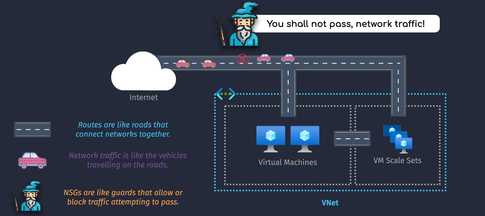

# 🔐 Azure Network Security Group (NSG) – Enhanced Deep Dive

An **Azure Network Security Group (NSG)** is a stateful firewall that filters **inbound and outbound traffic** to and from resources in a Virtual Network (VNet).

Think of it like Azure’s version of **Security Groups in AWS**, but with more flexibility in how and where you apply it (e.g., per subnet and/or per NIC).

---

  

---

## 🧱 Key Capabilities

| Feature                          | Description                                                             |
| -------------------------------- | ----------------------------------------------------------------------- |
| 🔄 **Stateful Rules**            | Inbound and outbound rules automatically track session state            |
| 📦 **Multiple Scope Levels**     | Can attach to **subnets** or **NICs** independently                     |
| 📊 **Priority-Based Evaluation** | Lower number = higher priority; rule processing stops at first match    |
| 🧠 **Augmented Rules**           | Allow grouping of IPs, ports, and protocols using ASGs and service tags |
| 📥 **Explicit Allow/Deny**       | Rules must be explicitly defined — last rule always denies              |

---

## 🧭 NSG Rule Processing Logic

Azure evaluates **inbound and outbound rules** differently depending on the **NSG scope** (subnet or NIC).

| Traffic Direction | Evaluation Order                 |
| ----------------- | -------------------------------- |
| 🔽 **Inbound**    | 1. NSG on Subnet → 2. NSG on NIC |
| 🔼 **Outbound**   | 1. NSG on NIC → 2. NSG on Subnet |

> 🧠 A packet must pass all associated NSGs. If any NSG denies it, it’s dropped.

---

## 📋 Anatomy of a Rule

| Field                | Description                                               |
| -------------------- | --------------------------------------------------------- |
| **Name**             | Rule identifier (must be unique within the NSG)           |
| **Priority**         | Integer 100–4096 (lower = higher priority)                |
| **Direction**        | Inbound or Outbound                                       |
| **Access**           | Allow or Deny                                             |
| **Protocol**         | TCP / UDP / ICMP / \* (any)                               |
| **Source**           | IP/CIDR, Service Tag, or Application Security Group (ASG) |
| **Source Port**      | Usually `*` (wildcard) for ingress                        |
| **Destination**      | Same as source                                            |
| **Destination Port** | Common ports: 22 (SSH), 80, 443, 3389, etc.               |

---

## 🔐 Default NSG Rules

Azure adds three **default rules** for both **inbound** and **outbound** traffic. These have lower priority (higher number), so **your custom rules will override them** if they use a lower number.

  

### ✅ Inbound

| Priority | Name                     | Description                            |
| -------- | ------------------------ | -------------------------------------- |
| 65000    | AllowVnetInbound         | Allow traffic from same VNet           |
| 65001    | AllowAzureLoadBalancerIn | Allow traffic from Azure Load Balancer |
| 65500    | DenyAllInbound           | Deny everything else                   |

### ✅ Outbound

| Priority | Name                  | Description                         |
| -------- | --------------------- | ----------------------------------- |
| 65000    | AllowVnetOutbound     | Allow traffic within the same VNet  |
| 65001    | AllowInternetOutbound | Allow all outbound internet traffic |
| 65500    | DenyAllOutbound       | Deny everything else                |

---

## 🌐 NSG + Public IP Address SKUs

Azure behaves differently based on the **Public IP SKU** associated with the NIC or Load Balancer:

### 🔸 Standard Public IP (Recommended)

| Behavior                         | Description                               |
| -------------------------------- | ----------------------------------------- |
| ✅ Secure by default             | All inbound traffic **denied by default** |
| ⚙️ Requires NSG to allow traffic | Must explicitly define **allow rules**    |
| 🛡️ Production use                | Best for controlled, secure deployments   |

### 🔸 Basic Public IP (Legacy/Dev)

| Behavior                    | Description                                          |
| --------------------------- | ---------------------------------------------------- |
| ❌ Insecure by default      | **All inbound traffic allowed** unless NSG blocks it |
| 🧪 For dev/test only        | Not zone-redundant, no SLA                           |
| 🚫 Not recommended for prod | Use NSG or Azure Firewall to secure                  |

---

## 🔧 NSG Deployment Methods

| Method         | Tools                          | Notes                           |
| -------------- | ------------------------------ | ------------------------------- |
| **Portal**     | Azure Portal GUI               | Click-and-create interface      |
| **CLI**        | `az network nsg ...`           | Azure CLI scripting             |
| **PowerShell** | `New-AzNetworkSecurityGroup`   | Ideal for Windows admins        |
| **ARM/Bicep**  | Infrastructure-as-Code         | Declarative provisioning        |
| **Terraform**  | azurerm_network_security_group | Best for DevOps/CI-CD pipelines |

---

## 🛠️ NSG Use Cases

| Use Case                      | Recommendation                                       |
| ----------------------------- | ---------------------------------------------------- |
| 🔐 Harden public VM           | Attach NSG to NIC + Public IP + allow specific ports |
| 🔁 Isolate backend subnet     | Attach NSG to subnet, allow only internal traffic    |
| 🚪 Front-end web access       | Allow inbound 80/443, deny others                    |
| 📉 Block outbound to internet | Deny outbound `0.0.0.0/0` on subnet NSG              |
| 📡 Allow private PaaS access  | Use Service Tags like `Storage`, `AzureSQL`, etc.    |

---

## 📊 Best Practices

✅ Apply these guidelines to secure your Azure network effectively:

| Practice                              | Why it matters                                        |
| ------------------------------------- | ----------------------------------------------------- |
| 🧩 Use NSGs at both subnet + NIC      | Enables defense-in-depth                              |
| 🔢 Assign clear rule priorities       | Lower numbers override — don’t overlap!               |
| 🧽 Keep NSGs clean                    | Remove unused rules to minimize attack surface        |
| 🛑 Block broad outbound unless needed | Prevent VMs from leaking data to unknown destinations |
| 🔎 Monitor with NSG Flow Logs         | See what traffic is allowed or blocked in real time   |

---

## 🧠 NSG vs Azure Firewall

| Feature             | NSG                                     | Azure Firewall                            |
| ------------------- | --------------------------------------- | ----------------------------------------- |
| Layer               | Network (L3/L4)                         | Application-aware (L3–L7)                 |
| Directional rules   | Yes                                     | Yes                                       |
| DNAT/SNAT           | ❌ No                                   | ✅ Yes (full NAT support)                 |
| Logging             | Minimal (Flow Logs via NSG Diagnostics) | Full logging + analytics in Azure Monitor |
| Centralized control | ❌ No, distributed at subnet/NIC level  | ✅ Yes, deployed in a central subnet      |

> ✅ Use NSGs for **perimeter and micro-segmentation**, Azure Firewall for **deep inspection and egress control**.

---

## ✅ Summary – What to Remember

| Topic                     | Key Takeaway                                          |
| ------------------------- | ----------------------------------------------------- |
| NSG Scope                 | Subnet and/or NIC level                               |
| Rule Evaluation Order     | Inbound: Subnet → NIC Outbound: NIC → Subnet       |
| Default Rule Behavior     | Allow intra-VNet, deny others unless allowed          |
| Public IP SKU Differences | Standard = secure by default, Basic = open by default |
| Best Practice             | Combine NSG + Azure Firewall for layered defense      |
