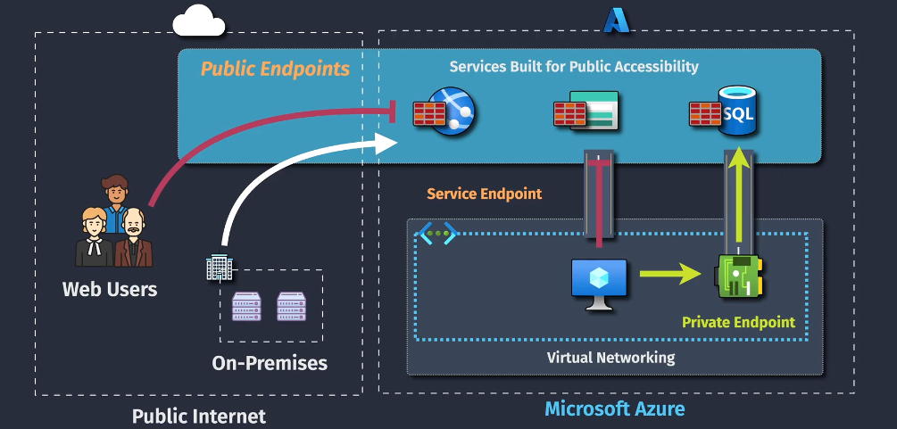
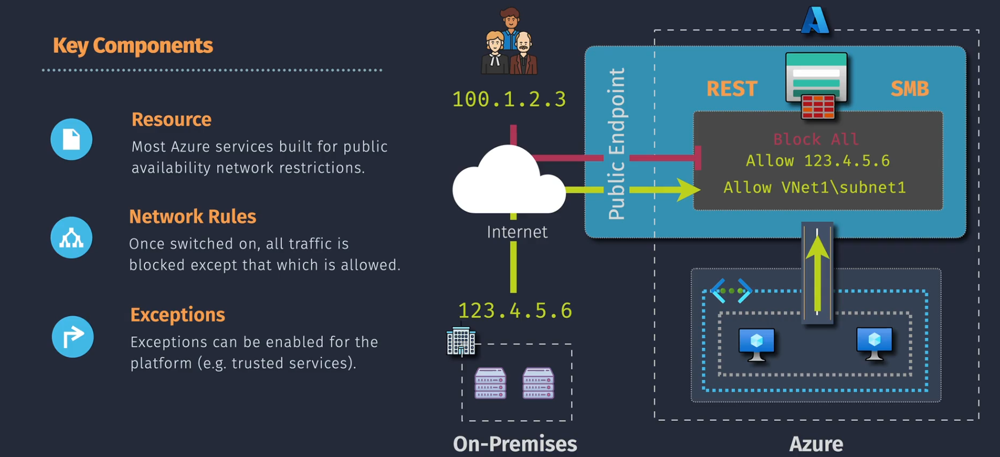
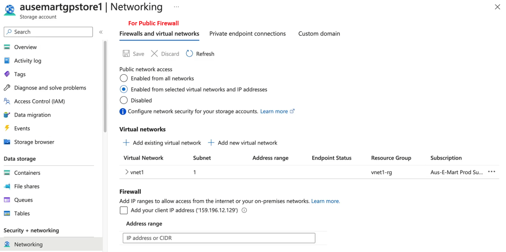

# 🔒 **Azure Resource Firewall**

A **Resource Firewall** in Azure is a security feature applied **at the resource level** (e.g., Storage Account, SQL Database, Key Vault) to restrict access based on **IP ranges** or **virtual network rules**.

> 💡 It **does not inspect traffic content** — it simply decides **who can connect** based on network location. Think of it as a **door lock** at the resource level, while **Azure Firewall** is more like a **security guard with a metal detector** for your whole network.

---

  

---

## 🧩 **Key Components**

1️⃣ **Resource** The Azure service you want to protect:

- Storage Account
- SQL Database
- Key Vault
- Event Hub, etc.

2️⃣ **Network Rules** Rules that allow or deny traffic **based on source IP ranges, subnets, or VNets**.

- Works at **Layer 4 (TCP/UDP)** — no application inspection.
- You can allow specific IPs or subnets.

3️⃣ **Exceptions** Azure services that may need **bypass access**, for example:

- Azure Backup
- Azure Monitor
- Azure Site Recovery
- Azure DevTest Labs
- Azure Event Grid
- Azure Networking
- Azure SQL Data Warehouse

  

---

## ⚙️ **How to Configure a Resource Firewall**

  

### 1️⃣ **Firewalls and Virtual Networks** (Public Access)

In the resource’s **Networking** blade:

- **Public Network Access** Options:

  1. `Enabled from all networks` → **Open** to the public internet.
  2. `Enabled from selected virtual networks and IP addresses` →
     Restrict to specific VNets or IP ranges.
     **Note:** VNets must be linked via **Service Endpoint** or **Private Endpoint**.
  3. `Disabled` → No public network access at all.

- **Example**:
  Allow only `203.0.113.0/24` and a specific VNet for storage account access.

---

### 2️⃣ **Private Endpoint Connections** (Private Access)

If you use a **Private Endpoint**:

- Traffic flows via **private IP** inside your VNet.
- Resource firewall **does not control private endpoint traffic** — use:

  - **Network Security Groups (NSGs)** → Inbound/Outbound rules.
  - **Route Tables** → Direct traffic paths.

> 💡 **Note:** For Private Endpoints, the resource firewall’s IP rules are irrelevant — you control access **via NSG**.

---

## 📌 **Important Notes**

- **Default Behavior**:
  If no firewall rules exist → Resource is publicly accessible (unless private endpoint is enforced).
- **System Routes & Effective Routes** still determine if your VNet can reach the resource.
- Resource firewall is **per-resource**; it’s not shared between resources.
- If you block public access and don’t configure private endpoint → The resource becomes unreachable.

---

## 🥊 **Resource-Level Firewall vs Azure Firewall**

| Feature   | Resource-Level Firewall    | Azure Firewall                                    |
| --------- | -------------------------- | ------------------------------------------------- |
| Scope     | Single resource            | Entire VNet or multiple VNets                     |
| OSI Layer | Layer 4 (TCP/UDP)          | Layers 3–7                                        |
| Filtering | Based on IP ranges / VNets | Stateful inspection, app rules, NAT, threat intel |
| Logs      | Resource diagnostics       | Centralized Azure Monitor logs                    |
| Example   | Storage Account firewall   | Hub-Spoke network firewall                        |

---

💡 **AWS Comparison**

- **Azure Resource Firewall** ≈ **S3 Bucket Policy IP Restrictions** or **RDS Security Group**
- **Azure Firewall** ≈ **AWS Network Firewall / NAT Gateway with rules**

---

## 🔍 **Real-World Example**

**Scenario:**
You have a **Storage Account** used only by:

- An App Service in `VNet-App1`
- Admin IP range `198.51.100.0/24`

**Configuration:**

1. In Storage Account → **Networking**:

   - Public Network Access → `Selected networks`
   - Add:

     - `VNet-App1` (via service endpoint)
     - IP range `198.51.100.0/24`

2. Disable “Allow Azure services on the trusted services list” unless needed.

**Result:**

- Access is denied from any other IP or VNet.
- Attempting from a random VM on the internet → `403 Forbidden`.
