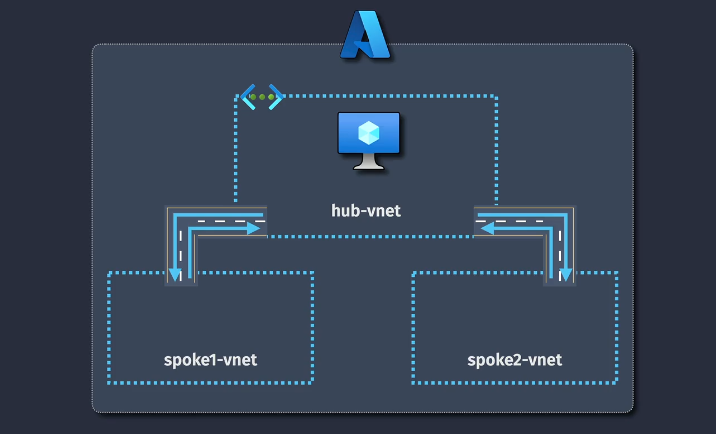
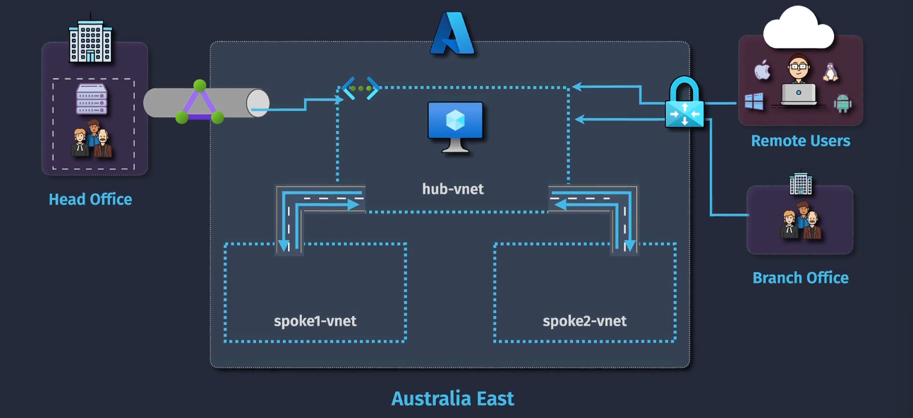
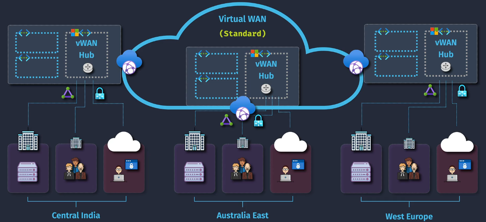
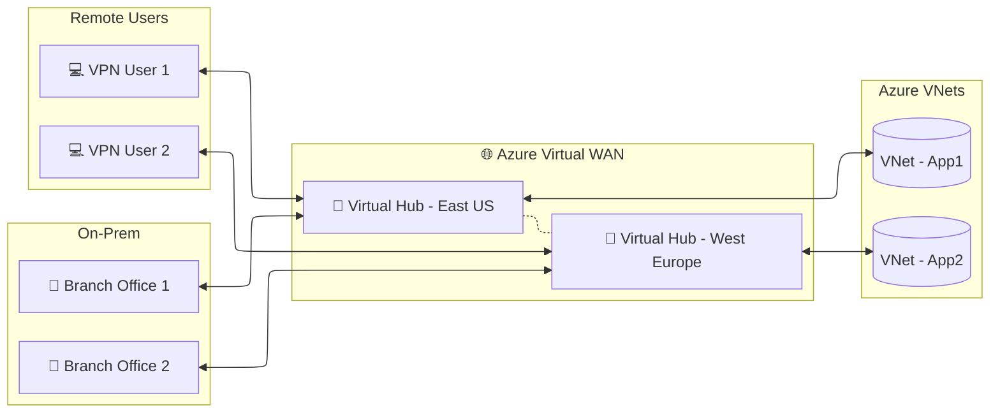

# 🌐 **Azure Virtual WAN** — Global Networking in Azure

> 📖 **Official Definition**  
> **Azure Virtual WAN** is a **Microsoft-managed global network service** that lets you connect and secure your **branch offices, VNets, remote users, and other clouds** through a **single, unified hub-and-spoke architecture**.

---

  

---

  

---

## 🧩 **Core Concepts**

### 1️⃣ **Virtual WAN Resource**

- The **global container** that holds all your WAN hubs, connections, and security settings.
- **Scope**: **Global** (you can connect VNets from different Azure regions under one WAN).

---

### 2️⃣ **Virtual Hub**

- A **Microsoft-managed hub** `in a specific region`.
- Acts as:

  - **Router** between connected VNets.
  - **Gateway** for site-to-site (VPN/IPSec) or ExpressRoute connections.
  - **Point of presence** for remote user VPN.

💡 You can have **multiple hubs** in different Azure regions for performance and redundancy.

---

### 3️⃣ **Connections**

- **VNet connections** → Connect VNets to the hub (spoke).
- **Site-to-Site VPN** → Connect on-premises sites to the hub.
- **ExpressRoute** → Private dedicated circuit to the hub.
- **Point-to-Site VPN** → Remote user connectivity.

---

### 4️⃣ **Routing**

- Uses **hub routing tables** to control traffic flow between VNets, sites, and users.
- Supports **custom routing** (similar to AWS TGW route tables).

---

### 5️⃣ **Security Integration**

- Built-in **Azure Firewall** or **third-party security appliances** in the hub.
- Supports **traffic inspection, logging, and policy enforcement**.

---

  

---

## 💡 **Example Use Case** — Global Enterprise

**Scenario:**

- HQ in New York (Site-to-Site VPN → Hub in East US)
- Branch in Paris (ExpressRoute → Hub in West Europe)
- App1 VNet in East US
- App2 VNet in West Europe
- Remote workers connecting from various countries (Point-to-Site VPN)

**Result with Virtual WAN:**

- All sites, VNets, and users connect through the **Microsoft global backbone**.
- Traffic between Paris and New York does **not** go over the public internet.
- Single pane of glass to manage routing, security, and monitoring.

---

## 🔍 **Virtual WAN vs Traditional VNet Peering**

| Feature         | Virtual WAN                    | VNet Peering         |
| --------------- | ------------------------------ | -------------------- |
| Scope           | Global, cross-region           | Same or cross-region |
| Management      | Centralized hub                | Peer-to-peer setup   |
| Connectivity    | VNets, Sites, Remote Users, ER | VNets only           |
| Routing Control | Routing tables in hubs         | Manual routes        |
| Security        | Integrated Azure Firewall      | No built-in security |

💡 AWS Equivalent: Closest is **AWS Transit Gateway** with **Global Accelerator** + managed VPN, but Azure VWAN bundles more services natively.

---

## ✍🏻 **Step-by-Step Example**: Connecting VNets + Site-to-Site VPN in Virtual WAN

1️⃣ **Create Virtual WAN**

- Azure Portal → Search `Virtual WAN` → `+ Create`.
- Resource Group: `RG-WAN`
- Name: `corp-vwan`
- Region: `East US` (primary management location)

2️⃣ **Create Virtual Hub**

- Inside VWAN → `+ Create hub`.
- Name: `us-east-hub`
- Region: `East US`
- Add Azure Firewall (optional).

3️⃣ **Connect VNet**

- From the hub → `+ Add connection`
- Select `VNet-App1` → Associate with hub routing table.

4️⃣ **Add Site-to-Site VPN**

- Configure VPN gateway in the hub.
- Enter on-prem public IP, pre-shared key, and local network ranges.

5️⃣ **Test Routing**

- Use `Effective routes` in VM NIC to verify cross-site connectivity.

---

## ✅ **Security Best Practices**

- Always use **Azure Firewall** in the hub for inspection & logging.
- Use **custom hub route tables** to isolate sensitive VNets.
- Enable **Azure Monitor** logging for diagnostics.

Great question, Hady. The Azure service that most closely mirrors **AWS Transit Gateway**—especially for hub-and-spoke architectures across multiple VNets—is **Azure Virtual WAN**.

---

### 🌐 Azure Virtual WAN: The Transit Gateway Equivalent

**Azure Virtual WAN** is a **managed networking service** that provides centralized connectivity across:

- Multiple VNets
- Branch offices
- Remote users
- On-premises networks

---

## 🌨️ **AWS Similarity**

| Feature                    | Azure Virtual WAN                      | AWS Transit Gateway      |
| -------------------------- | -------------------------------------- | ------------------------ |
| Centralized routing        | ✅ Yes                                 | ✅ Yes                   |
| VNet/VPC connectivity      | ✅ Multiple VNets via hub              | ✅ Multiple VPCs via TGW |
| VPN & ExpressRoute support | ✅ Integrated                          | ✅ Integrated            |
| SD-WAN integration         | ✅ With partners like Cisco, Barracuda | ✅ With SD-WAN partners  |
| Global reach               | ✅ Across Azure regions                | ✅ Across AWS regions    |
| Policy-based routing       | ✅ With routing intent                 | ✅ With route tables     |

---

## 🧠 **When to Use Azure Virtual WAN**

- You’re managing **multiple VNets across regions**
- You want **centralized routing and security policies**
- You need to integrate **VPN, ExpressRoute, and remote user access**
- You’re building a **hub-and-spoke topology** at scale
