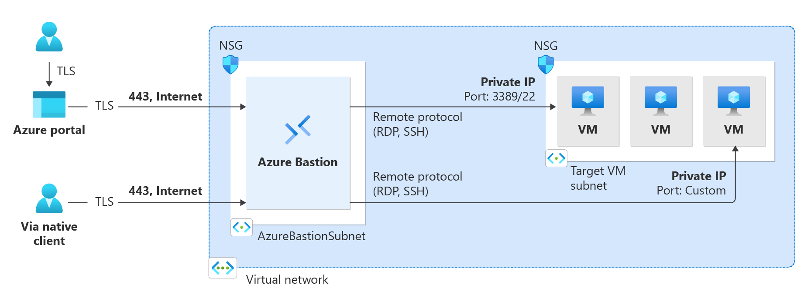

# 👩🏻‍⚖️ Azure Bastion — Secure VM Access Without Public IP

## 📌 1. Official Definition

> **Azure Bastion** is a fully managed PaaS service that allows you to securely connect to your Azure VMs **via RDP or SSH over TLS (HTTPS)** directly in your browser **without needing a public IP** on the VM.

---

<div align="center">
  
</div>

## 🔄 2. AWS Perspective

| Azure Concept   | AWS Equivalent                      | Key Difference                                           |
| --------------- | ----------------------------------- | -------------------------------------------------------- |
| Azure Bastion   | AWS Systems Manager Session Manager | Bastion supports full RDP/SSH GUI over browser           |
| Jump Server VM  | EC2 Bastion Host                    | Azure Bastion is managed, no OS maintenance              |
| Private IP Only | SSM Port Forwarding                 | Bastion is browser-based, no agent installation required |

---

## 🛠 3. Why Use Azure Bastion?

- 🚫 **No Public IP** needed on VM
- 🔒 **No inbound ports (3389/22)** exposed to the internet
- 🌐 **Browser-based RDP/SSH** from Azure Portal
- 📈 Scales automatically (PaaS)
- 🔄 Works with **Windows** and **Linux** VMs

---

## ⚙ 4. How It Works


- **Bastion is deployed into your VNet** in a dedicated subnet called `AzureBastionSubnet`
- You connect via **Azure Portal** using your browser
- Bastion uses **private IPs** to connect to the VM inside the VNet
- All traffic is encrypted over **TLS 443**

---

## 🚀 5. Deployment Steps

1. **Create Bastion Host**

   - In Azure Portal → **Create a resource** → **Bastion**
   - Choose the same **VNet** where your VMs reside
   - Create subnet named **`AzureBastionSubnet`** (must be /26 or larger)
   - Assign a **public IP** to the Bastion (this IP is for the Bastion service, not the VM)

2. **Connect to VM**

   - Go to **VM → Connect → Bastion**
   - Enter credentials (or SSH key for Linux)
   - Browser opens RDP/SSH session — no local RDP/SSH client needed

---

## 📌 6. Example — Windows VM Access Without Public IP

### Before:

- VM has **public IP**
- NSG allows inbound TCP 3389
- Risk: Exposed to internet

### After (Bastion):

- Remove VM public IP
- Deploy Bastion in same VNet
- Use **Azure Portal → Connect via Bastion**
- In-browser RDP, secure and private

---

## 📌 7. Example — Linux VM SSH Without Public IP

```bash
# Without Bastion:
ssh azureuser@52.160.x.x   # Public IP required

# With Bastion (Browser-based):
# Azure Portal → Connect → Bastion → Choose SSH → Paste private key
# Secure SSH in browser, no direct internet exposure
```

---

Got it ✅ — here’s the **Azure Bastion SKU tiers** section rewritten in your preferred enhanced style so it’s AZ-104 friendly, with explanations, table, and visuals context.

---

## 🏷 Azure Bastion SKU Tiers — Feature Breakdown

Azure Bastion comes in **three SKUs**: **Basic**, **Standard**, and **Premium**.  
Each tier builds on the previous one, adding more enterprise-grade capabilities.

---

### 1️⃣ **Old / Preview Naming**

- **Developer SKU** — used during early preview for testing, cheap and limited. Not available anymore for general use.
- **Basic SKU** — initial GA (General Availability) SKU.
- **Standard SKU** — came later, added enterprise features.

---

### 2️⃣ **Current Naming (2025)**

Microsoft now lists **three active SKUs**:

| Current SKU  | Origin                      | Notes                                                                        |
| ------------ | --------------------------- | ---------------------------------------------------------------------------- |
| **Basic**    | Came from original GA tier  | Minimal feature set, still available                                         |
| **Standard** | Evolved from enhanced Basic | Adds scaling, file transfer, custom ports                                    |
| **Premium**  | Introduced later            | Adds compliance/security features like session recording & private-only mode |

The **Developer SKU** only exists in **lab/sandbox subscription offers** for training/demo.
In production, you only choose between **Basic, Standard, and Premium**.

---

### 📊 1. SKU Feature Comparison

| Feature                               | Basic | Standard | Premium |
| ------------------------------------- | ----- | -------- | ------- |
| Connect to target VMs in same VNet    | ✅    | ✅       | ✅      |
| Connect to target VMs in peered VNets | ✅    | ✅       | ✅      |
| Concurrent connections                | ✅    | ✅       | ✅      |
| Access Linux VM Private Keys in AKV   | ✅    | ✅       | ✅      |
| Connect to Linux via SSH              | ✅    | ✅       | ✅      |
| Connect to Windows via RDP            | ✅    | ✅       | ✅      |
| Connect to Linux via RDP              | ❌    | ✅       | ✅      |
| Connect to Windows via SSH            | ❌    | ✅       | ✅      |
| Custom inbound port                   | ❌    | ✅       | ✅      |
| Azure CLI connection                  | ❌    | ✅       | ✅      |
| Host scaling                          | ❌    | ✅       | ✅      |
| File upload/download                  | ❌    | ✅       | ✅      |
| Kerberos authentication               | ✅    | ✅       | ✅      |
| Shareable link                        | ❌    | ✅       | ✅      |
| Connect via IP address                | ❌    | ✅       | ✅      |
| VM audio output                       | ✅    | ✅       | ✅      |
| Disable copy/paste (web)              | ❌    | ✅       | ✅      |
| Session recording                     | ❌    | ❌       | ✅      |
| Private-only deployment               | ❌    | ❌       | ✅      |

---

### 🛠 2. SKU Use-Case Guidance

#### **Basic SKU** — Minimal Secure Access

- Good for **small dev/test** environments
- Only supports core RDP/SSH into VMs
- No advanced session control or file transfer

#### **Standard SKU** — Enterprise Operations

- Adds **custom ports**, **CLI support**, and **file upload/download**
- Great for **production** and **multi-VNet** environments
- **Shareable link** feature is useful for temporary vendor access

#### **Premium SKU** — High-Security & Compliance

- Adds **session recording** for audit
- Supports **private-only** deployments (no public IP on Bastion)
- Best for **finance, government, compliance-driven** workloads

---

### 🔍 3. Key Feature Highlights

#### 📌 Private-only Deployment (Premium)

- Deploys Bastion without a public IP
- Connect only from **private endpoints** (e.g., ExpressRoute, VPN)

#### 📌 Session Recording (Premium)

- Captures entire RDP/SSH session for compliance review
- Stored securely for auditing

#### 📌 File Upload/Download (Standard+)

- Transfer files to/from VM directly in the Bastion session
- No need for FTP, SCP, or public file sharing

---

### 1. Bastion Developer (Deprecated)

<div align="center">
  
</div>

### 2. Basic SKU and higher

<div align="center">
  
</div>

### 3. Private-only deployment

<div align="center">
  
</div>

---

## 🔐 8. Security Benefits

- Removes need for inbound **3389** or **22** in NSG
- Protects against brute-force and scanning attacks
- Integrates with **Azure AD authentication**
- Optionally use **Just-In-Time VM Access** for extra security
- Managed service — no OS patching like a traditional jump server

---

## 📏 9. Best Practices

- ✅ Always **disable public IP** on VMs when using Bastion
- ✅ Deploy Bastion **per VNet** for isolation
- ✅ Combine with **NSGs** to restrict traffic
- ✅ Use **Azure AD-based authentication** when possible
- ✅ Monitor Bastion usage in **Azure Monitor / Logs**

---

## 🧠 10. AZ-104 Exam Notes

- **Subnet name must be `AzureBastionSubnet`**
- Must be /26 or larger subnet
- Bastion supports **Windows (RDP)** and **Linux (SSH)**
- Connects via **browser in Azure Portal**
- VM **does not need a public IP**
- Uses port **443** for management traffic
- **Basic SKU** covers most AZ-104 scenarios
- Know that **Premium SKU** is the only tier with **private-only deployment** & **session recording**
- **Standard SKU** is most common in enterprise production
- The **AzureBastionSubnet** name requirement applies to **all SKUs**

---

## 🆚 11. Bastion vs Windows Admin Center vs RDP

| Feature             | Bastion              | WAC            | RDP             |
| ------------------- | -------------------- | -------------- | --------------- |
| Protocol            | RDP/SSH over TLS 443 | HTTPS          | RDP TCP 3389    |
| OS Support          | Win & Linux          | Windows only   | Windows only    |
| No Public IP Needed | ✅                   | ✅             | ❌              |
| Full Desktop Access | ✅                   | ❌             | ✅              |
| Management Scope    | Full OS session      | OS admin tools | Full OS session |

---

> 💡 **AWS Hook**: Think of Azure Bastion as **AWS SSM Session Manager + EC2 Instance Connect + Managed Jump Host**, but with full RDP and SSH desktop sessions inside your browser — no agent required.
