# 🚄 Azure ExpressRoute — Your Private Highway to Azure

> 📖 _Azure ExpressRoute lets you extend your on-premises networks into Microsoft cloud over a private connection facilitated by a connectivity provider. The connection does not go over the public internet, offering more reliability, faster speeds, and consistent latencies._

Azure ExpressRoute provides a **dedicated, private connection** between your on-premises network and Azure, bypassing the public internet entirely.
Think of it as **Azure’s version of AWS Direct Connect**, but with Azure-specific flavors like **Private Peering** and **Microsoft Peering**.

---

  

---

## 🧩 2. Core Components

  

| Component                 | Description                                                                     |
| ------------------------- | ------------------------------------------------------------------------------- |
| **On-Premises Network**   | Your corporate LAN or data center infrastructure.                               |
| **Connectivity Provider** | The ISP/Telco (e.g., Equinix, AT\&T, BT) providing the fiber link to Azure.     |
| **ExpressRoute Circuit**  | The logical private connection to Azure (provisioned in Azure Portal).          |
| **ExpressRoute Gateway**  | A special Azure VNet Gateway SKU for ExpressRoute private peering.              |
| **BGP Peering**           | Used to exchange routes between your network and Azure.                         |
| **Peering Types**         | Private Peering (VNets), Microsoft Peering (SaaS), Public Peering (deprecated). |

---

## 🛠️ 3. How It Works

```mermaid
flowchart LR
    DC[🏢 On-Prem Data Center] -- Private Fiber --> POP[🌐 Provider POP]
    POP -- ExpressRoute Circuit --> GW[🔌 ExpressRoute Gateway in Azure]
    GW --- VNET1[(VNet 1)]
    GW --- VNET2[(VNet 2)]
```

- **Provider POP** = Your entry point to Microsoft’s network.
- **ExpressRoute Circuit** = Your reserved “lane” inside Azure’s backbone.
- **BGP** = Handles route advertisement both ways.

---

## 🔄 4. Peering Types

| Peering               | Purpose                                                     | AWS Equivalent               | Example                                            |
| --------------------- | ----------------------------------------------------------- | ---------------------------- | -------------------------------------------------- |
| **Private Peering**   | Connect directly to Azure VNets (IaaS).                     | Direct Connect + Private VIF | Access Azure SQL VM in your private subnet.        |
| **Microsoft Peering** | Connect privately to Microsoft SaaS (Office 365, Dynamics). | Direct Connect + Public VIF  | Access O365 without hitting public internet.       |
| **Public Peering**    | (Deprecated) Access Azure public services privately.        | Old Public VIF               | Replaced by Private Endpoints + Microsoft Peering. |

---

## 📊 5. ExpressRoute vs VPN Gateway

| Feature        | ExpressRoute                   | VPN Gateway (S2S) |
| -------------- | ------------------------------ | ----------------- |
| Path           | Private Fiber                  | Internet (IPsec)  |
| Latency        | Predictable                    | Variable          |
| Bandwidth      | 50 Mbps – 10 Gbps              | Up to \~10 Gbps   |
| Encryption     | Not by default (can add IPsec) | Always IPsec      |
| AWS Equivalent | Direct Connect                 | Site-to-Site VPN  |

---

## 🏗️ 6. Step-by-Step Example — Private Peering with Storage

1. **Order the Circuit**

   - In Azure Portal → **ExpressRoute → Create** → Choose bandwidth (e.g., 1 Gbps) and provider (e.g., Equinix).

2. **Get Service Key**

   - Azure generates a **Service Key** — share it with your provider.

3. **Provider Activates Circuit**

   - Provider connects your data center to Azure’s edge.

4. **Configure Private Peering**

   - Set ASN, peer IPs, and enable BGP.

5. **Link to VNet**

   - Create **ExpressRoute Gateway** in the target VNet → Link to the circuit.

---

## 🚨 7. Common Pitfalls

| Problem                       | Cause                                          | Fix                                              |
| ----------------------------- | ---------------------------------------------- | ------------------------------------------------ |
| Still hitting public internet | Using public service without Microsoft Peering | Enable Microsoft Peering or use Private Endpoint |
| High latency                  | Provider POP far away                          | Choose provider with closer POP                  |
| Route conflicts with VPN      | Overlapping address spaces                     | Use distinct address ranges                      |

---

## 🛡️ 8. Security Best Practices

- Use **dual ExpressRoute circuits** in **different POPs** for HA.
- If compliance requires, run **IPsec over ExpressRoute**.
- Combine with **Azure Firewall** + **NSGs** for granular filtering.

---

## 🌎 9. Real-World Scenario

- **London HQ** connects to **Azure UK South** using **1 Gbps ExpressRoute Private Peering**.
- **Microsoft Peering** enabled for Office 365 private traffic.
- A **VPN Gateway** acts as failover in case ExpressRoute goes down (active-standby).

---

  

---
