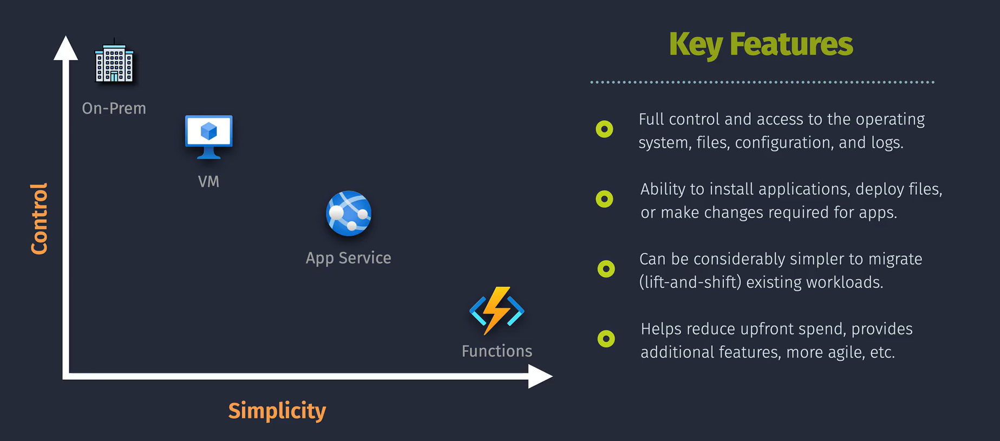
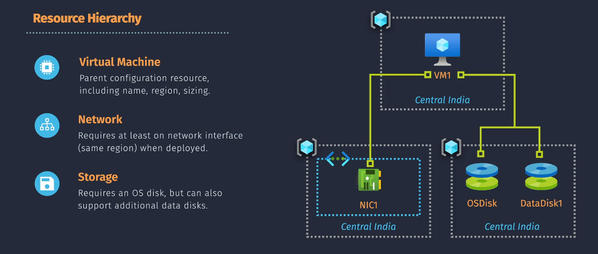

# ☁️ Azure Virtual Machine (VM) & Associated Resources

In Azure, a **Virtual Machine (VM)** is the core **IaaS compute unit**, just like **EC2** in AWS. But when you deploy an Azure VM, you don’t just get a VM — you get an ecosystem of **associated resources** that work together to run your workload.

Let’s break it down piece by piece. 🧩

---

<div align="center">
  
</div>

---

## 🏗️ What Gets Created When You Deploy an Azure VM?

When you launch a VM from the Azure Portal or CLI, you typically create:

| Resource Type         | Azure Component                     | AWS Equivalent              |
| --------------------- | ----------------------------------- | --------------------------- |
| **Compute**           | Virtual Machine                     | EC2 Instance                |
| **Disk (OS + Data)**  | Managed Disk                        | EBS Volume                  |
| **Networking**        | Network Interface (NIC)             | Elastic Network Interface   |
| **Security**          | Network Security Group (NSG)        | Security Group              |
| **IP Address**        | Public IP / Private IP              | Elastic IP / Private IP     |
| **Network Placement** | Virtual Network (VNet) + Subnet     | VPC + Subnet                |
| **Identity**          | System-assigned / User-assigned MSI | IAM Role / Instance Profile |
| **Availability**      | Availability Zone / Set             | AZ / Placement Group        |
| **Monitoring**        | Diagnostic Settings + Insights      | CloudWatch + CloudTrail     |

---

<div align="center">
  
</div>

📌Core Components:

1. **VNet**: A Virtual Network (VNet) must be in the same region as the VM to enable network connectivity.
1. **NIC**: A VM requires at least one Network Interface Card (NIC), which also needs to be in the same region as the VM.
1. **Storage**: VMs require an OS disk and can support additional data disks. All disks must be in the same region as the VM.

---

## 🧬 Components

### 💻 1. **Virtual Machine (VM)**

- The compute resource that runs your OS and applications.
- Supports **Windows and Linux images**, including custom and marketplace options.
- Deployed via **Azure Resource Manager (ARM)** templates, CLI, Bicep, or Portal.

> 📦 Uses **Azure VM images** similar to AWS AMIs.

---

### 💾 2. **Disks (Managed Disks)**

| Disk Type    | Role               | Notes                                            |
| ------------ | ------------------ | ------------------------------------------------ |
| OS Disk      | Boot volume        | Required; e.g., `/dev/sda` or `C:`               |
| Data Disk(s) | Additional storage | Optional; attach 0–64 depending on VM size       |
| Temp Disk    | Ephemeral cache    | Non-persistent; `/mnt` on Linux, `D:` on Windows |

> 💡 Azure handles all disk provisioning automatically (no need for manual storage accounts like early Azure days).

---

### 🌐 3. **Network Interface (NIC)**

- Attaches the VM to a **subnet** within a **Virtual Network (VNet)**.
- Can have **multiple NICs** (based on VM size).
- Each NIC gets:

  - **Private IP** (always)
  - **Optional Public IP**
  - **Attached NSG** for traffic control

> 📍 Just like ENI in AWS.

---

### 🌐 4. **Public & Private IP Addresses**

| Type       | Behavior                                           |
| ---------- | -------------------------------------------------- |
| Private IP | Always assigned from subnet range                  |
| Public IP  | Optional; assigned via dynamic/static Standard SKU |

> ⚠️ Use **NAT Gateway** or Load Balancer if scaling public access for multiple VMs.

---

### 🔐 5. **Network Security Group (NSG)**

- A stateful firewall at **NIC** or **subnet** level.
- Controls **inbound and outbound** traffic using rules (like AWS Security Groups).
- Supports:

  - IP ranges
  - Ports
  - Protocols
  - **Service Tags** and **Application Security Groups (ASG)**

---

### 🏘️ 6. **Virtual Network (VNet) & Subnets**

- VNets are **Azure’s private network boundary**, like AWS VPC.
- Subnets allow **segmentation** and define **IP address scope** for NICs.

> 🧠 All VM traffic flows through the VNet → Subnet → NIC.

---

### 🆔 7. **Managed Identity (Optional)**

- Attach a **System-assigned** or **User-assigned** identity to a VM.
- Use this identity to securely call Azure services (e.g., Azure Key Vault, Blob Storage).

> Equivalent to AWS **IAM Roles for EC2**.

---

### 🧯 8. **Availability Options**

| Option                 | Description                                          | Similar to AWS             |
| ---------------------- | ---------------------------------------------------- | -------------------------- |
| **Availability Zones** | Deploy VMs across physically separated zones         | EC2 in multiple AZs        |
| **Availability Sets**  | Anti-affinity at rack level (fault + update domains) | Placement Groups (sort of) |
| **VM Scale Sets**      | Auto-scaling groups of VMs with load balancing       | Auto Scaling Groups        |

---

### 📈 9. **Monitoring & Diagnostics**

- **Boot diagnostics**: See screenshots during startup.
- **Guest diagnostics**: Monitor CPU, memory, disk I/O, etc.
- **Azure Monitor + Log Analytics**: Track performance, alerts, and security logs.
- **Azure VM Insights**: Built-in metrics + charts.

> Similar to CloudWatch + CloudTrail + EC2 Status Checks.

---

## 🧪 VM Creation Example (CLI)

```bash
az vm create \
  --name myvm \
  --resource-group myrg \
  --image UbuntuLTS \
  --vnet-name myvnet \
  --subnet mysubnet \
  --admin-username azureuser \
  --generate-ssh-keys
```

This command automatically provisions:

- NIC with private IP
- Public IP (unless disabled)
- OS Disk (Managed)
- Network Security Group
- Monitoring extensions (if enabled)

---

## ✅ Summary: What You Should Remember

| Area          | Key Insight                                             |
| ------------- | ------------------------------------------------------- |
| VM            | Core compute; Linux or Windows                          |
| Disks         | Managed Disks (OS + Data), with Ultra and Premium tiers |
| NIC           | Required; gets private IP; may get public IP            |
| VNet/Subnet   | Like AWS VPC/Subnet; defines IP space                   |
| NSG           | Stateful rules at subnet or NIC level                   |
| Public IP SKU | Use Standard SKU; secure by default                     |
| Identity      | Use Managed Identity for secure access to services      |
| HA/DR Options | Use Zones or Availability Sets or Scale Sets            |
| Monitoring    | Enable Azure Monitor, Log Analytics, and VM Insights    |
