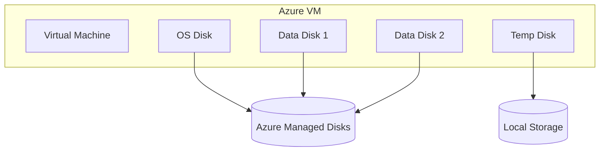

# 💾 Azure VM Storage

Azure VM Storage is the **backbone of your virtual machine’s data** — where your OS lives, your app data resides, and your temp files do their job. It’s similar to **Amazon EC2 + EBS**, but Azure adds some unique flavors to disk types, scaling, and performance tiers.

Let’s break it all down in your favorite way:

> 💡 Disks are stored behind the scenes in **azure blob Storage** AS **Page blobs**.

---

## 🧱 Azure VM Disk Types

Every Azure VM is backed by **Azure Managed Disks**, which come in different flavors depending on purpose and performance.

  

---

### 1️⃣ OS Disk

| Property           | Description                                               |
| ------------------ | --------------------------------------------------------- |
| 📦 Purpose         | Holds the **Operating System** (Windows/Linux)            |
| 📌 Type            | Always a **Managed Disk**                                 |
| 💾 Mount Path      | Usually `C:\` (Windows) or `/dev/sda1` (Linux)            |
| 🔄 Snapshot/Backup | Snapshots are supported, integrated with **Azure Backup** |
| 📈 Resize          | Yes, requires **deallocation** (stop VM first)            |
| ➕ Attach/Detach   | OS Disk is **non-removable** (unlike data disks)          |

> 🧠 **AWS Equivalent**: This is like your EC2 instance's root EBS volume.

---

### 2️⃣ Data Disks

| Property      | Description                                                         |
| ------------- | ------------------------------------------------------------------- |
| 📦 Purpose    | Store app data, logs, files, DBs, etc.                              |
| 🔗 Attachment | Attach/detach **dynamically** (live attach supported)               |
| 🔄 Resize     | Supported **without reboot** (depending on VM SKU)                  |
| 💾 Mount Path | Windows: `F:\`, `G:\`, etc.  Linux: `/dev/sdc`, `/dev/sdd`, etc. |
| 📈 Scaling    | Up to **32 disks per VM** (depends on VM size)                      |

> 🧠 **AWS Equivalent**: Just like **EBS volumes** attached to EC2 — persistent, resizable block storage.

---

### 3️⃣ Temporary Disk (Local Ephemeral)

| Property        | Description                                                                   |
| --------------- | ----------------------------------------------------------------------------- |
| 📦 Purpose      | **Scratch disk** for temporary operations: pagefile, swap, caching, temp data |
| 🔁 Volatile     | **Data is lost** on stop/deallocate or host reboot                            |
| 💨 High IOPS    | Great for **fast, non-critical** read/write operations                        |
| 📍 Path         | `D:\` (Windows) or `/dev/sdb1` (Linux) – **auto-mounted**                     |
| 📉 Availability | Not available on all VMs (e.g., ephemeral OS VMs don’t include it)            |

> 🧠 **AWS Equivalent**: Like **instance store volumes**, but **not user-configurable** in Azure.

---

## 🌀 Azure VM Disk Performance Tiers

You can choose your disk **performance level** based on cost, IOPS, and throughput needs — just like in AWS (gp2, io1, sc1).

### 🔹 Standard HDD

| Feature     | Value                     |
| ----------- | ------------------------- |
| 💰 Cost     | Cheapest                  |
| ⚡ IOPS     | Lowest                    |
| ⏱️ Latency  | Highest                   |
| 🧩 Use Case | Dev/Test, Backup, Archive |

---

### 🔸 Standard SSD

| Feature     | Value                       |
| ----------- | --------------------------- |
| 💰 Cost     | Moderate                    |
| ⚡ IOPS     | Better than HDD, consistent |
| ⏱️ Latency  | Lower than HDD              |
| 🧩 Use Case | Web servers, light DBs, VDI |

---

### 🔶 Premium SSD

| Feature     | Value                                   |
| ----------- | --------------------------------------- |
| 💰 Cost     | High                                    |
| ⚡ IOPS     | Up to 20,000+ per disk                  |
| ⏱️ Latency  | Very low (<1 ms read latency typical)   |
| 🧩 Use Case | SQL Server, SAP HANA, high-IO workloads |

---

### 💡 Newer Disk Types (Bonus)

| Tier               | Use Case                                         |
| ------------------ | ------------------------------------------------ |
| **Premium SSD v2** | Ultra-fast block storage, dynamic perf config    |
| **Ultra Disk**     | DBs with extreme IOPS/latency needs (up to 160K) |

> 🧠 **AWS Equivalents**:
>
> - Standard HDD → `sc1`
> - Standard SSD → `gp2`
> - Premium SSD → `io1`/`gp3`
> - Ultra Disk → No direct AWS equivalent

---

## 🗂️ Azure Disk Comparison Summary

| Feature        | Standard HDD  | Standard SSD | Premium SSD | Ultra Disk   |
| -------------- | ------------- | ------------ | ----------- | ------------ |
| 💰 Cost        | Lowest        | Low–Mid      | High        | Very High    |
| ⚡ IOPS        | Low           | Medium       | High        | Very High    |
| 📶 Throughput  | Low           | Medium       | High        | Very High    |
| ⏱️ Latency     | High          | Medium       | Low         | Ultra Low    |
| 🔄 Resize Live | ❌ No         | ✅ Yes       | ✅ Yes      | ✅ Yes       |
| 🧩 Use Cases   | Archive, Test | Web, Dev     | DBs, SAP    | Critical DBs |

---

## 🔗 Storage Architecture Behind the Scenes

Each disk is a **separate Azure Resource**:

> 📌 Managed Disks are encrypted by default, replicated in Azure Storage, and support backup & snapshots.

---

## 🛡️ Backup and Recovery Options

| Feature                       | Support                                      |
| ----------------------------- | -------------------------------------------- |
| **Azure Backup**              | Yes – with full VM recovery support          |
| **Snapshot**                  | Yes – point-in-time for OS or data disks     |
| **Azure Site Recovery (ASR)** | Yes – disaster recovery across regions       |
| **Disk Encryption**           | Yes – Azure-managed or customer-managed keys |

---

## 🧠 Best Practices for Azure VM Storage

| Practice                            | Benefit                                 |
| ----------------------------------- | --------------------------------------- |
| Use **Premium SSD** for prod DBs    | Ensures performance and reliability     |
| Detach unused disks                 | Avoids unnecessary billing              |
| Use snapshots before resize         | Adds a fallback checkpoint              |
| Enable Azure Backup for OS & data   | Protects against deletion or corruption |
| Use separate disks for logs/db/data | Better performance & fault isolation    |

---

## 🧾 Summary – Azure VM Storage Essentials

| Component     | Purpose                            | AWS Equivalent  |
| ------------- | ---------------------------------- | --------------- |
| OS Disk       | Boot and OS storage                | EBS root volume |
| Data Disk(s)  | Persistent block storage for apps  | EBS volumes     |
| Temp Disk     | Ephemeral local storage            | Instance store  |
| Managed Disks | Azure-managed storage abstraction  | EBS-backed AMIs |
| Ultra/Premium | High-IO, high-throughput workloads | io1 / io2       |
