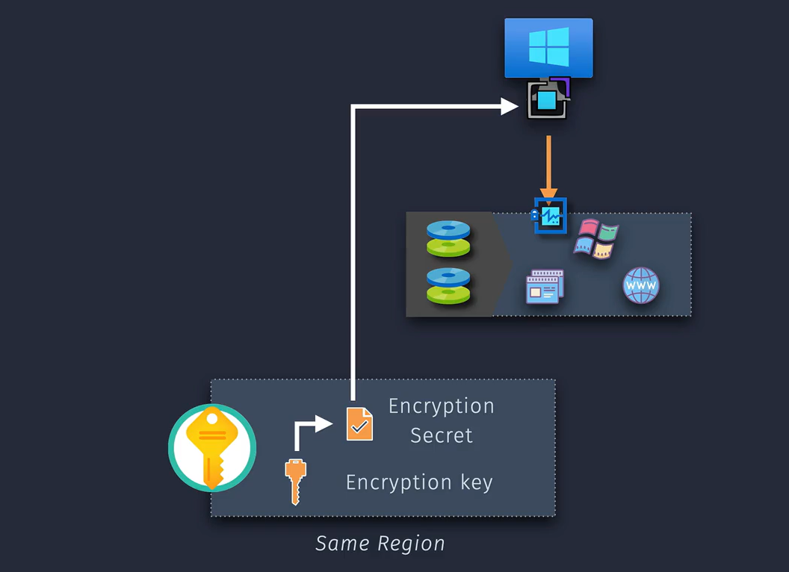

# 🔐 Azure VM Disk Encryption

There are **3 main ways Azure encrypts your VM disks**, and **only one** of them works inside the VM (like a **client**) — that’s **ADE**.

| 💡 Your Understanding        | ✅ Azure Name                    | 📍 Where It Happens                    | 🔒 What It Protects                                          |
| ---------------------------- | -------------------------------- | -------------------------------------- | ------------------------------------------------------------ |
| 1️⃣ **OS-level encryption**   | **Azure Disk Encryption (ADE)**  | _Inside the VM_ (BitLocker / dm-crypt) | Volumes (C: / D:), encrypted by the **VM itself**            |
| 2️⃣ **Disk-level encryption** | **Server-Side Encryption (SSE)** | _Azure Storage layer_                  | Data on **managed disks** (OS & data disks)                  |
| 3️⃣ **Host-level encryption** | **Encryption at Host**           | _On the physical Azure host_           | **All disks**, **temp disks**, and **caches** before writing |

---

## 🧠 Think of It Like This:

### 🔹 1. **ADE = Inside the Guest OS**

- Agent runs **inside the VM**
- Encrypts volumes using OS-native tools (BitLocker/Linux dm-crypt)
- Requires **Azure Key Vault**
- Needs **reboot**
- Like **client-side encryption**

### 🔹 2. **SSE = On Disk in Azure Storage**

- **Default** for all managed disks
- Transparent, automatic encryption at-rest (like EBS with default KMS)
- You can optionally use **Customer-Managed Keys (CMK)**

### 🔹 3. **Encryption at Host = Extra Layer**

- Ensures **temp disks + cache** are encrypted
- Happens **on Azure host**, before any data is persisted to disk
- Useful for **full data protection including ephemeral storage**

### 🔁 Combined = Layered Security

When enabled together, this is how the layers apply:

```ini
[Inside VM: ADE] ─> [Encryption at Host] ─> [Azure Storage SSE]
```

💪 You can **combine**:

- **ADE + SSE**
- **SSE + CMK**
- **Encryption at Host + SSE**
- Or even **all 3 together**

---

## 1️⃣ Azure Disk Encryption (ADE) – _Guest-OS Level Encryption_

**💡 What it is:**
Encrypts virtual disks **from inside the VM**, using the OS’s native tools:

- 🪟 Windows: **BitLocker**
- 🐧 Linux: **dm-crypt**

ADE runs as a **VM extension**, and integrates with **Azure Key Vault** to manage keys.

<div align="center">
  
</div>

### ⚙️ Key Features

| Feature            | Details                                                    |
| ------------------ | ---------------------------------------------------------- |
| 📍 Scope           | OS & Data Disks (not temp disks)                           |
| 🔑 Key Store       | Azure Key Vault – required - **Must be in same vm region** |
| 🔄 Agent           | ADE extension runs inside the VM                           |
| 🔁 Requires Reboot | Yes – applies BitLocker or dm-crypt                        |
| 🚫 Limitations     | Not supported on Ultra Disks, A-series, <2 GB RAM VMs      |
| 🧩 Encryption Type | Volume-level, like LUKS / BitLocker                        |
| 🔓 Decryption      | Happens in-guest, keys fetched from Azure Key Vault        |

### 🆚 Compared to AWS:

| Concept in AWS              | Equivalent in Azure         |
| --------------------------- | --------------------------- |
| BitLocker or LUKS in EC2    | Azure Disk Encryption (ADE) |
| KMS-managed client-side key | Azure Key Vault-managed key |

---

## 2️⃣ Server-Side Encryption (SSE) – _Storage-Level_

**💡 What it is:**
This is **transparent encryption at rest** for all **Azure Managed Disks** (OS/Data). It happens **before** data is written to Azure Storage.

### 🔐 Always On by Default

- Uses **AES-256**
- Encrypts at the storage service layer
- **No performance hit** or agent needed

### 1️⃣ **Server-Side Encryption (SSE) with Platform-Managed Keys (PMK)**

**🔧 Default for all disks!**

| Feature          | Description                                       |
| ---------------- | ------------------------------------------------- |
| 🔒 Key Ownership | Microsoft-managed                                 |
| ✅ Automatic     | Enabled by default on all new disks               |
| 📦 Key Rotation  | Managed by Azure                                  |
| 🛠️ Use Case      | Low-risk workloads, where Microsoft controls keys |

💡 _AWS Equivalent_: **EBS default encryption with AWS-managed key (aws/ebs)**

---

### 2️⃣ **Server-Side Encryption with Customer-Managed Keys (CMK)**

**🔐 For sensitive workloads needing key control!**

| Feature          | Description                               |
| ---------------- | ----------------------------------------- |
| 🔑 Key Ownership | You (stored in Azure Key Vault)           |
| 🔄 Key Rotation  | Manual or automatic                       |
| 📘 Prerequisites | Azure Key Vault + Access Policies or RBAC |
| ✅ Supported On  | OS + data disks, snapshots, images        |

💡 _AWS Equivalent_: **EBS encryption with KMS CMK (user-managed)**

🛠️ Example Scenarios:

- Financial, healthcare workloads needing compliance (HIPAA, PCI)
- Audit and control requirements
- Key revocation capabilities

---

### 3️⃣ **Double Encryption (Optional)**

**🎯 Add a second layer of protection!**

| Feature        | Description                                          |
| -------------- | ---------------------------------------------------- |
| 🔁 Layers      | Disk encrypted with **CMK**, then again with **PMK** |
| 🛡️ Security    | Extra defense-in-depth                               |
| ⚙️ Requirement | Disk must be encrypted with CMK                      |

💡 _AWS Equivalent_: ❌ _Not natively supported_

---

### 🆚 Compared to AWS:

| AWS Concept                      | Azure Equivalent                     |
| -------------------------------- | ------------------------------------ |
| EBS default KMS-based encryption | SSE with Platform-Managed Keys (PMK) |
| EBS with CMK                     | SSE with Customer-Managed Key (CMK)  |

---

## 3️⃣ Encryption at Host – _Physical Host Level Encryption_

**💡 What it is:**
Encrypts **all disk I/O** on the **Azure compute host** **before data ever reaches Azure Storage**. This includes:

- Temp disk (`D:` on Windows, `/dev/sdb1` on Linux)
- Host-level disk cache
- Writes from OS/Data disks (in addition to SSE)

### 🧩 Scope

| Encrypted        | Notes                                          |
| ---------------- | ---------------------------------------------- |
| OS Disk writes   | Yes – before writing to storage                |
| Data Disk writes | Yes – before writing to storage                |
| Temp Disk        | ✅ Yes – encrypted, even though not persistent |
| Host Cache       | ✅ Yes                                         |
| Boot Diagnostics | ✅ Yes                                         |

### ⚙️ Important Notes

- Must be **enabled at VM creation**
- **Not available** on all VM sizes (check support)
- Cannot be disabled after creation

### 🆚 Compared to AWS:

| AWS Concept                           | Azure Equivalent   |
| ------------------------------------- | ------------------ |
| Nitro-based ephemeral disk encryption | Encryption at Host |

---

## 🔁 How They Work Together

### 💡 Example: ADE + SSE + Host Encryption

1. 🧠 **Guest OS (ADE)** encrypts disk volumes using BitLocker or dm-crypt
2. 🧊 **Encryption at Host** encrypts everything (even temp disks) before it’s persisted
3. 🔐 **SSE** encrypts managed disk data at rest in Azure Storage

---

## ✅ Summary Table

| Layer              | Azure Feature                | Required?   | Covers                        | Notes                          |
| ------------------ | ---------------------------- | ----------- | ----------------------------- | ------------------------------ |
| VM OS Encryption   | Azure Disk Encryption (ADE)  | ❌ Optional | OS + data volumes (inside VM) | Needs agent + reboot           |
| Storage Encryption | Server-Side Encryption (SSE) | ✅ Default  | Disks at rest in Azure        | Transparent + supports CMK     |
| Host Encryption    | Encryption at Host           | ❌ Optional | Temp disk, cache, all writes  | Must be enabled at VM creation |

---

## 🤔 What to Choose?

| Use Case                                  | Recommended Encryption Layers           |
| ----------------------------------------- | --------------------------------------- |
| ✅ Basic protection (default)             | SSE with Microsoft-managed keys         |
| 🛡️ BYOK or strict compliance needed       | SSE with Customer-managed keys (CMK)    |
| 🔐 In-guest encryption required by policy | ADE (in addition to SSE)                |
| 🧯 Temp disk & cache must be encrypted    | Enable Encryption at Host               |
| 🔁 Maximum protection                     | Combine: ADE + SSE + Encryption at Host |

---

## 💡 Tips for AWS Users

| AWS Concept            | Azure Equivalent              |
| ---------------------- | ----------------------------- |
| EC2 Nitro + KMS        | Host Encryption + SSE         |
| BitLocker + KMS on EC2 | ADE with Azure Key Vault      |
| EBS default encryption | SSE with MMK                  |
| EBS with KMS CMK       | SSE with Customer-managed key |

---

## 🛑 Important Notes

- **ADE** introduces **VM reboot** and needs **manual key management**
- **SSE** is **always-on** and safest for most workloads
- **Encryption at Host** only applies if enabled at **VM creation**
- Combining all 3 adds **maximum protection**, but also **operational complexity**
