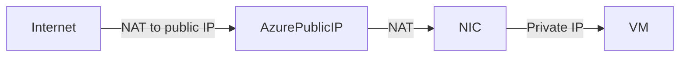

# 🌐 **Azure VM Networking**

> _If you come from AWS, you're probably thinking about ENIs, Elastic IPs, IGWs, and NAT Gateways. Azure uses different naming and logic, but the concepts are familiar. Let's break it down._

---

## 📦 **Azure VM ↔ Networking – Key Components**

| Azure Term           | AWS Equivalent                  | Description                                                              |
| -------------------- | ------------------------------- | ------------------------------------------------------------------------ |
| **NIC**              | ENI (Elastic Network Interface) | Connects VM to a VNet/subnet. Can hold multiple IP configs.              |
| **Private IP**       | Private IP                      | Assigned from subnet range. Used for internal VNet traffic.              |
| **Public IP**        | Elastic IP (sort of)            | NAT-mapped to private IP. Azure manages NAT; OS doesn't "see" this IP.   |
| **IP Configuration** | ENI config                      | Each NIC can have multiple configurations (each with private/public IP). |
| **VNet**             | VPC                             | Azure's isolated network environment.                                    |
| **Subnet**           | Subnet                          | Logical segmentation within a VNet.                                      |
| **NAT**              | IGW / NAT Gateway               | Azure handles NAT to map public IPs → private IPs for internet access.   |

---

## 🧩 **Azure VM Network Interface (NIC)**

### What is a NIC?

Every Azure VM must have **at least one NIC**, which is the virtual interface connecting it to a VNet.

### Each NIC Can Have:

- 🟢 One or more **IP configurations**
- 🟢 One **primary private IP address**
- 🟡 One optional **public IP address** (attached through NAT)
- 🔁 Optional **DNS name label**

### ❗Important NIC Rules:

- VMs **can have multiple NICs**, but only if the **VM SKU supports** it.
- NICs **can be in different subnets**, but **must be in the same VNet**.
- You **cannot move a VM to a different VNet** — you'd need to delete and recreate it.

---

## 🔢 **Multiple NICs = Multiple ENIs**

💡 Just like multiple ENIs in AWS allow:

- 🔒 **Traffic isolation** (mgmt vs app vs DB)
- 📶 **Multihoming**
- 🚦 **Custom routing per NIC**

Azure allows **multi-NIC VMs** for advanced use cases:

- Web-tier + Management-tier
- Network Virtual Appliances
- Layer 3/4 routing/firewall scenarios

🔧 **Adding a second NIC** (Portal):

- Go to **VM > Networking > + Add network interface**
- Select a **NIC** that is in the **same VNet**
- VM must be **deallocated first**

🧪 Supported by DSv2, F-series, M-series, etc.

---

## 🌍 **Public IP Behavior – NOT OS-Visible**

In AWS:

- You assign an Elastic IP → appears in OS (`eth0`)
- You manage NAT yourself using IGW or NAT Gateway

In Azure:

- You assign a **Public IP** to the **NIC's IP configuration**
- Azure manages **1:1 NAT** under the hood
- The **OS sees only the private IP**
- Inbound/outbound NAT is handled by Azure automatically

💡 This is why your VM **doesn’t show the public IP in `ip a` or `ifconfig`**.

---

## 🔁 **Traffic Flow**



🔄 NAT applies for:

- **Inbound** from Internet to public IP
- **Outbound** from VM to Internet (if public IP or NAT Gateway is present)

🧠 Azure auto-manages **SNAT** for outbound traffic and **DNAT** for inbound.

---

## 🔄 **IP Configuration Breakdown**

Each NIC supports **multiple IP configurations**:

- 🔹 Primary private IP (required)
- 🔸 Additional private IPs (optional)
- 🔸 Public IPs (optional per config)

📝 A single NIC **can have multiple private/public IPs** via configurations.

---

## 🌐 **IPv6 Support**

Azure supports **dual-stack NICs**:

- IPv4 + IPv6
- Requires enabling IPv6 on the VNet + subnet

---

## 🧰 **Tools to Work With Networking**

### 🖥️ Azure Portal

- Simple GUI for creating VMs, attaching NICs, IPs, NSGs, etc.

### 💻 Azure CLI

```bash
# List IPs for a VM
az network nic list --resource-group myRG --query "[].{Name:name, IPs:ipConfigurations[*].privateIpAddress}"
```

### ⚙️ PowerShell

```powershell
Get-AzNetworkInterface -ResourceGroupName "myRG" | Select-Object Name, MacAddress, IpConfigurations
```

---

## ⚙️ **Things to Know (Cheat Sheet)**

| Feature              | Azure Behavior                                                   |
| -------------------- | ---------------------------------------------------------------- |
| Add Public IP to VM  | Attach to NIC → IP config → Public IP (NATed, not visible to OS) |
| Remove Public IP     | Disassociate public IP from NIC config                           |
| Change Subnet/VNet   | ❌ Not allowed — must delete and recreate VM                     |
| Multiple NICs        | ✅ Supported on some SKUs, NICs must be in same VNet             |
| Assign Static IP     | ✅ Set static private IP in NIC settings                         |
| Dynamic Public IP    | IP may change unless you reserve a **Standard SKU** Public IP    |
| Multiple IPs per NIC | ✅ Add more IP configurations                                    |
| IPv6                 | ✅ Must be enabled on VNet/subnet + IP config                    |

---

## 🧠 Summary: Azure Networking = More Abstracted

| Concept               | AWS                   | Azure                           |
| --------------------- | --------------------- | ------------------------------- |
| Public IP             | OS-visible Elastic IP | Azure-managed NAT mapping       |
| NIC                   | ENI                   | NIC with 1+ IP configs          |
| Move to new VPC/VNet  | Yes (detach, attach)  | No (VM must be recreated)       |
| Add multiple NICs     | Yes                   | Yes (on supported SKUs)         |
| Private IP assignment | Dynamic or static     | Same, controlled via NIC config |
| NAT Gateway / IGW     | Explicit setup        | Auto NAT with public IP         |
