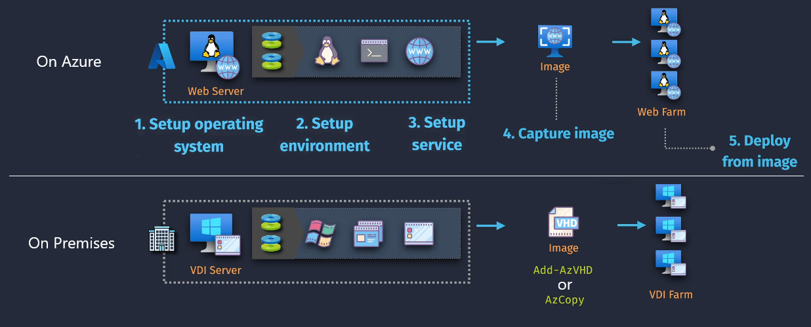
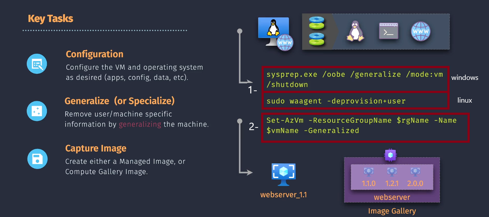

# 💾 Azure VM Images — Creation, Storage, Sharing, and Usage

## 📌 1. Official Definition

> An **Azure VM Image** is a template that contains an operating system, configuration, and optionally, pre-installed applications, which you can use to create new VMs.

Think of it like a **"golden AMI"** in AWS — it’s your **master copy** to quickly deploy identical VMs.

---

<div align="center">
  
</div>

---

## 🗂 2. Types of VM Images in Azure

| Type                    | Description                                                           | AWS Equivalent                  | Storage Location        |
| ----------------------- | --------------------------------------------------------------------- | ------------------------------- | ----------------------- |
| **Marketplace Images**  | Ready-to-use OS/app images from Azure Marketplace                     | AWS Marketplace AMIs            | Managed by Microsoft    |
| **Custom Images**       | Created from your own configured VM                                   | Custom AMIs                     | Azure Managed Disks     |
| **Managed Images**      | Single image resource stored in Azure, usable within the subscription | AMI stored in EBS snapshots     | Resource group in Azure |
| **Shared Images (SIG)** | Images shared across subscriptions/tenants                            | AMI sharing across AWS accounts | Azure Compute Gallery   |
| **Specialized Images**  | Captured without removing machine-specific data                       | AMI created without `sysprep`   | Managed Disks           |
| **Generalized Images**  | Captured after removing machine/user-specific data                    | AMI created with `sysprep`      | Managed Disks           |

---

## 🏗 3. VM Image Lifecycle

<div align="center">
  
</div>

---

### **Step 1 — Configure the Source VM**

- Install OS, updates, and applications
- Apply security configurations
- Set environment variables, software settings

---

### **Step 2 — Generalize (or Specialize)**

- **Generalized** → Removes unique info (hostname, SID, SSH keys)

  - Windows:

    ```powershell
    sysprep.exe /oobe /generalize /mode:vm /shutdown
    ```

  - Linux:

    ```bash
    sudo waagent -deprovision+user
    ```

- **Specialized** → Keep user/machine data (good for cloning test environments)

---

### **Step 3 — Capture the Image**

- **Portal** → VM → **Capture**
- **Azure CLI**:

  ```bash
  az vm generalize --resource-group MyRG --name MyVM
  az image create \
    --resource-group MyRG \
    --name MyImage \
    --source MyVM
  ```

- **PowerShell**:

  ```powershell
  Set-AzVm -ResourceGroupName MyRG -Name MyVM -Generalized
  New-AzImage -ResourceGroupName MyRG -ImageName MyImage -SourceVirtualMachineId $vm.Id
  ```

---

### **Step 4 — Store the Image**

- In a **Resource Group** (Managed Image)
- In **Azure Compute Gallery** (recommended for sharing & versioning)

---

### **Step 5 — Deploy from the Image**

- **Portal** → Create VM → Select "My Images"
- **CLI**:

  ```bash
  az vm create \
    --resource-group MyRG \
    --name NewVM \
    --image MyImage \
    --admin-username azureuser \
    --generate-ssh-keys
  ```

---

## 🏢 4. Storage & Sharing Options

### **Managed Image**

- Single region
- Limited scalability
- Best for small environments

### **Azure Compute Gallery (formerly Shared Image Gallery)**

- Multi-region replication
- Image versioning
- RBAC-based sharing
- **AWS Equivalent:** AMI with cross-account + region copy

---

## 📦 5. Using VM Images from On-Premises

- Prepare your VHD file
- Upload via:

  ```powershell
  Add-AzVhd -ResourceGroupName MyRG -Destination "https://mystorage.blob.core.windows.net/vhds/mydisk.vhd" -LocalFilePath "C:\mydisk.vhd"
  ```

  Or:

  ```bash
  azcopy copy "C:\mydisk.vhd" "https://<storageaccount>.blob.core.windows.net/vhds/<sas-token>"
  ```

- Create Image from uploaded VHD

---

## 🔐 6. Best Practices

- ✅ Always **generalize** images for broad reuse
- ✅ Use **Azure Compute Gallery** for production deployments
- ✅ Maintain **version numbers** in your images (e.g., `webserver_1.0`, `webserver_1.1`)
- ✅ Limit access with **RBAC** and **private endpoints**
- ✅ Store golden images in a **locked Resource Group**

---

## 🧠 7. AZ-104 Exam Tips

- **Generalized Images** require `sysprep` (Windows) or `waagent` (Linux)
- **Specialized Images** = no `sysprep`, keeps user data
- **Azure Compute Gallery** = best for multi-region sharing & scaling
- Images **cannot be updated in place** — create a **new version**
- **Managed Images** are regional; SIG can be replicated globally

---

## 🔄 8. AWS Comparison Table

| Azure Feature         | AWS Equivalent        | Key Difference                               |
| --------------------- | --------------------- | -------------------------------------------- |
| Managed Image         | AMI                   | Both single-region by default                |
| Azure Compute Gallery | AMI cross-region copy | Azure supports versioning inside the gallery |
| Marketplace Image     | AWS Marketplace AMI   | Similar marketplace concept                  |
| Specialized Image     | AMI without `sysprep` | Same behavior                                |
