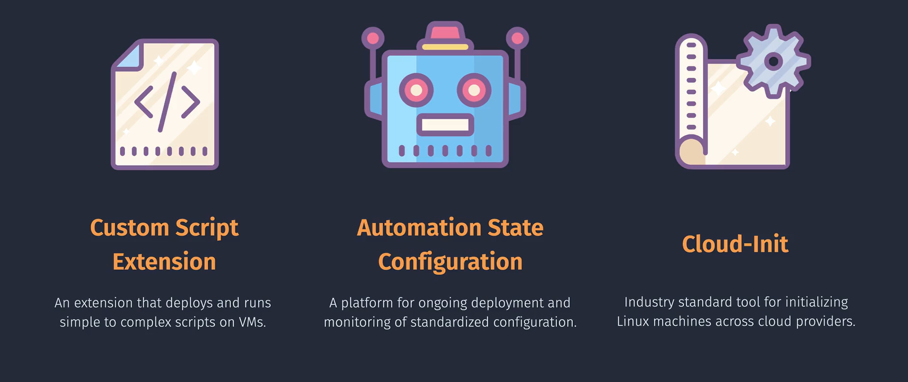
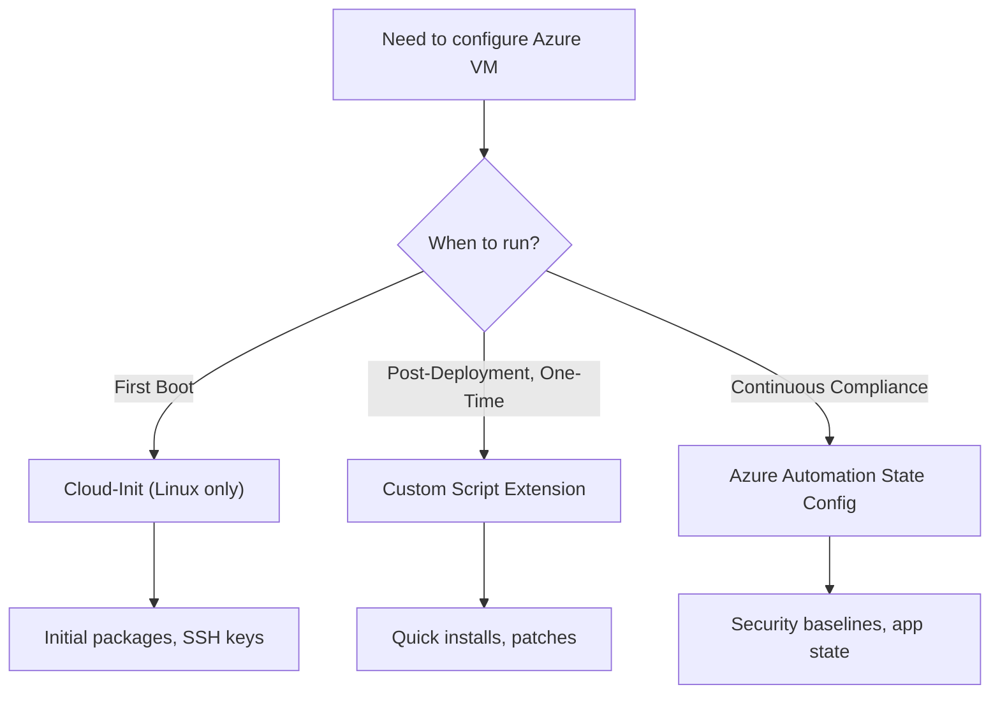

# ⚙️ Azure VM Configuration Tools

> When you deploy a **Virtual Machine** in Azure, the OS starts out in a **base state** —
> it may have the OS installed, but **it’s not yet tailored for your workload**.
> You might need to:
>
> - Install software packages
> - Apply security baselines
> - Configure application settings
> - Create users and set permissions
> - Connect the VM to specific services

You could do this **manually** by logging in over RDP/SSH…
…but that’s **slow, error-prone, and not scalable**.

Instead, Azure gives you **VM configuration tools** —
these are **automated ways to configure a VM** at **creation time** or **post-deployment**,
either **once** or **continuously**. Think of this like **AWS EC2 User Data + SSM Documents + State Manager**,
but in Azure you have **three distinct ways** to configure VMs —
**before boot**, **after boot**, or **forever**.

These tools let you:

- 🏗 **Automate** VM setup without logging in
- 🎯 Apply **consistent configs** across many VMs
- 🔒 Enforce **security baselines**
- 🚀 Scale deployments quickly

---

## 📅 2. When Do We Need VM Configuration Tools?

We typically use these tools in scenarios like:

| Scenario                  | Why We Use Configuration Tools                                                                                     |
| ------------------------- | ------------------------------------------------------------------------------------------------------------------ |
| **First Boot Setup**      | To automatically install packages, create users, and configure the environment right when the VM is first started. |
| **Post-Deployment Setup** | To quickly apply configurations after a VM is already running.                                                     |
| **Ongoing Compliance**    | To ensure that VMs **always** have certain settings/software, even if someone changes them.                        |
| **Scaling Out**           | To replicate the same configuration across 10, 100, or 1,000 VMs without manual effort.                            |
| **Security Baselines**    | To enforce consistent firewall rules, registry keys, or OS hardening policies.                                     |

---

## 🛠 The 3 Azure VM Configuration Options

<div align="center">
  
</div>

---

### **1️⃣ Cloud-Init** — _AWS’s EC2 User Data for Linux_

#### 📌 Definition

- **Linux-only** first boot initialization using **YAML**
- Pre-installed in most Azure Linux Marketplace images
- Runs **before** VM is ready for SSH

---

#### 📅 Use Cases

- Create users and SSH keys
- Install packages before login
- Configure network and disks at boot

---

#### 🖥 Example — Install Apache on Ubuntu

```yaml
#cloud-config
package_update: true
packages:
  - apache2
runcmd:
  - systemctl enable apache2
  - systemctl start apache2
```

> 📌 Portal: **Advanced → Custom Data → Paste YAML**

---

#### ✅ Best Practices

- Use for **initial boot setup only**
- Keep YAML syntax valid — **cloud-init is picky**
- Combine with **CSE** or **ASC** for later changes

---

### **2️⃣ Custom Script Extension (CSE)** — _AWS’s “Run Command” on Steroids_

#### ⁉️ What It Is

- An **Azure VM Extension** that runs **custom scripts** (PowerShell for Windows, Bash for Linux) inside your VM.
- Scripts can come from **Azure Storage**, **GitHub**, or an accessible HTTP(S) endpoint.
- Good for **quick, one-off configuration tasks** after deployment.
- Similar to **AWS SSM Run Command** or **EC2 User Data (run once)**.

---

#### 📅 When to Use

- Installing or updating software **after deployment**.
- Applying hot-fixes or security patches.
- Configuring app settings or environment variables.
- Running automation tasks that don’t need to repeat.

---

#### ⚙ How It Works

1. VM has the **Azure VM Agent** installed (default for Marketplace images).
2. Azure sends the extension payload (script + parameters).
3. VM agent downloads and executes the script.
4. Execution logs are saved inside the VM.

> 💡 Custom Script Extension can't apply on stopped VMs.

---

#### 🖥 Example — Install Nginx on Ubuntu

```bash
az vm extension set \
  --resource-group MyRG \
  --vm-name MyLinuxVM \
  --publisher Microsoft.Azure.Extensions \
  --name CustomScript \
  --settings '{"fileUris":["https://mystorage.blob.core.windows.net/scripts/install-nginx.sh"],"commandToExecute":"./install-nginx.sh"}'
```

📂 **install-nginx.sh**

```bash
#!/bin/bash
apt update
apt install -y nginx
systemctl enable nginx
systemctl start nginx
```

---

#### ✅ Best Practices

- Make scripts **idempotent** (safe to re-run).
- Store in **secure** locations (SAS token if Azure Storage).
- Use for **post-deployment tasks**, not ongoing compliance.

---

### **3️⃣ Azure Automation State Configuration (ASC)** — _AWS’s SSM State Manager_

#### ⁉️ What It Is

- Azure’s **Desired State Configuration (DSC)** platform.
- Keeps VMs in a **defined state** — if someone changes something, it will be **auto-fixed**.
- Works for **Windows** and **Linux**.

---

#### 📅 When to Use

- Enforcing security and compliance baselines.
- Ensuring specific services or apps are installed/running.
- Managing large VM fleets with consistent settings.

---

#### ⚙ How It Works

1. Create an **Automation Account** in Azure.
2. Upload a **DSC configuration** (PowerShell script).
3. Compile to a **Node Configuration**.
4. Assign to VMs as “DSC nodes”.
5. DSC agent enforces state and corrects drift.

---

#### 🖥 Example — Ensure IIS is Installed on Windows

```ini
Configuration WebServerConfig {
    Node "localhost" {
        WindowsFeature IIS {
            Name = "Web-Server"
            Ensure = "Present"
        }
    }
}
WebServerConfig
```

**Steps:**

1. Upload to **Azure Automation → State Configuration (DSC)**.
2. Compile → Assign to VM.
3. DSC will install IIS if missing.

---

#### ✅ Best Practices

- Use for **long-term** enforcement, not ad-hoc changes.
- Keep configs **modular**.
- Combine with **Update Management** for patch compliance.

---

## 📊 Quick Comparison for AWS Experts

| Feature        | Cloud-Init      | Custom Script Ext. | Automation State Config |
| -------------- | --------------- | ------------------ | ----------------------- |
| OS Support     | Linux only      | Win/Linux          | Win/Linux               |
| Timing         | First boot only | Post-deployment    | Continuous              |
| Purpose        | Initial setup   | One-off tasks      | Maintain state          |
| Format         | YAML            | Script             | PowerShell DSC          |
| Idempotent?    | Not required    | Recommended        | Yes                     |
| AWS Equivalent | EC2 User Data   | SSM Run Command    | SSM State Manager       |

---

## 🗺 Decision Flow (Mermaid Diagram)

<div align="center">



</div>

---

## ✅ **Summary**

- Use **Cloud-Init** → First boot Linux setup (like EC2 User Data)
- Use **CSE** → Quick post-deployment tasks (like SSM Run Command)
- Use **ASC** → Ongoing compliance (like SSM State Manager)
