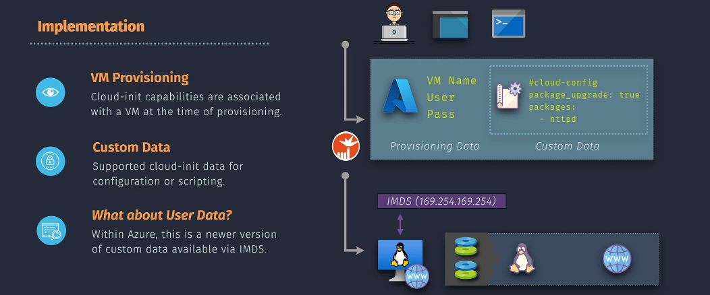
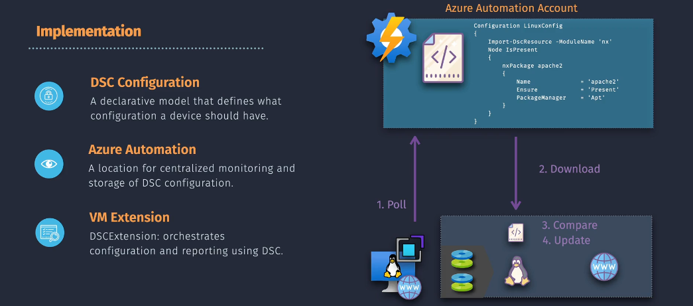

# ✍🏻 Azure VM Configuration and Management

## 1. **Cloud-Init**

**Cloud-Init** is a tool used to customize Linux VMs during their initial boot process. It allows you to run commands or scripts when the VM first starts, which can be useful for installing packages, setting up users, or configuring services. Cloud-Init works across different Linux distributions, making it a flexible option for VM customization.

<div align="center">
  
</div>

---

### **🪜 Implementation Steps:**

1. **Prepare the Cloud-Init Configuration File**:

   - Write your Cloud-Init configuration in a YAML file.
   - **Example Cloud-Init YAML**:

     ```yaml
     #cloud-config
     package_update: true
     packages:
       - nginx
     runcmd:
       - echo "Hello, world!" > /var/www/html/index.html
     ```

2. **Deploy the VM with Cloud-Init**:

   - Use the Azure CLI or an ARM template to create a new VM and provide the Cloud-Init file.
   - **Azure CLI Example**:

     ```bash
     az vm create \
       --resource-group $rg \
       --name $vm \
       --image $img \
       --custom-data "./cloud-init.yml" \
       --admin-username $username \
       --generate-ssh-keys
     ```

---

## 2. **Custom Script Extension**

The **Custom Script Extension** is a tool in Azure that lets you run scripts on your virtual machines (VMs) after they are deployed. This is useful for tasks like installing software, configuring settings, or performing maintenance. You can upload your scripts from a location like Azure Storage or GitHub, and the extension will execute them on your VM.

<div align="center">
  
</div>

---

### **🪜 Implementation Steps:**

1. **Prepare the Script**:

   - Write your custom script (e.g., a Bash script for Linux or a PowerShell script for Windows) and save it to a location accessible by Azure, such as Azure Storage or GitHub.

2. **Upload the Script**:

   - If using Azure Storage, upload the script to a storage account container.

3. **Deploy the Custom Script Extension**:

   - Use the Azure Portal, Azure CLI, or PowerShell to deploy the Custom Script Extension to your VM.
   - **Azure CLI Example**:

     ```bash
     az vm extension set \
       --resource-group $rg \
       --vm-name $vm \
       --name $name \
       --publisher "Microsoft.Azure.Extensions" \
       --settings '{"fileUris": ["https://mystorageaccount.blob.core.windows.net/mycontainer/myscript.sh"], "commandToExecute": "./myscript.sh"}'
     ```

   - **PowerShell Example**:

     ```powershell
     Set-AzVMExtension `
       -ResourceGroupName $rg `
       -VMName $vm `
       -Name $name `
       -Publisher "Microsoft.Azure.Extensions" `
       -ExtensionType "CustomScript" `
       -TypeHandlerVersion "2.0" `
       -Settings '{"fileUris": ["https://mystorageaccount.blob.core.windows.net/mycontainer/myscript.ps1"], "commandToExecute": "powershell -ExecutionPolicy Unrestricted -File myscript.ps1"}' `
     ```

---

## 3. **Automation State Configuration**

**Automation State Configuration (DSC)** is a service in Azure that helps you manage and configure your VMs to ensure they stay in a desired state. You write configuration scripts that define how your VMs should be set up, and DSC makes sure they follow those configurations. It's like setting rules for your VMs and making sure they always follow them.

<div align="center">
  
</div>

---

### **🪜 Implementation Steps:**

1. **Create an Automation Account**:

   - In the Azure Portal, navigate to "Automation Accounts" and create a new automation account.

2. **Import DSC Configuration**:

   - Write your DSC configuration script and import it into the automation account.
   - **Example DSC Configuration (PowerShell)**:

     ```powershell
     Configuration MyDscConfiguration {
         Node "localhost" {
             WindowsFeature "IIS" {
                 Ensure = "Present"
                 Name = "Web-Server"
             }
         }
     }
     MyDscConfiguration -OutputPath "C:\DSC\"
     ```

3. **Compile Configuration**:

   - Compile the DSC configuration into a node configuration (MOF file) in the Azure Portal.

4. **Assign Configuration to VM**:
   - Navigate to "State Configuration (DSC)" in the Automation Account and add the VM as a node. Assign the compiled configuration to the VM.
   - VM Must Be Running because DSC Uses VM Extensions in Background which also needs VM To be in running state.

---

## 📦 Azure Custom Data vs User Data (IMDS Version)

### 🧠 The Big Picture

Azure historically only had **Custom Data** for VM boot-time configuration.
Recently, Microsoft introduced **User Data** in **IMDS (Instance Metadata Service)** —
similar to AWS’s IMDS endpoint for EC2 metadata.

So now we have **two “data at launch” concepts**:

1. **Custom Data** → Classic method, set at provisioning, read by the OS (Cloud-Init on Linux).
2. **User Data (IMDS)** → Newer method, accessible via IMDS endpoint from inside the VM.

---

### 🔍 How the Slide is Mapping It

- **VM Provisioning Data**: Basic stuff (VM name, admin username/password) set at deployment.
- **Custom Data**: Configuration or scripting content, given at creation time, **executed via Cloud-Init (Linux)** or via extension (Windows).
- **User Data (IMDS)**:

  - Stored separately
  - Queried via the IMDS endpoint **169.254.169.254**
  - Doesn’t automatically execute — you must retrieve and use it inside your OS.
  - Great for **retrieving launch-time info** without embedding it in a script.

---

### 📊 Key Differences

| Feature        | Custom Data                                                    | User Data (IMDS)                                 |
| -------------- | -------------------------------------------------------------- | ------------------------------------------------ |
| Set When       | VM creation                                                    | VM creation                                      |
| Where Stored   | VM property in Azure metadata                                  | VM metadata via IMDS                             |
| Access Method  | Automatically read by Cloud-Init (Linux)                       | HTTP GET to IMDS endpoint                        |
| Execution      | Linux: auto-run by Cloud-Init; Windows: needs script extension | Not executed — your script must fetch and use it |
| AWS Equivalent | EC2 User Data field                                            | EC2 User Data via IMDS                           |

---

### 🖥 Example: Reading **User Data** from IMDS in Azure (Linux)

```bash
curl -H Metadata:true \
  --noproxy "*" \
  http://169.254.169.254/metadata/instance/compute/userData?api-version=2021-02-01&format=text \
  | base64 --decode
```

- Returns whatever was set in User Data when VM was provisioned.
- You can put **secrets, config, keys, or IDs** here for your app to pull at runtime.

---

### 🖥 Example: Reading **Custom Data** in Cloud-Init (Linux)

If you provisioned with:

```bash
az vm create \
  --name MyLinuxVM \
  --custom-data cloud-init.txt \
  --image Ubuntu2204 \
  --generate-ssh-keys \
  --admin-username azureuser
```

Cloud-Init will execute the YAML in `cloud-init.txt` at first boot — no manual retrieval needed.

---

### 🎯 Best Practices

- **For first boot automation (Linux)** → Use **Custom Data + Cloud-Init**.
- **For dynamic runtime retrieval** → Use **User Data via IMDS**.
- **For Windows VMs** → Neither Custom Data nor User Data auto-runs; use **Custom Script Extension**.
- **Never put secrets in plain text** in either — encrypt or fetch them from **Azure Key Vault**.
