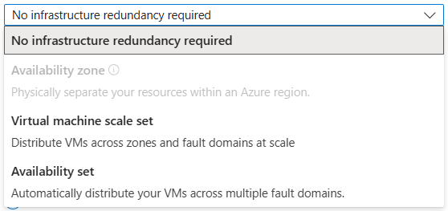
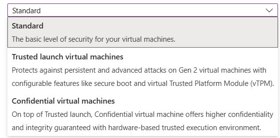

# Topics are very important

## Redeploy and reapply

## Availability options

Azure offers a range of options for managing availability and resiliency for your applications. Architect your solution to use replicated VMs in Availability Zones or Availability Sets to protect your apps and data from datacenter outages and maintenance events.Learn more

  

## Security type

Security type refers to the different security features available for a virtual machine. Security features like Trusted launch and Confidential virtual machines help to improve the security of Azure generation 2 virtual machines. However, additional security features have some limitations, which include not supporting back up, managed disks, and ephemeral OS disks. Learn more about Trusted launch virtual machine and Confidential virtual machine.

  

## Azure Spot

Azure Spot offers unused Azure capacity at a discounted rate versus pay as you go prices. Workloads should be tolerant to infrastructure loss as Azure may recall capacity for pay as you go workloads.Learn more

## Enable accelerated networking

Extensions provide post-deployment configuration and automation.

Enables low latency and high throughput on the network interface.Learn more

## Advanced

### Extensions

Add new features, like configuration management or antivirus protection, to your virtual machine using extensions.

### VM applications

VM applications contain application files that are securely and reliably downloaded on your VM after deployment. In addition to the application files, an install and uninstall script are included in the application. You can easily add or remove applications on your VM after create.Learn more

### Custom data and cloud init

Pass a cloud-init script, configuration file, or other data into the virtual machine while it is being provisioned. The data will be saved on the VM in a known location.Learn more about custom data for VMs

### User data

Pass a script, configuration file, or other data that will be accessible to your applications throughout the lifetime of the virtual machine. Don't use user data for storing your secrets or passwords.Learn more about user data for VMs

### Host

Azure Dedicated Hosts allow you to provision and manage a physical server within our data centers that are dedicated to your Azure subscription. A dedicated host gives you assurance that only VMs from your subscription are on the host, flexibility to choose VMs from your subscription that will be provisioned on the host, and the control of platform maintenance at the level of the host.Learn more

### Capacity reservations

Capacity reservations allow you to reserve capacity for your virtual machine needs. You get the same SLA as normal virtual machines with the security of reserving the capacity ahead of time.Learn more

### Proximity placement group

Proximity placement groups allow you to group Azure resources physically closer together in the same region.Learn more
