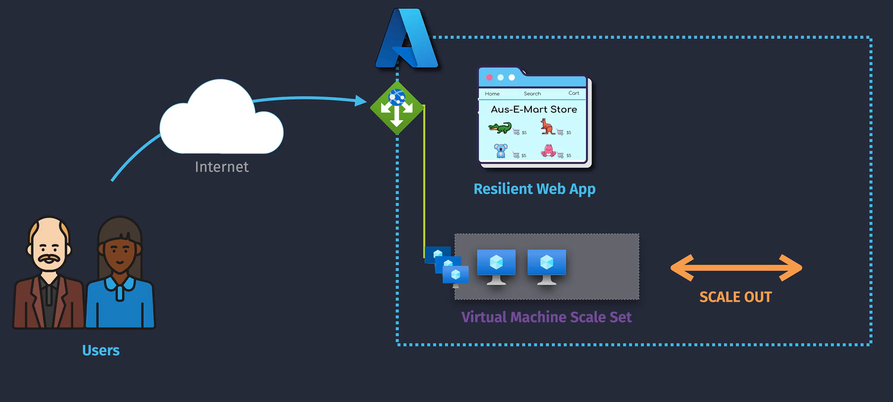
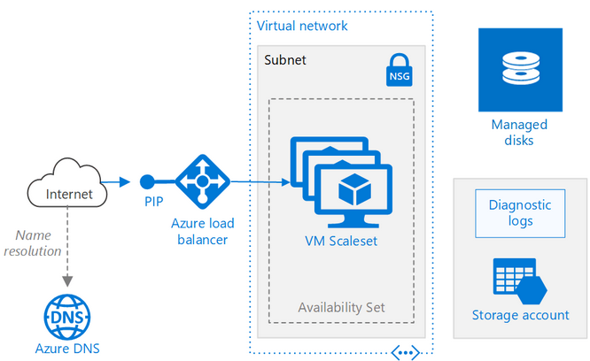

# ⚡ Azure Virtual Machine Scale Sets (VMSS)

## 🧠 1. What is VMSS?

**Official Definition!**

> **Azure Virtual Machine (VM) Scale Sets** **(vmss)** allow you to deploy and manage a group of VMs. They help ensure **high availability** and performance by **automatically** adjusting the number of VM instances **based on demand**.

**In Plain English:**

- Think of it as a **herd of identical VMs** that grow or shrink automatically.
- All VMs are built from the **same image** and **same configuration**.
- Works well for **stateless workloads** like web apps, APIs, batch processing.

**AWS Equivalent:**

- AWS Auto Scaling Group (ASG) + EC2 instances.

---

<div align="center">
  
</div>

---

## 💡 2. Why Use VMSS?

You need VMSS when:

- You have **fluctuating traffic** and want to **scale automatically**.
- You want to **patch/update VMs consistently** across a fleet.
- You need **high availability** with VMs spread across zones or regions.
- You want **infrastructure as code** with **zero manual VM setup**.

Example:

> Your web app gets 5x traffic during a sales event. Instead of buying more servers upfront, VMSS automatically launches extra VMs, then shuts them down later to save cost.

---

## 🏗 3. Architecture Overview

📌 **Load Balancer / App Gateway** → Distributes traffic.  
📌 **VM Instances** → All identical.  
📌 **Scale Set Control Plane** → Adds/removes instances based on rules.  
📌 **Image Source** → Marketplace image, custom image, or Shared Image Gallery.

<div align="left">
  
</div>

---

## 🛠 4. Types of VMSS

### 4.1 **Uniform Orchestration**

- All VMs are identical.
- Scale set is managed as a single resource.
- Uses **identical OS images + configurations**.
- Simplest to manage.
- Recommended for most workloads.

### 4.2 **Flexible Orchestration**

- VMs in the scale set **can be different sizes and configurations**.
- Useful for **mixed workloads** or **spot + on-demand** combinations.
- Allows adding **existing VMs** to the set.

---

## ⚙ 5. Scaling Methods

### **1. Manual Scaling**

```bash
az vmss scale --name MyScaleSet --resource-group MyRG --new-capacity 10
```

- You set the exact number of instances.

### **2. Autoscaling**

- Scale **out** (add VMs) when CPU > 75% for 10 minutes.
- Scale **in** (remove VMs) when CPU < 25% for 15 minutes.
- Defined in Azure Monitor → Autoscale rules.

Example Rule:

```json
{
  "metricName": "Percentage CPU",
  "operator": "GreaterThan",
  "threshold": 75,
  "direction": "Increase",
  "changeCount": 2
}
```

---

## 📦 6. Creating VMSS

### Using Azure CLI

```bash
az vmss create \
  --resource-group MyRG \
  --name MyScaleSet \
  --image Ubuntu2204 \
  --upgrade-policy-mode automatic \
  --instance-count 2 \
  --admin-username azureuser \
  --generate-ssh-keys
```

### Using a Custom Image

```bash
az vmss create \
  --resource-group MyRG \
  --name MyScaleSet \
  --image /subscriptions/<subID>/resourceGroups/MyRG/providers/Microsoft.Compute/images/MyCustomImage \
  --upgrade-policy-mode automatic \
  --instance-count 3
```

---

## 🔄 7. Upgrade Policies

- **Automatic** → All instances updated automatically (can cause downtime).
- **Rolling** → Updates applied in batches to maintain availability.
- **Manual** → You trigger updates manually.

---

## 🧰 8. Common Integrations

| Service                       | Purpose                                        |
| ----------------------------- | ---------------------------------------------- |
| **Azure Load Balancer**       | Distribute traffic to VM instances.            |
| **Azure Application Gateway** | Advanced routing + WAF protection.             |
| **Azure Monitor Autoscale**   | Define CPU/memory/network-based scaling rules. |
| **Azure Image Builder**       | Create consistent VM images for VMSS.          |
| **Azure DevOps Pipelines**    | Automate image build + VMSS rollout.           |

---

## ✅ 9. Best Practices

- Use **Custom Images** + **Cloud-Init** for faster boot.
- Spread instances across **Availability Zones** for resilience.
- Use **Automatic OS image upgrades** to stay patched.
- Keep VMSS **stateless** — store data in **Azure Files**, **Blob**, or **Database**.
- Combine with **Azure Bastion** or **Jumpbox VM** for secure admin access.

---

## 🎯 Example Real-World Use Case

> **E-commerce Site Scaling**
>
> - Baseline: 3 VM instances
> - Traffic spike: VMSS grows to 15 VMs in two minutes
> - After spike: VMSS scales back to 3 to save cost
> - Managed via Azure Monitor autoscaling rules
