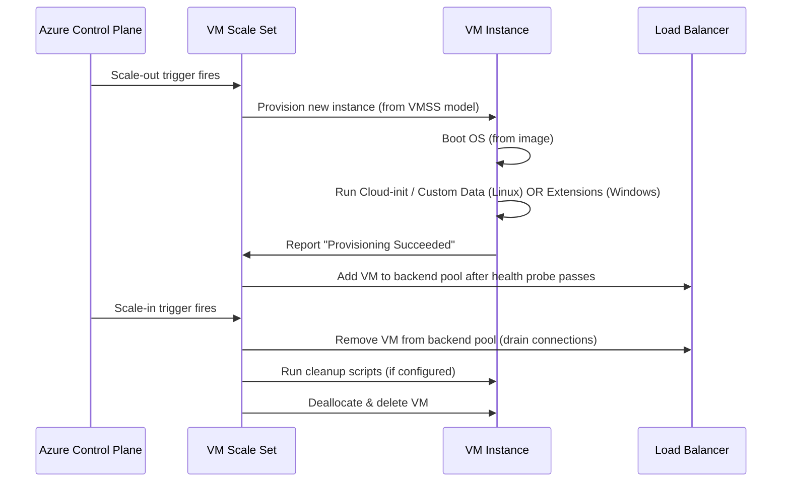

# 🖥️ Azure vmss — Full Lifecycle & Script Execution Points

## 🌟 1. What is VMSS? (Quick Foundation)

Azure **Virtual Machine Scale Sets (VMSS)** let you run **identical or similar VMs** in an **autoscaling group**.
It’s the Azure equivalent of **AWS Auto Scaling Groups (ASG)** with:

- Automatic scale-out (add VMs)
- Automatic scale-in (remove VMs)
- Load balancing
- Integration with scripts/extensions at provisioning time

---

## 🧠 2. Why This Matters for You (AWS Expert)

In AWS, you’ve probably used:

- **User Data** to bootstrap EC2 instances
- **Launch Configurations/Templates** to define the machine
- **Lifecycle Hooks** to run code before/after scaling events

Azure has **similar concepts**, but the terms and timing are slightly different:

| AWS Concept        | Azure Concept              | Notes                      |
| ------------------ | -------------------------- | -------------------------- |
| Auto Scaling Group | VM Scale Set               | The scaling resource group |
| Launch Template    | VMSS Model Definition      | The blueprint for new VMs  |
| User Data          | Custom Data                | Passed at provisioning     |
| Lifecycle Hook     | VM Extensions / Automation | Custom execution points    |

---

## 🛠 3. VMSS Scaling Triggers

1. **Manual** — you change the instance count in the portal, CLI, or API.
2. **Scheduled** — scale at fixed times.
3. **Autoscale Rules** — scale based on metrics like CPU%, memory, disk queue, HTTP requests/sec.

---

## 🔄 4. VMSS Lifecycle Flow (Scale-Out + Scale-In)



---

## 📦 5. What Runs and When (Script Points)

### 🆕 **Scale-Out Phase**

1. **Image Deployment**

   - Azure picks the image from **VMSS model** (Marketplace, Shared Image Gallery, custom image).
   - Example:

     ```bash
     az vmss create \
       --resource-group MyRG \
       --name MyScaleSet \
       --image Ubuntu2204 \
       --custom-data cloud-init.txt
     ```

2. **Boot + Initialization**

   - **Linux**: Runs `cloud-init` if you pass **Custom Data/User Data**.
   - **Windows**: Runs VM Extensions (Custom Script Extension, DSC).
   - Example Cloud-init:

     ```yaml
     #cloud-config
     package_upgrade: true
     packages:
       - nginx
     runcmd:
       - systemctl enable nginx
       - systemctl start nginx
     ```

3. **VM Extensions**

   - **Custom Script Extension**:

     ```json
     {
       "commandToExecute": "apt-get update && apt-get install -y htop"
     }
     ```

   - Runs **after** the OS is provisioned.

4. **Health Check + Load Balancer Registration**

   - VM is tested with health probe.
   - If OK → Added to LB backend pool.

---

### 🗑 **Scale-In Phase**

1. **Trigger**

   - Example: CPU < 25% for 10 min.

2. **LB Deregistration**

   - VM marked unavailable to stop receiving traffic.

3. **Connection Draining**

   - Active sessions finish.

4. **Optional Cleanup Script**

   - Run via **Azure Automation Runbook** or **VM Run Command** before deletion.

5. **VM Deletion**

   - OS + attached ephemeral disks deleted unless persistent.

---

## 🧩 6. Custom Data vs Cloud-init vs User Data (Azure Context)

| Term            | Azure Definition                                                                                               | AWS Mapping              | Notes                                          |
| --------------- | -------------------------------------------------------------------------------------------------------------- | ------------------------ | ---------------------------------------------- |
| **Custom Data** | Text file/script passed at provisioning to VM. Can include Cloud-init on Linux.                                | User Data                | Base method in Azure; runs on first boot.      |
| **Cloud-init**  | Industry-standard init system (Linux only) that interprets Custom Data YAML to configure packages, users, etc. | Cloud-init (same in AWS) | Powerful for automation.                       |
| **User Data**   | Newer IMDS-based way to retrieve boot scripts from inside VM.                                                  | User Data                | Azure uses IMDS (169.254.169.254) to serve it. |

---

## 💡 7. Best Practices

- **Prebake images** for faster scale-out.
- Keep **Custom Data scripts idempotent** (safe to re-run).
- Use **VM Extensions** for post-deployment installs/configs.
- Always use **LB health probes** so traffic flows only when ready.
- For scale-in cleanup → integrate with Azure Automation or Functions.
- For production, prefer **Uniform mode** for predictable scaling.

---

## 📌 8. Example — Full VMSS with Cloud-init

```bash
az vmss create \
  --resource-group MyRG \
  --name MyScaleSet \
  --image Ubuntu2204 \
  --upgrade-policy-mode automatic \
  --custom-data cloud-init.yaml \
  --instance-count 2 \
  --admin-username azureuser \
  --generate-ssh-keys
```

**cloud-init.yaml!**

```yaml
#cloud-config
package_upgrade: true
packages:
  - nginx
runcmd:
  - systemctl enable nginx
  - systemctl start nginx
```

This will:

1. Deploy 2 Linux VMs in a scale set.
2. Run Cloud-init to install and start Nginx.
3. Add instances to LB after passing health checks.
