# 🚀 Azure VMSS Upgrade Policy & OS Upgrades

If you’re from AWS, think of this as a mix between **EC2 Auto Scaling Group** rolling updates and **Launch Template version refresh** — but with Azure’s own flavor of orchestration, extensions, and image handling.

---

## 🧠 1. Why We Even Care About Upgrade Policies

When you run **Virtual Machine Scale Sets (VMSS)**, at some point you’ll need to:

- Patch the **OS** (security fixes, kernel updates, new Azure base image).
- Deploy a **new app version** (via extension scripts or automation).
- Change **VM configuration** (new size, extensions, network settings).

**Upgrade Policy** tells Azure **WHEN** and **HOW** to replace or update the VMs.

---

## 🛠 2. The Core Upgrade Modes

| **Mode**      | **What Happens**                                                              | **Risk Level** | **When to Use**                             |
| ------------- | ----------------------------------------------------------------------------- | -------------- | ------------------------------------------- |
| **Automatic** | All VMs are upgraded **at once**, no waiting for probes, no batches.          | 🔥 High        | Dev/test or stateless workloads only        |
| **Rolling**   | Upgrade in **batches**, drain traffic, health check, then move to next batch. | 🟢 Low         | Prod apps with high availability            |
| **Manual**    | Azure **does nothing** until you tell it to update specific instances.        | 🟡 Medium      | Controlled patching, regulated environments |

---

### **A. Automatic Mode** ⚡

- All VMs updated **at the same time**.
- **Fast**, but downtime risk.
- Best for: **Dev/Test**, stateless workloads.

💬 **Example**:
You have 3 web VMs. Microsoft releases a new OS image. All 3 VMs are updated instantly → short outage but minimal maintenance time.

---

### **B. Rolling Mode** 🚚

- Updates are done **in batches**.
- You choose:

  - **Batch size** (% or number of VMs)
  - **Pause time** between batches
  - **Health probes** to check app health before continuing.

- Best for: Production with uptime needs.

💬 **Example**:
10 VMs → Batch size = 2, pause = 5 min.
Update 2 → Check health → Update next 2 → Repeat.
App stays online during rollout.

---

### **C. Manual Mode** 🖐️

- **No automatic rollout** — you trigger updates when ready.
- Full control, no surprises.
- Best for: **Critical production systems** with manual QA before rollout.

💬 **Example**:
You patch the staging VMSS → Test → Approve → Manually upgrade prod VMSS during your scheduled window.

---

## ⚙️ 3. How an Upgrade Actually Happens (Step-by-Step)

---

### **Step 1: Drain Traffic**

- If behind a **Load Balancer** or **App Gateway**, Azure **removes the VM** from backend pool.
- No new requests are routed to it.

---

### **Step 2: Stop or Reimage VM**

- **OS Upgrade** → Replace **OS disk** with new base image version (platform or custom).
- **App Update Only** → VM stays but extension scripts run.

---

### **Step 3: Apply OS Image Upgrade**

- **Uniform mode** → Azure handles this automatically.
- **Flexible mode** → You do it manually (via CLI, Automation, Ansible, etc.).

---

### **Step 4: Run Extensions**

- **Custom Script Extension (CSE)**, **DSC**, or others run again.
- Azure ensures `provisionAfterExtensions` order is respected.
- Script **MUST be idempotent** (safe to re-run).

---

### **Step 5: Health Probe Check**

- Azure waits until the **Load Balancer probe** or **Application Gateway health check** passes.
- If probe fails → upgrade stops.

---

### **Step 6: Return to LB Pool**

- VM rejoins backend pool.
- Traffic resumes.

---

### **Step 7: Move to Next Batch** _(Rolling mode only)_

- Repeat process until all VMs are upgraded.

---

## 📦 4. Extensions & Upgrades — What You Need to Know

| **Extension Type**          | **Runs After OS Upgrade?** | **Common Use**                |
| --------------------------- | -------------------------- | ----------------------------- |
| **Custom Script Extension** | ✅ Yes                     | Install app packages, configs |
| **Azure DSC Extension**     | ✅ Yes                     | Ensure compliance state       |
| **App Insights Agent**      | ✅ Yes                     | Monitoring hooks              |
| **Cloud Init** (Linux)      | ❌ No (only on first boot) | First-boot provisioning       |

💡 **Pro Tip**:

- If you build a **custom image** that already contains your app, your upgrade time drops massively because the extension doesn’t need to install heavy dependencies.
- Store CSE scripts in **Azure Blob with SAS token** to avoid GitHub downtime breaking your upgrades.

---

## 🆚 5. Uniform vs Flexible Mode — OS Upgrade Handling

| Feature                     | Uniform Mode          | Flexible Mode |
| --------------------------- | --------------------- | ------------- |
| OS Image Auto-upgrade       | ✅ Yes                | ❌ No         |
| Extension re-run on upgrade | ✅ Yes                | 🔄 Manual     |
| Upgrade Policy Options      | Auto, Rolling, Manual | Manual only   |
| Traffic draining            | ✅ Yes                | 🔄 Manual     |

---

## 🖥️ How OS Upgrade Works (Uniform Mode)

Here’s the **behind-the-scenes process**:

```mermaid
sequenceDiagram
    participant Admin as You
    participant Azure as Azure VMSS
    participant VM as VM Instances

    Admin->>Azure: Trigger OS upgrade (or auto trigger)
    Azure->>VM: Batch 1 - Drain traffic
    Azure->>VM: Stop VMs
    Azure->>VM: Replace OS disk with new image
    Azure->>VM: Start VMs + run health checks
    Azure->>Azure: Continue to next batch until done
    Azure->>Admin: All upgraded ✅
```

> 🔍 **Notes**:
>
> - OS upgrades **replace** the OS disk → Anything not persisted elsewhere is lost.
> - Data disks remain untouched.
> - Health probes protect against upgrading unhealthy instances.

---

## 🖥 6. Example — Rolling OS Upgrade with Custom Script Extension

**Scenario**:

- 6 VMs in a Uniform VMSS
- Running a Python API installed via **Custom Script Extension**
- Load-balanced via Azure Standard Load Balancer
- Upgrade mode: **Rolling** (batch size 2)

**Upgrade Flow**:

1. **Batch 1 (VM1, VM2)** removed from LB pool.
2. VM reimaged with latest Ubuntu image.
3. **Custom Script Extension** runs → installs Python, pulls code from storage.
4. Health probe OK → VM1 & VM2 back in pool.
5. **Batch 2 (VM3, VM4)** upgraded next.
6. **Batch 3 (VM5, VM6)** upgraded last.

---

## 🏆 7. Best Practices for VMSS Upgrades

- ✅ Always use **Rolling** for production.
- ✅ Keep upgrade scripts **idempotent**.
- ✅ Use **Shared Image Gallery** to store tested OS images.
- ✅ Configure **health probes** for zero-downtime upgrades.
- ✅ Store upgrade logs in **Log Analytics** for audit.
- ✅ Test upgrades in **staging scale set** before production.
