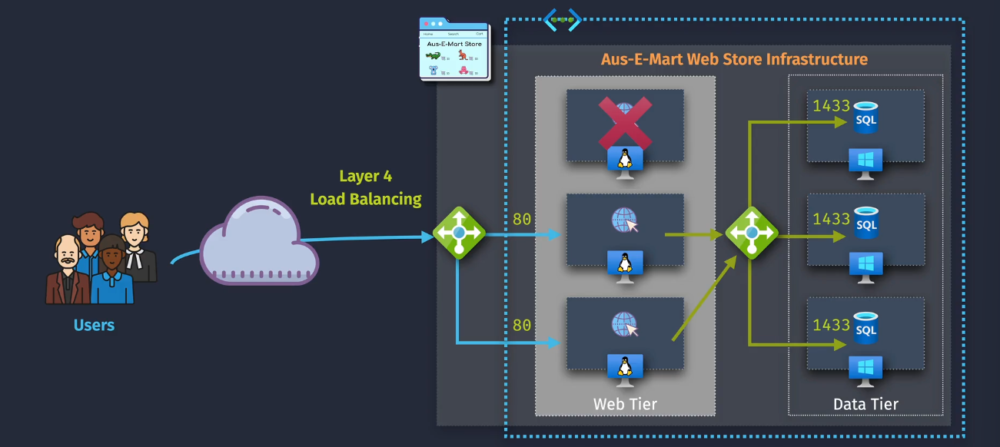
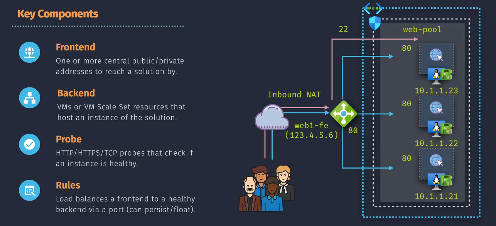
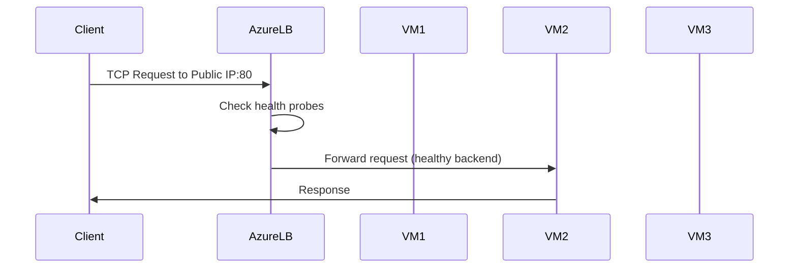
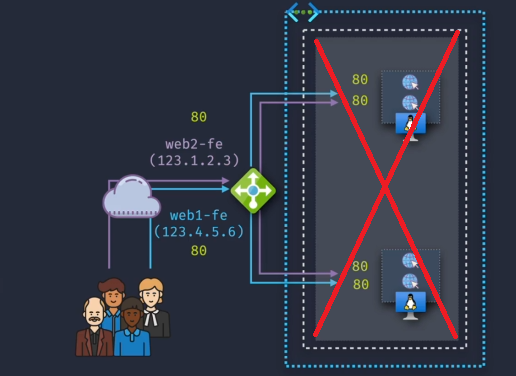
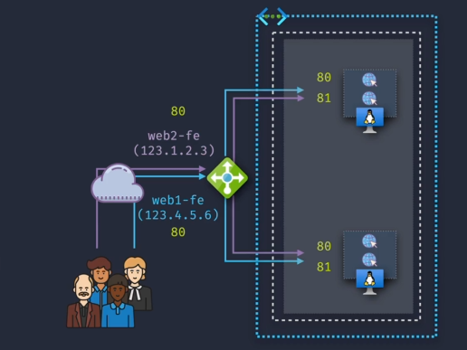
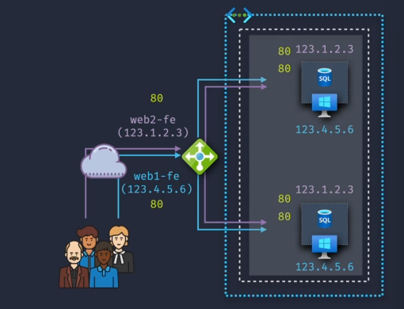
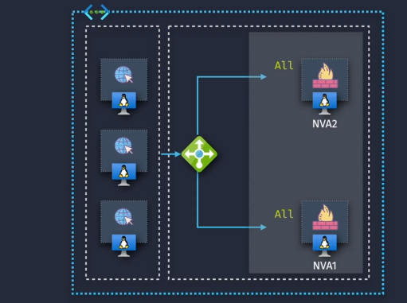

# ⚖️ Azure Load Balancer

## 🌍 1. What is Azure Load Balancer?

Azure Load Balancer is a **Layer 4 (TCP/UDP)** load balancer that distributes inbound or outbound traffic **based on transport layer information** (IP, port, protocol) across **healthy** backend resources like VMs, VM Scale Sets, or on-prem servers (via VPN/ExpressRoute).

> 💡 **AWS Parallel:** Azure Load Balancer ≈ AWS **Network Load Balancer (NLB)** — both operate at Layer 4, unlike Application Gateway (L7 like AWS ALB).

---

## 🧩 2. Key Features

- **Layer 4 Load Balancing** (TCP, UDP, ICMP probes for health).
- **Inbound & Outbound** scenarios.
- **High Availability** — spreads traffic only to healthy instances.
- **Zonal or Zone-redundant** deployments.
- **Cross-region support** for DR and global traffic routing.
- **No SSL/TLS termination** (for that, use Azure Application Gateway).

---

## 🗂 3. Types of Azure Load Balancer

| Type                                | Scope                  | Use Case                                               | Example                                        |
| ----------------------------------- | ---------------------- | ------------------------------------------------------ | ---------------------------------------------- |
| **🌐 Public Load Balancer**         | Internet-facing        | Distribute inbound internet traffic to Azure VMs/VMSS  | A public website with multiple backend servers |
| **🏠 Internal Load Balancer (ILB)** | Private network (VNet) | Distribute traffic inside Azure VNet or hybrid network | Backend microservices behind private IPs       |

> 💡 **AWS Parallel**
>
> - **Public Load Balancer** → AWS NLB (Internet-facing)
> - **Internal Load Balancer** → AWS NLB (Internal)

---

<div align="center">
  
</div>

---

## 🔍 4. Components

<div align="center">
  
</div>

<div align="center">
  
</div>

### 📌 4.1 **Frontend IP Configuration**

- **Description:** Represents the IP address that clients use to connect to the load balancer.
- **Types:**

  - **Public IP:** For public load balancers accessible from the internet.
  - **Private IP:** For internal load balancers accessible within a virtual network.

- Can have **multiple frontends** per Load Balancer.

### 📌 4.2 **Backend Pool**

- Set of VMs, VMSS instances, or NICs that will receive traffic.
- Instances must be in the **same region** as the Load Balancer.

### 📌 4.3 **Load Balancing Rules**

- Define how traffic maps from frontend → backend.
- Include:

  - Frontend IP
  - Protocol (TCP/UDP)
  - Port mapping
  - Backend pool
  - Health probe
  - **Session Persistence:** Determines if connections should stick to the same backend instance.

### 📌 4.4 **Health Probes**

- Periodically check backend health.
- Types: TCP, HTTP, HTTPS.
- If a probe fails, instance is removed from rotation.

  > 💡 **AWS Parallel**: Similar to **Target Group health checks** in AWS ELB/NLB.

### 📌 4.5. **Inbound NAT rules**

**Inbound NAT (Network Address Translation) rules** in Azure Load Balancer are used to forward traffic from a specific port of a public IP address (or a private IP in the case of an internal load balancer) to a specific port of a virtual machine in the backend pool. This is useful for scenarios where you need direct access to a specific VM for services like SSH or RDP.

**Example Use Case:**

Suppose you have three VMs in the backend pool, and you want to allow remote desktop access (RDP) to each VM via different ports on the same public IP address.

1. **Frontend IP Configuration**:
   - **Public IP Address**: `20.50.30.10`
2. **Backend Pool**:
   - **VM1**: `10.0.0.4`
   - **VM2**: `10.0.0.5`
   - **VM3**: `10.0.0.6`
3. **Inbound NAT Rules**:
   - **Rule 1**: Forward port `50001` on the public IP `20.50.30.10` to port `3389` on `VM1` (`10.0.0.4`)
   - **Rule 2**: Forward port `50002` on the public IP `20.50.30.10` to port `3389` on `VM2` (`10.0.0.5`)
   - **Rule 3**: Forward port `50003` on the public IP `20.50.30.10` to port `3389` on `VM3` (`10.0.0.6`)

### 📌 4.6 **Outbound SNAT Rules**

- Allow backend resources without public IPs to reach the internet.
- Uses **SNAT** (Source Network Address Translation) to share frontend IPs.

---

## 🚦 5. How It Works (Inbound)



---

## 🚀 6. Deployment Modes

| Mode               | Description                                    | Example                                       |
| ------------------ | ---------------------------------------------- | --------------------------------------------- |
| **Zonal**          | Load Balancer & frontend IP in a specific zone | App in Zone 1 only                            |
| **Zone-redundant** | Spans multiple AZs in a region                 | HA app across 3 zones                         |
| **Cross-region**   | Connects multiple region-specific LBs          | Global failover between East US & West Europe |

---

## 👔 7. SKU Types

Azure Load Balancer offers two SKU types, each with different features and capabilities:

### 💸 1. **Basic SKU**

- **Cost:** Lower cost option suitable for small-scale or non-critical applications.
- **Features:**

  - Limited to **100** frontend IP configurations.
  - **No Support for AZs**.
  - Support **Only HTTP/TCP** health Probes.
  - **Traffic opened by default** (requires NSG for security)
  - **Doesn't support HA Ports**.
  - **NO SLA**.

- **Use Case:** Ideal for development, testing, or small production environments with minimal traffic.

### 🤑 2. **Standard SKU**

- **Cost:** Higher cost but offers enhanced features and performance.
- **Features:**

  - Supports up to **1,000** frontend IP configurations.
  - **Supports AZs**.
  - Support **HTTP/HTTPS/TCP** health Probes.
  - **Traffic blocked by default**.
  - **Supports HA Ports**.
  - **99.99% SLA**

- **Use Case:** Suitable for large-scale, high-traffic, and mission-critical applications requiring robust performance and availability.

---

## ✍🏻 8. Example Scenarios

### Example 1 — **Public Web App**

- Public LB frontend IP: `20.x.x.x`
- Backend pool: 3 VMs in VMSS
- HTTP probe on `/health`
- Rule: TCP:80 → Backend TCP:80

### Example 2 — **Internal Microservices**

- ILB frontend: `10.0.0.5`
- Backend pool: 4 internal services
- Used by other services in the same VNet.
- No public exposure.

### Example 3 — **Outbound-Only**

- VM without public IP can access the internet via outbound rule on LB.

---

## 📜 9. Azure CLI Example — Public LB

```bash
# Create Public Load Balancer
az network lb create \
  --resource-group MyRG \
  --name MyPublicLB \
  --sku Standard \
  --frontend-ip-name MyFrontEnd \
  --backend-pool-name MyBackEndPool \
  --public-ip-address MyPublicIP

# Add load balancing rule
az network lb rule create \
  --resource-group MyRG \
  --lb-name MyPublicLB \
  --name HTTPRule \
  --protocol Tcp \
  --frontend-port 80 \
  --backend-port 80 \
  --frontend-ip-name MyFrontEnd \
  --backend-pool-name MyBackEndPool \
  --probe-name MyHTTPProbe
```

---

## ✅ 10. Best Practices

- ✅ Always use **Standard SKU** for production — supports zones, secure by default.
- ✅ Use **ZRS public IP** for zone redundancy.
- ✅ Configure **proper health probes** to avoid blackholing traffic.
- ✅ For SSL/TLS offloading or WAF, pair with **Azure Application Gateway** in front.
- ✅ Monitor via **Azure Monitor → Metrics** for connections, health probe status, SNAT port exhaustion.

---

---

## Important Considerations

When configuring Azure Load Balancer, it's crucial to be aware of certain options and settings to optimize performance and security.

### 1. **Sticky Sessions (Persistence)**

- **What It Is:** Ensures that a client consistently connects to the same backend instance for the duration of a session.
- **How It Works:**
  - **Enabled:** Uses cookies or source IP affinity to maintain session persistence.
  - **Disabled:** Distributes requests to backend instances without maintaining session consistency.
- **Use Case:** Useful for applications that store session state locally on the backend instances, such as certain web applications.

### 2. **Matching SKUs**

- **What It Is:** Ensures that the SKU of the public IP address matches the SKU of the load balancer.
- **Why It Matters:**
  - **Consistency:** Prevents configuration mismatches that can lead to connectivity issues.
  - **Compatibility:** Certain features are only available when SKUs align correctly.
- **Recommendation:** Always verify that the public IP SKU (Basic or Standard) matches the load balancer SKU to ensure seamless operation.

### 3. **Floating IPs**





- **What It Is:** Allows the load balancer to direct traffic to multiple backend instances on the same port using the same frontend IP.
- **How It Works:**
  - **Enabled:** Supports direct server return (DSR), allowing backend instances to respond directly to clients.
  - **Disabled:** All responses go through the load balancer, which can add slight latency.
- **Use Case:** Essential for scenarios requiring high availability and failover, such as active-active configurations.

### 4. **HA Ports (High Availability Ports)**



- **What It Is:** Allows the load balancer to handle all protocols on all ports simultaneously.
- **How It Works:**
  - **Enabled:** Supports multiple protocols (TCP, UDP) across all ports, ensuring comprehensive load balancing coverage.
  - **Disabled:** Restricts load balancing to specific protocols and ports as defined by rules.
- **Use Case:** Necessary for applications that require simultaneous handling of diverse protocols and a wide range of ports, ensuring all traffic is appropriately balanced.

## Summary

**Azure Load Balancer** is a powerful and flexible service that ensures your applications remain highly available, scalable, and reliable by efficiently distributing network traffic across multiple resources. Understanding its types, key components, use cases, SKU options, and important configuration considerations is essential for optimizing your Azure infrastructure.

- **Types:** Choose between **Public Load Balancer** for internet-facing applications and **Internal Load Balancer** for internal traffic distribution.
- **Key Components:** Frontend IPs, backend pools, load balancing rules, health probes, and inbound/outbound rules form the backbone of effective load balancing.
- **Use Cases:** Ideal for web applications, gaming services, database clusters, multi-tier architectures, and hybrid deployments.
- **SKU Types:** Select **Basic** for cost-effective, small-scale deployments or **Standard** for enhanced features and large-scale applications.
- **Important Considerations:** Configure sticky sessions, ensure SKU matching, utilize floating IPs, and enable HA ports to meet your specific networking needs.
