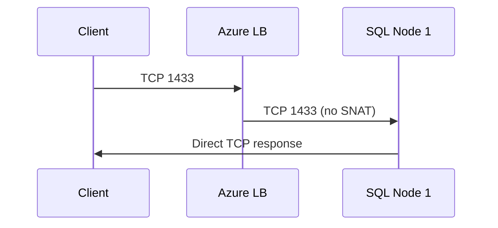

# ⚖️ Azure Load Balancer — Advanced Configuration Considerations

> This section is about **fine-tuning your Azure Load Balancer** so it doesn’t just _work_, but works **optimally, securely, and with the right feature set**.

---

## 1️⃣ Sticky Sessions (Session Persistence) 🍪

### 📌 What It Is

A **sticky session** (also called _session affinity_) ensures that once a client connects to a backend VM, **all future requests from that same client go to the same VM** for the lifetime of the session.

---

### 🔍 How It Works in Azure LB

- **Session persistence** is configured **per Load Balancing Rule**.
- Azure LB uses **Source IP Affinity** (a.k.a. _2-tuple_ or _3-tuple_ hashing) to make sure the same client IP hits the same backend.

| Mode                     | Description                                          | Example                                  |
| ------------------------ | ---------------------------------------------------- | ---------------------------------------- |
| **None**                 | No persistence, each request is routed independently | Good for stateless APIs                  |
| **Client IP**            | Maps based on client’s IP address                    | All requests from 203.0.113.25 → same VM |
| **Client IP + Protocol** | Maps based on client IP + protocol (TCP/UDP)         | HTTP vs HTTPS connections separated      |

---

### 💡 Use Case

- ✅ When backend VMs store **local session state** (e.g., ASP.NET in-process session state) rather than using Redis/AppFabric/SQL Session State.
- ⚠️ Not recommended for truly stateless apps — it can create uneven load distribution.

---

## 2️⃣ Matching SKUs (Public IP & Load Balancer) 🎯

### 📌 What It Is

Your **Public IP Address SKU** must match your **Load Balancer SKU** — otherwise, they won’t work together.

---

### 🔍 Why It Matters

- **Basic Public IP** ↔ **Basic Load Balancer**
- **Standard Public IP** ↔ **Standard Load Balancer**
- A mismatch = failed frontend binding.

---

### 📊 Feature Differences

| Feature            | Basic SKU            | Standard SKU               |
| ------------------ | -------------------- | -------------------------- |
| Availability Zones | ❌                   | ✅                         |
| Cross-region LB    | ❌                   | ✅                         |
| Secure by default  | ❌ (Open by default) | ✅ (Closed unless allowed) |
| SLA                | None                 | 99.99%                     |

---

### 💡 Best Practice

- Always check SKU match **before** associating IP with LB.
- For production — **always** use Standard SKU (better security + HA + SLA).

---

## 3️⃣ Floating IPs (Direct Server Return) 🌊

### 📌 What It Is

Enables **Direct Server Return (DSR)** — where the **frontend IP + backend port are the same** for multiple backends, and backend VMs can reply directly to the client without going back through the LB.

---

### 🔍 How It Works

- Enabled **per Load Balancing Rule**.
- Used for **HA configurations** (e.g., SQL Always On, NLB migration).

---

**Traffic Flow Example with Floating IP ON:**

---

### 💡 Use Case

- Database clustering (SQL Always On, MySQL HA)
- Failover scenarios where IP must remain constant

⚠️ **Not for web apps** — they usually require the LB to handle all responses.

---

## 4️⃣ HA Ports (High Availability Ports) 🚪

### 📌 What It Is

A **catch-all load balancing mode** — instead of defining individual LB rules for each port, you enable HA Ports so **all TCP/UDP ports** are load balanced.

---

### 🔍 How It Works

- Applies to **internal load balancers** only (for backend workloads).
- Single LB rule → matches **all ports, all protocols**.
- Health probes still required to check backend availability.

---

### 💡 Use Case

- NVA (Network Virtual Appliances)
- Azure Firewall load balancing
- VPN gateways needing multi-port handling

---

## 📦 Summary Table — Advanced LB Options

| Feature         | Purpose                      | Where to Use               | Caution                 |
| --------------- | ---------------------------- | -------------------------- | ----------------------- |
| Sticky Sessions | Keep same client on same VM  | Local session state apps   | Uneven load possible    |
| Matching SKUs   | Ensure IP & LB compatibility | All deployments            | Mismatch = broken LB    |
| Floating IPs    | Direct Server Return for HA  | DB clusters, NLB migration | Not for normal web apps |
| HA Ports        | LB all ports/protocols       | NVAs, Azure Firewall       | Internal LB only        |

---

## 💡 Quick Best Practices

- ✅ Use **Standard SKU** for production
- ✅ Enable **HA Ports** for appliances needing full port handling
- ✅ Avoid Sticky Sessions for stateless apps
- ✅ Document **SKU match** in infra diagrams to avoid config issues
