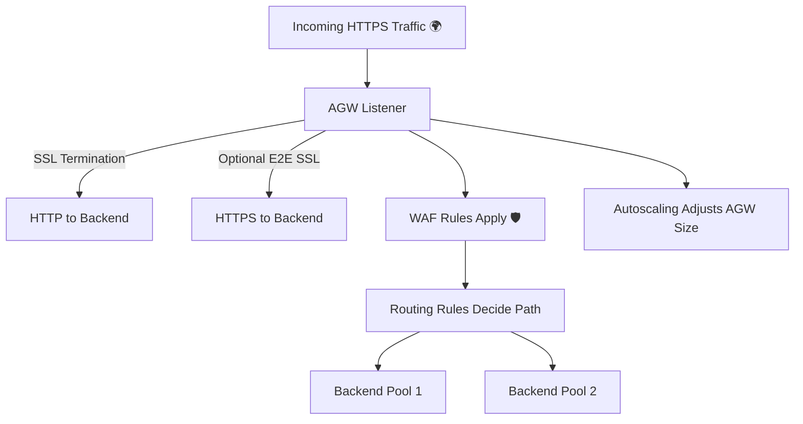

# 🎯 Azure Application Gateway – Important Considerations

These are the **"must-think-about" knobs** before you put AGW into production.
Skip them, and you risk **slow apps**, **security holes**, or **bloated bills**.

---

## 1️⃣ **SSL Termination** 🔐

**🛑 Problem:**
If your backend servers handle SSL/TLS encryption themselves, they waste CPU cycles doing encryption math instead of serving content.
Also, you have to manage and renew certificates on each backend — which is a pain.

**💡 Solution:**
Let **Application Gateway decrypt traffic** for you (SSL termination) at the **edge**.
Your backends can then receive HTTP instead of HTTPS.

**⚙ How It Works:**

- Upload your SSL cert to AGW.
- Create an **HTTPS listener** that uses that cert.
- AGW decrypts incoming requests, routes traffic, and sends HTTP to backend.

**✅ Benefits:**

- Backend CPU freed up for business logic.
- One place for cert management.
- Easier troubleshooting (you can inspect clear HTTP between AGW and backend).

**⚠ Considerations:**

- Traffic from AGW to backend is **unencrypted** unless you enable **end-to-end SSL**.
- Store certs securely (Key Vault integration is best).
- Always use modern TLS protocols (TLS 1.2 or 1.3).

---

## 2️⃣ **Web Application Firewall (WAF)** 🛡

**🛑 Problem:**
Your web app is exposed to **SQL injection**, **XSS**, **bots**, and other **OWASP Top 10** nasties.
Without an edge security layer, you’re relying on app-level validation alone.

**💡 Solution:**
Enable **WAF** mode in AGW to filter out bad requests **before** they hit your backend.

**⚙ How It Works:**

- AGW inspects HTTP(S) requests at Layer 7.
- Matches them against OWASP Core Rule Sets (CRS).
- Blocks or logs suspicious traffic.

**✅ Benefits:**

- Protects from most common web attacks.
- Can create **custom rules** for your app logic.
- Integrated logging to Azure Monitor for auditing.

**⚠ Considerations:**

- Use **Prevention mode** in production; **Detection mode** for testing.
- Keep CRS updated — new threats appear monthly.
- Watch for false positives — tune rules if legitimate requests are blocked.

---

## 3️⃣ **Routing Rules** 🛣

**🛑 Problem:**
Without smart routing, all requests end up in one backend pool, even if some are for images, some for APIs, some for a blog — wasting resources and complicating scaling.

**💡 Solution:**
Use **Routing Rules** in AGW to send traffic to the **right backend pool** based on URL, host header, or both.

**⚙ Types of Rules:**

- **Basic:** One listener → One backend pool.
- **Path-based:** `/api/*` → API pool, `/images/*` → storage pool.
- **Multi-site:** `shop.example.com` → Pool A, `blog.example.com` → Pool B.

**✅ Benefits:**

- Efficient use of backend resources.
- Easier scaling per workload type.
- Supports multi-app hosting with one AGW.

**⚠ Considerations:**

- Order matters — more specific rules should be evaluated before general ones.
- Document your routing logic — future you will thank you.
- Test rules with dummy requests before production.

---

## 4️⃣ **Autoscaling** 📈

**🛑 Problem:**
Fixed-size AGWs either choke under peak load or waste money sitting idle at 5% usage.

**💡 Solution:**
Enable **Autoscaling SKU** so AGW adjusts instance count dynamically based on traffic.

**⚙ How It Works:**

- You set **min** and **max** instance limits.
- Azure monitors CPU, connection count, throughput, and scales accordingly.

**✅ Benefits:**

- Handles traffic spikes without manual intervention.
- Saves money during quiet hours.
- Keeps latency low for end users.

**⚠ Considerations:**

- Don’t set `max` too low — you’ll throttle yourself under sudden spikes.
- Monitor scale-out events in Azure Monitor to fine-tune thresholds.
- Autoscaling isn’t instant — expect a short ramp-up time.

---

## 📌 **Summary**

---

## 💡 **Pro Tips Before You Deploy**

- Store certs in **Azure Key Vault** and bind via identity for automation.
- If you need **global routing + caching**, use **Front Door** in front of AGW.
- For private apps, use **Private Link** to keep all traffic inside your VNet.
- Always enable **WAF logs** and stream them to Log Analytics for security audits.
