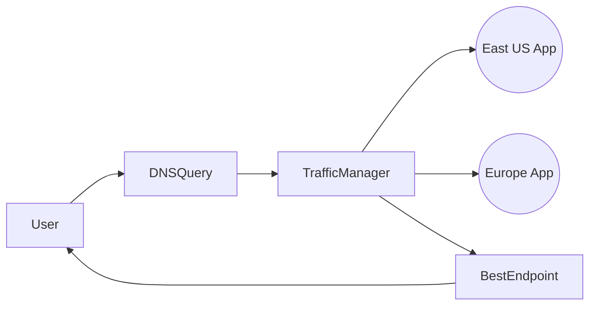
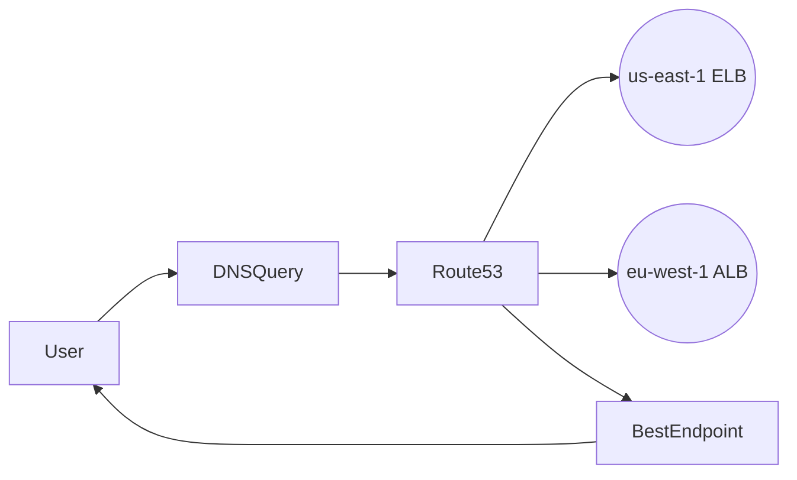

# ⚔️ Azure Traffic Manager vs AWS Route 53 – The DNS Duel 💥

| Feature 🔍                      | 🌐 **Azure Traffic Manager**                                    | 🛰️ **AWS Route 53**                                  |
| ------------------------------- | --------------------------------------------------------------- | ---------------------------------------------------- |
| 🌍 **Type**                     | DNS-based Traffic Routing                                       | DNS + Domain Registrar                               |
| 🧠 **Routing Logic**            | Performance, Priority, Geographic, Weighted, Subnet, Multivalue | Latency, Failover, Geolocation, Weighted, Multivalue |
| ⚙️ **Custom Domain Management** | ❌ Not a domain registrar                                       | ✅ Yes, Route 53 = DNS + Domain Name Service         |
| 🔌 **Integration**              | Azure-native services, external endpoints                       | AWS-native services, external endpoints              |
| 💓 **Health Checks**            | Built-in probes (HTTP, TCP)                                     | Optional health checks (paid)                        |
| 🏛️ **DNS Zones**                | Requires separate Azure DNS                                     | Fully integrated in Route 53                         |
| 📦 **Nested Profiles**          | ✅ Yes (combine routing methods)                                | ❌ Not natively supported                            |
| 🚪 **Proxy Traffic?**           | ❌ No (DNS only)                                                | ❌ No (DNS only)                                     |
| 🧪 **A/B Testing?**             | ✅ Weighted profiles + TTL                                      | ✅ Weighted records + TTL                            |
| 💸 **Pricing Model**            | DNS queries + health probes                                     | DNS queries + optional health checks                 |

---

## 🧠 TL;DR — Conceptual Similarity

> Both are **DNS-based global traffic routers**, great for:

- **Global failover**
- **Latency-based routing**
- **Weighted A/B testing**
- **Geolocation control**
- **Multi-cloud or hybrid routing**

But…

| Azure Traffic Manager                        | AWS Route 53                            |
| -------------------------------------------- | --------------------------------------- |
| Built for **Azure-centric** workloads        | Built for **AWS-centric** workloads     |
| Doesn’t manage domains                       | Can buy and manage domains              |
| Supports **nested profiles**                 | Doesn’t support profile chaining        |
| Health probes always included                | Health checks = **extra config + cost** |
| Must pair with **Azure DNS** to manage zones | Route 53 does it all in one place       |

---

## 🖼️ Real Visual Example

### User Request Flow with Azure Traffic Manager

### Same with AWS Route 53

---

## 🧪 Use Case Mapping

| Use Case             | Azure Traffic Manager | AWS Route 53                                     |
| -------------------- | --------------------- | ------------------------------------------------ |
| Global failover      | ✅ Priority method    | ✅ Failover routing                              |
| Geo-specific content | ✅ Geographic routing | ✅ Geolocation routing                           |
| Low latency          | ✅ Performance method | ✅ Latency-based routing                         |
| Blue-green deploy    | ✅ Weighted routing   | ✅ Weighted routing                              |
| IP-based routing     | ✅ Subnet method      | ✅ (Not directly, but possible via custom rules) |
| Multiple IP return   | ✅ Multivalue routing | ✅ Multivalue answer routing                     |

---

## 🧠 Pro Insight

> **If you're Azure-native**, Traffic Manager is your go-to DNS balancer.
> **If you're AWS-native**, Route 53 is the default answer for DNS + domain + routing.

✅ Both support **external endpoints**, so hybrid and multi-cloud is fair game.

---

## ⚙️ Recommendation Matrix

| Scenario                                     | Best Choice                                       |
| -------------------------------------------- | ------------------------------------------------- |
| 🧱 Need domain registration + DNS            | AWS Route 53                                      |
| 🔁 Need complex routing with nested profiles | Azure Traffic Manager                             |
| 🔐 Need DNS + WAF + SSL offload              | Pair both with L7 proxy (Front Door / CloudFront) |
| 🧪 Want free health checks by default        | Azure Traffic Manager                             |
| 🛠️ Want to manage DNS records in one place   | AWS Route 53 (integrated)                         |
