# 🌍 Azure Front Door vs AWS Equivalent Services

> There is **no single AWS service** that matches Azure Front Door 1:1  
> Instead, AFD **combines features** of multiple AWS services into one global edge offering.

---

## 🗺️ High-Level Mapping

| Azure Front Door Feature                     | Closest AWS Equivalent                                                    | Notes                                                                                                                   |
| -------------------------------------------- | ------------------------------------------------------------------------- | ----------------------------------------------------------------------------------------------------------------------- |
| **Global Anycast IP**                        | **Amazon CloudFront + Route 53**                                          | CloudFront uses global edge locations; Route 53 gives DNS-based global endpoint.                                        |
| **Layer 7 Load Balancing (HTTP/HTTPS)**      | **Amazon Application Load Balancer (ALB)** (but **only regional** in AWS) | In AWS, ALB is regional — for global routing you combine ALB + Route 53.                                                |
| **Web Application Firewall (WAF)**           | **AWS WAF**                                                               | AWS WAF attaches to ALB, API Gateway, or CloudFront; in Azure, WAF is integrated into AFD.                              |
| **Dynamic Site Acceleration**                | **CloudFront + Global Accelerator**                                       | AFD routes traffic through Microsoft’s backbone; AWS uses Global Accelerator for TCP/UDP and CloudFront for HTTP/HTTPS. |
| **Rules Engine (Header rewrite, redirects)** | **CloudFront Functions / Lambda\@Edge**                                   | Both let you manipulate requests/responses at the edge.                                                                 |
| **Caching at Edge**                          | **CloudFront**                                                            | Same idea — AFD caches static content at POPs; CloudFront does it in AWS.                                               |
| **Multi-Region Failover**                    | **Route 53 Health Checks + ALB**                                          | AFD handles failover instantly at edge; AWS does DNS-based failover with TTL.                                           |
| **Private Link to Backend** (Premium SKU)    | **AWS PrivateLink + CloudFront Origin Access Control**                    | Lets AFD connect privately to backend without exposing public IP.                                                       |

---

## 🧠 AWS-to-Azure Thinking Shift

If you’ve built **global apps in AWS**:

- In AWS:

  ```ini
  Route 53 → CloudFront (optional) → ALB (Regional) → EC2/ECS/Lambda
  ```

  - Route 53 = DNS-based routing (Geo, Latency, Failover).
  - CloudFront = Edge caching + WAF.
  - ALB = Layer 7 routing within one region.
  - Global Accelerator (optional) = Anycast IP with TCP/UDP acceleration.

---

- In Azure with Front Door:

  ```ini
  Azure Front Door (Anycast + Caching + WAF + L7 Routing) → App Service / VMSS / AKS
  ```

  - No separate DNS-level failover — handled by Front Door’s global edge.
  - WAF built-in, rules configured in the same console.
  - Global performance baked in by default.

---

## 🚦 Traffic Flow Comparison

### AWS Style

```mermaid
flowchart LR
    User --> Route53[🌍 Route 53]
    Route53 --> CF[🌐 CloudFront]
    CF --> WAF[🔒 AWS WAF]
    WAF --> ALB[🚪 Application Load Balancer]
    ALB --> Backend[💻 EC2/ECS/Lambda]
```

<div align="center">



</div>

---

### Azure Style

```mermaid
flowchart LR
    User --> AFD["🌍 Azure Front Door </br> (Anycast + WAF + Caching)"]
    AFD --> Backend[💻 App Service / VMSS / AKS]
```

<div align="center">



</div>

> **Notice:** Azure collapses multiple AWS components into **one managed edge service**.

---

## 📌 Example: Multi-Region E-Commerce

**AWS Approach:**

1. Deploy ALB in **us-east-1** and **ap-southeast-1**.
2. Put CloudFront in front, with **origin failover** to ALBs.
3. Attach AWS WAF to CloudFront.
4. Configure Route 53 latency routing between CloudFront distributions (if needed).
5. Optionally, add AWS Global Accelerator for faster TCP handshakes.

**Azure Approach:**

1. Deploy App Service in **East US** and **Southeast Asia**.
2. Create Azure Front Door profile with **both backends** in one backend pool.
3. Set priority routing (failover) or weighted.
4. Enable WAF in the same portal.
5. Enable caching for static assets — done.

---

## 🛠 Key AWS vs Azure Differences

| Feature                    | AWS                                       | Azure                         |
| -------------------------- | ----------------------------------------- | ----------------------------- |
| **Routing logic**          | Split between Route 53 (DNS) and ALB (L7) | Single service at L7 globally |
| **Anycast IP**             | Global Accelerator only (paid extra)      | Built-in with Front Door      |
| **WAF Integration**        | Separate AWS WAF config                   | Integrated WAF Policy         |
| **Edge Compute**           | Lambda\@Edge / CloudFront Functions       | Rules Engine                  |
| **Private Backend Access** | CloudFront OAC + PrivateLink              | Premium SKU with Private Link |

---

> 💡 **Rule of Thumb:**  
> If you know AWS **CloudFront + Route 53 + ALB + WAF + Global Accelerator**,
> then **Azure Front Door is basically those rolled into one**, with management centralized and always global.
