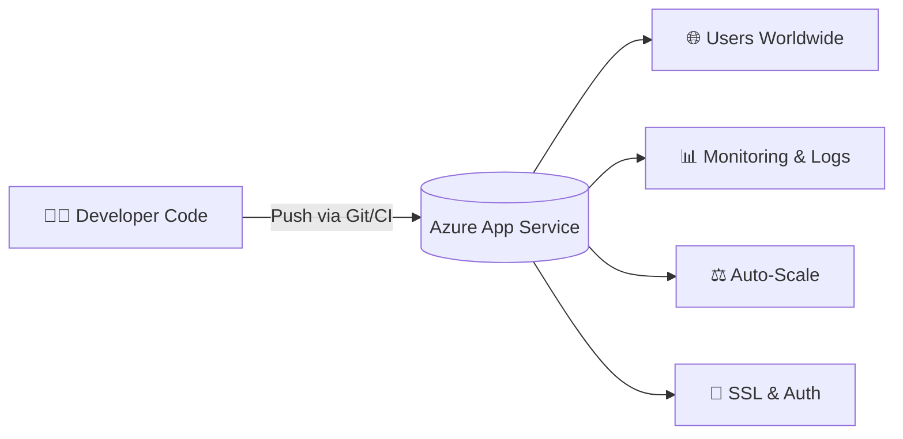
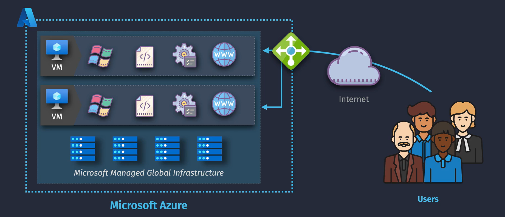
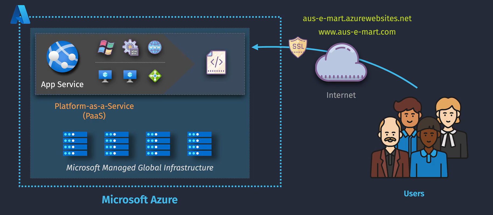
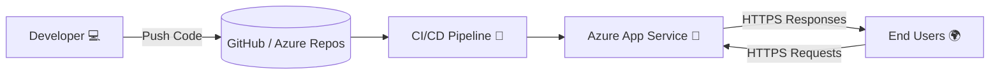

# 🚀 Azure App Service

> “Write code. Push it. Run it. Scale it. Secure it. Sleep well.” – That’s the **Azure App Service** promise.

---

## 🧠 What is Azure App Service?

> **Official Definition**:
> **Azure App Service** is a fully managed **Platform as a Service (PaaS)** offering for hosting **web apps, REST APIs, and mobile backends**.

It takes care of:

- 🖥️ Server provisioning
- 🔃 OS patching
- ♎ Auto-scaling
- 🌐 Load balancing
- 🚀 CI/CD
- 🔐 Custom domains + SSL

In short: **You focus on code**, Azure handles the **infrastructure, scalability, and uptime**.

---

## 🧱 App Service = PaaS for Web Apps

---

## ⚖️ Without vs. With App Service

- **Without App Service**: Developers must manage servers, networking, and scaling manually.

  

- **With App Service**: Infrastructure is fully managed, allowing developers to focus on application development and logic.

  

## 🧩 What Can You Host?

| Type                             | Description                                         | Example                   |
| -------------------------------- | --------------------------------------------------- | ------------------------- |
| 🌐 Web App                       | Full-stack app (HTML, JS, .NET, Java, Python, etc.) | React + Flask             |
| ⚙️ API App                       | RESTful services or microservices                   | .NET Core Web API         |
| 📱 Mobile Backend                | APIs for mobile apps with push notifications        | Backend for iOS/Android   |
| 🌉 App Service Environment (ASE) | Isolated, private App Service (VNET)                | Banking, enterprise       |
| 🛑 Static Web Apps               | Different service, better for Jamstack              | Use Azure Static Web Apps |

---

## 🕌 Resource Hierarchy

Azure App Service operates within a clear hierarchy to organize resources effectively.

  

### 📌 1. **App Service Plan**

- **Defines the compute resources for hosting your app.**
- **Pricing tiers:** Free, Shared, Basic, Standard, Premium, and Isolated.
- Determines features like **scaling**, **custom domains**, **SSL support**, and **dedicated resources**.

### 📌 2. **App**

- The individual application hosted within an App Service Plan.
- Supports multiple deployment slots for staging, testing, and production environments.

### 📌 3. **Resource Group**

- A logical container for related resources.
- Simplifies resource management, access control, and billing.

---

## 🏗️ App Service Plan (Very Important!)

> The **App Service Plan** defines the **compute resources** (CPU, memory, scaling) your app runs on.

| Tier              | Use Case                      | Features                                 |
| ----------------- | ----------------------------- | ---------------------------------------- |
| 🆓 Free / Shared  | Demos, testing                | Limited scale, no custom domains         |
| 🏃‍♂️ Basic          | Dev/Test                      | **Manual scale**                         |
| ⚖️ Standard       | Prod apps                     | **Auto-scale**, **staging slots**        |
| 🚀 Premium        | High traffic                  | **VNET support**, faster SSD, more scale |
| 🛡️ Isolated (ASE) | High-security, VNET-only apps | **Dedicated subnet**, massive scaling    |

> 💡 Multiple apps can **share the same App Service Plan** to save cost — but they share the same resources.

---

## 🚀 Supported Tech Stack

| Platform                 | Supported                    |
| ------------------------ | ---------------------------- |
| 🟦 .NET / .NET Core      | ✅                           |
| ☕ Java                  | ✅                           |
| 🐍 Python                | ✅                           |
| 🐘 PHP                   | ✅                           |
| 🟨 Node.js               | ✅                           |
| 🐧 Linux Containers      | ✅                           |
| 🐳 Docker (custom image) | ✅ via App Service for Linux |

---

## 🔄 Deployment Methods

Azure App Service supports **continuous deployment** from almost any source:

| Source                     | Supported           |
| -------------------------- | ------------------- |
| 💻 Local Git Push          | ✅                  |
| 🔧 GitHub                  | ✅                  |
| 🏭 Azure DevOps            | ✅                  |
| 🐳 Docker Hub              | ✅                  |
| 🪣 Azure Container Registry | ✅                  |
| 📂 FTP, ZIP Deploy         | ✅                  |
| 🧪 CI/CD Pipelines         | ✅ with YAML or GUI |

---

## 🧪 Deployment Slots = Zero-Downtime Deploys

> A **deployment slot** is a live environment (like staging, QA) linked to your App Service.

| Feature            | Benefit                           |
| ------------------ | --------------------------------- |
| 🔁 Swap            | Instantly switch staging <-> prod |
| 🔬 Test in staging | Test with prod config             |
| 🛡️ Rollback        | Failed deploy? Just swap back     |
| ⚠️ Premium Plan    | Slots need Standard+ plans        |

---

## 🖼 **How It Works**

- Your **code** gets deployed into an **App Service**.
- It **runs on VMs** managed by Azure (via the App Service Plan).
- Azure handles **load balancing**, **OS/runtime patches**, and **high availability**.

---

## 📜 **Example – Deploy a Node.js Web App**

1. **Create App Service Plan** (S1 tier, East US, Linux).
2. **Create App Service** → Choose Node.js 20 runtime.
3. **Configure Custom Domain** → `app.mydomain.com`.
4. **Set Deployment** → Connect to GitHub repo.
5. **Enable Autoscale** → 2–5 instances based on CPU.
6. **Deploy** → Azure automatically starts serving traffic.

---

## 📌 **Best Practices**

- Separate **dev/test/prod** apps into **different App Service Plans**.
- Use **Premium/Isolated** tier for VNet integration or high performance.
- Always enable **HTTPS Only** in App Settings.
- Use **Deployment Slots** for zero-downtime updates.
- Enable **App Insights** for monitoring performance.

---

## 🧠 Built-in Features

| Feature                 | Description                                      |
| ----------------------- | ------------------------------------------------ |
| 🌐 Custom Domains       | map your own domain (e.g. mysite.com)            |
| 🔐 SSL (HTTPS)          | Free App Service-managed or upload your own cert |
| 👥 Auth                 | Azure AD, Google, Facebook, Twitter, etc.        |
| 📈 Monitoring           | App Insights, Logs, Metrics                      |
| 🔄 Scaling              | Manual, Schedule, or CPU-based auto-scale        |
| 🔥 App Restart on Crash | Built-in resiliency                              |
| 🔧 DevOps Integration   | Azure DevOps, GitHub Actions                     |

---

## 🛡️ Security Features

| Security Layer      | Feature                                 |
| ------------------- | --------------------------------------- |
| 🔐 SSL              | TLS 1.2, free certs                     |
| 🧑‍🤝‍🧑 Identity         | Azure AD auth, role restrictions        |
| 🔒 IP Restrictions  | Allow/block IPs                         |
| 🧱 VNET Integration | Inject app into VNET (Premium+)         |
| 🪪 Managed Identity  | Access Key Vault, Storage, etc.         |
| 👀 App Secrets      | Use App Settings + Key Vault references |

---

## 🌍 Scaling Your App

| Method       | Type                   | Description                      |
| ------------ | ---------------------- | -------------------------------- |
| 📏 Manual    | Vertical or Horizontal | Add more power or more instances |
| ⏰ Scheduled | Horizontal             | Scale up during business hours   |
| 🔥 CPU-based | Horizontal             | Auto-scale when CPU > threshold  |
| 🚀 Scale Out | More instances         | Handle more load                 |
| 🧹 Scale In  | Fewer instances        | Save cost when idle              |

---

## 💡 Use Cases

| Scenario                 | Why App Service?                     |
| ------------------------ | ------------------------------------ |
| 🧪 Dev/Test              | Fast deploy, low setup               |
| 📦 Microservices         | API-first deployments                |
| 🌍 Global Web App        | Auto-scale + load balancing          |
| 🔐 Secure Enterprise App | VNET, identity, Key Vault            |
| 🧪 Blue-Green Deployment | Deployment slots + swap              |
| 💻 Multi-tech Teams      | Supports .NET, Java, Python, Node.js |

---

## 📊 Pricing Summary

> You **pay for the App Service Plan**, **not per app**.

| Tier     | Cost   | Features                                |
| -------- | ------ | --------------------------------------- |
| Free     | \$0    | 1GB, no custom domain                   |
| Basic    | Low    | Manual scaling                          |
| Standard | Med    | Auto-scale, SSL, staging slots          |
| Premium  | High   | VNET, high scale, SSD                   |
| Isolated | \$\$\$ | ASE in VNET, enterprise-level isolation |

---

## 🧠 Pro Tips

- 🛑 Don’t put too many heavy apps in one App Service Plan — **they share CPU/RAM**!
- 🔐 Use **Managed Identity** to securely access Azure Storage, Key Vault, etc.
- 🧪 Use **staging slots** for safe releases.
- 🔎 Enable **Application Insights** for deep diagnostics and live metrics.
- 🏷️ Use **tags** and naming conventions to manage costs.

---

## ⚙️ App Service vs Azure Alternatives

| Feature               | App Service | Azure Container Apps | AKS           | Functions                |
| --------------------- | ----------- | -------------------- | ------------- | ------------------------ |
| Type                  | PaaS        | Microservices PaaS   | Kubernetes    | Serverless               |
| Infra Managed?        | ✅ Yes      | ✅ Yes               | ❌ You manage | ✅ Yes                   |
| Long-running Web Apps | ✅ Yes      | ✅ Yes               | ✅            | ❌ Use Durable Functions |
| Per-second billing    | ❌          | ✅                   | ❌            | ✅                       |
| Container Support     | ✅          | ✅ Native            | ✅            | ✅ via Premium plan      |

---

## ✅ Summary

| Feature         | Value                                  |
| --------------- | -------------------------------------- |
| 💡 Type         | PaaS (Platform as a Service)           |
| ⚙️ Languages    | .NET, Node.js, Java, Python, PHP, etc. |
| 🚀 Deploy From  | GitHub, DevOps, Git, Docker            |
| 🔄 Scaling      | Manual, auto-scale, schedule           |
| 🔒 Secure       | SSL, Identity, VNET                    |
| ⚡ Performance  | Backed by scalable compute             |
| 🧪 Safe Deploys | Deployment slots                       |
