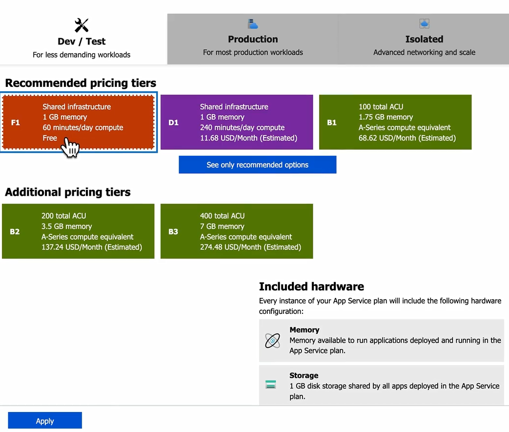
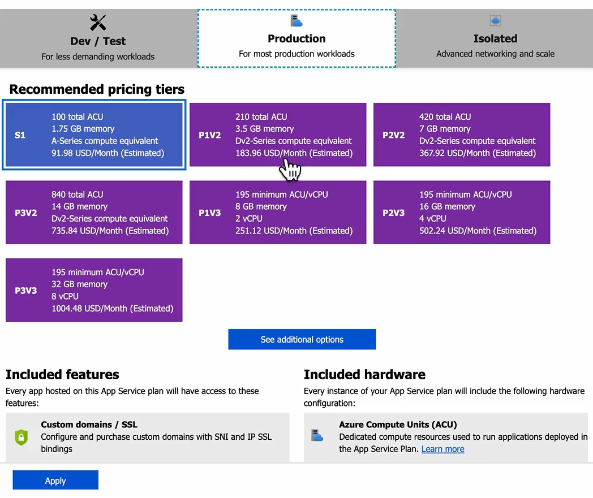

# 🏗 Azure App Service Plan (ASP)

## 🛑 **Problem** – Why App Service Plan Exists

When you run **Azure App Service** (Web App, API App, Function App, etc.),
the app code itself is **just the passenger** — it needs a **driver & vehicle** (compute, scaling, pricing) to run.

That **driver & vehicle** is the **App Service Plan**.

---

## ✅ **Definition**

**Azure App Service Plan** = The **compute resource container** for running your App Services.

It defines:

- 💰 **Pricing tier** (Free → Premium → Isolated)
- ⚙️ **VM size & specs** (CPU, RAM, storage)
- 📈 **Scaling options** (manual, auto-scale)
- 🛠 **Features** (custom domains, SSL, backups, VNet integration, staging slots, etc.)

**AWS Equivalent:**

- Similar to **AWS Elastic Beanstalk Environment** or **AWS Lambda + Provisioned Concurrency** (for Functions).
- Also partly like **EC2 Auto Scaling Group** but **dedicated only to App Service workloads**.

---

## 🧩 **App Service Plan Components**

| Component         | Description                         | Example                                          |
| ----------------- | ----------------------------------- | ------------------------------------------------ |
| **Region**        | Where the underlying compute lives. | `East US`                                        |
| **Instance Size** | VM specs behind the plan.           | `B1` (1 core, 1.75 GB RAM)                       |
| **Tier**          | Determines cost + features.         | Free, Shared, Basic, Standard, Premium, Isolated |
| **Scaling**       | Manual or automatic scaling rules.  | Scale out to 3 instances at 80% CPU              |
| **Workload Type** | Linux or Windows environment.       | Web App on Linux                                 |

---

## 📦 **Tiers & Features**

| Tier                    | Pricing | Features                                      | Use Case               |
| ----------------------- | ------- | --------------------------------------------- | ---------------------- |
| **Free (F1)**           | \$0     | 1 GB memory, shared compute                   | Test apps              |
| **Shared (D1)**         | Low     | Shared VM, limited scaling                    | Dev/test               |
| **Basic (B1-B3)**       | Paid    | Dedicated VMs, no autoscale                   | Small prod             |
| **Standard (S1-S3)**    | Paid    | Autoscale, staging slots, backups             | Typical prod workloads |
| **Premium (P1v3-P3v3)** | Higher  | More instances, better perf, VNet integration | High traffic apps      |
| **Isolated (I1-I3)**    | \$\$\$  | Private network, dedicated environment        | Compliance-heavy apps  |

---

  

---

  

---

## 📜 **Scaling**

- **Scale Up** = Change **VM size/tier** (more CPU, RAM).
- **Scale Out** = Add more instances (horizontal scaling).
- Scaling is **per App Service Plan**, affecting all apps in it.

💡 AWS analogy:

- **Scale Up** = change EC2 instance type.
- **Scale Out** = increase EC2 Auto Scaling Group desired count.

---

## 🪜 **Step-by-Step Example**

**Goal:** Deploy a production web app with auto-scaling.

1. **Choose Region:** East US.
2. **Pick Tier:** Standard (S1).
3. **Set Scale Rules:** Auto-scale to 3 instances if CPU > 75%.
4. **Deploy App Service:** Link it to the plan.
5. **Add Second App:** Reuse the same ASP to save money.

---

## 📌 **Best Practices**

- **Don’t mix dev & prod** apps in the same ASP (shared scaling & downtime risk).
- Always **plan scaling at the ASP level** — one ASP = one scaling configuration.
- Use **Premium or Isolated** for VNet integration.
- For Functions, consider **Consumption Plan** or **Premium Functions Plan** instead of ASP if workloads are spiky.
