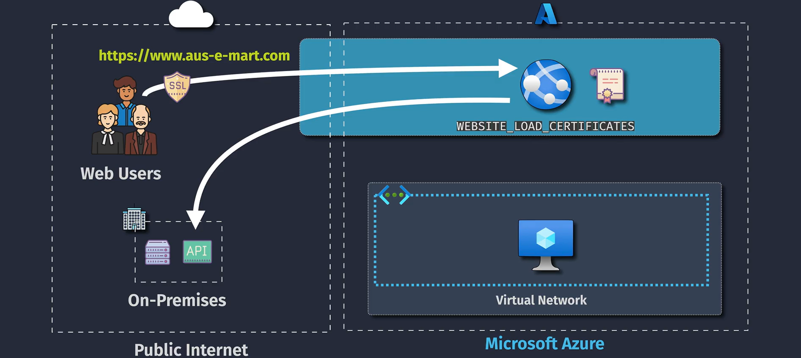
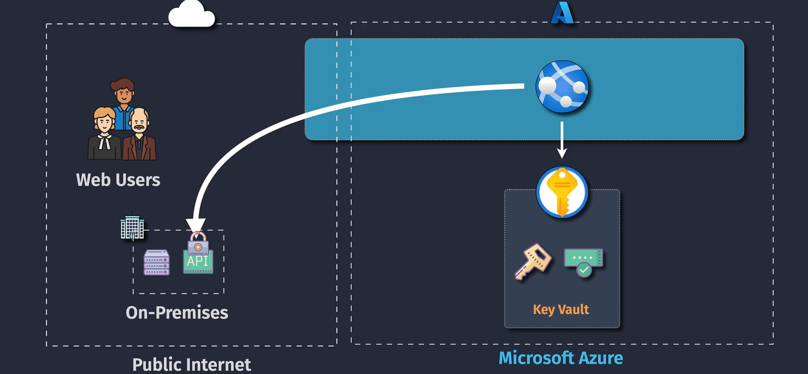

# 🛡 Azure App Service Security

Azure App Service provides **multi-layered protection** for your applications, data, and communications — covering **encryption**, **data security**, **network access control**, and **threat detection**.

---

## 1️⃣ **Encrypted Connections**

  

### 🔹 **What It Does**

- **HTTPS/TLS encryption** for all inbound requests.
- Data in transit is encrypted between the client and your app.
- TLS enforcement (e.g., only TLS 1.2 or TLS 1.3 allowed).
- Automatic redirect from HTTP → HTTPS.

### 🔹 **Data at Rest Encryption**

- App Service stores files, logs, and content on **Azure Storage**, which is encrypted with **AES-256** at rest.
- Microsoft-managed keys by default; customer-managed keys possible via **Azure Storage + Key Vault**.

📌 **AWS Parallel** → Similar to enforcing HTTPS in Elastic Beanstalk & S3 encryption.

---

## 2️⃣ **Secure Data Storage**

  

### 🔹 **Azure Key Vault Integration**

- Store and retrieve:

  - **Secrets** (e.g., API keys)
  - **Certificates**
  - **Encryption Keys**

- No hardcoding credentials in code — use **Managed Identity** for access.

### 🔹 **App Settings & Connection Strings**

- Stored encrypted in Azure.
- Access controlled at the platform level.
- Can be **slot-specific** for deployment slots.

📌 **Best Practice**

- Never store secrets in `appsettings.json` or environment variables in plain text.
- Use **Key Vault references** in App Service configuration.

📌 **AWS Parallel** → AWS Secrets Manager or SSM Parameter Store.

---

## 3️⃣ **Network Security**

  

### 🔹 **Access Restrictions**

- Define **allow/deny** rules for:

  - IP ranges (CIDR notation)
  - Azure Service Tags (e.g., AzureFrontDoor.Backend)
  - Virtual Network (VNet) subnets

- Evaluated in priority order.

### 🔹 **Private Endpoints**

- Assign your App Service a **private IP address** inside a VNet.
- Completely removes **public internet exposure**.
- Useful for internal apps or APIs.

### 🔹 **VNet Integration**

- Outbound calls from your app go into your VNet.
- Required for talking to private databases or services.

📌 **AWS Parallel** → Security Groups + AWS PrivateLink.

---

## 4️⃣ **Threat Protection**

### 🔹 **Azure DDoS Protection**

- Built-in basic DDoS mitigation for all public endpoints.
- Can integrate with **Azure DDoS Protection Standard** for enterprise-level mitigation.

### 🔹 **Azure Defender for App Service**

- Detects suspicious activity:

  - Unexpected file changes
  - Known malware patterns
  - Outbound spam or data exfiltration

- Integrates with **Microsoft Defender for Cloud** for alerts.

📌 **AWS Parallel** → AWS Shield + GuardDuty.

---

## 5️⃣ **Authentication & Authorization**

- **App Service Authentication / EasyAuth**:

  - Supports Microsoft Entra ID, Facebook, Google, GitHub, OpenID Connect.
  - No code changes required.

- Requests are **validated before** hitting your app code.
- JWT/OAuth 2.0 tokens enforced by the platform.

📌 **AWS Parallel** → AWS Cognito Hosted UI.

---

## 6️⃣ **Security Best Practices Checklist**

- ✅ Enable HTTPS-only mode
- ✅ Enforce TLS 1.2 or higher
- ✅ Use Private Endpoints for sensitive apps
- ✅ Restrict inbound traffic with Access Restrictions
- ✅ Store secrets in Azure Key Vault
- ✅ Enable Azure Defender for App Service
- ✅ Use Managed Identity instead of credentials
- ✅ Regularly update dependencies
