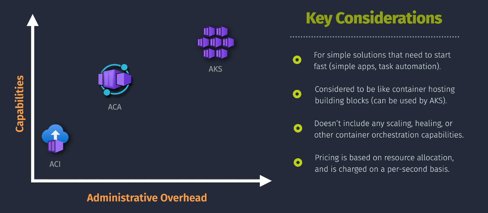
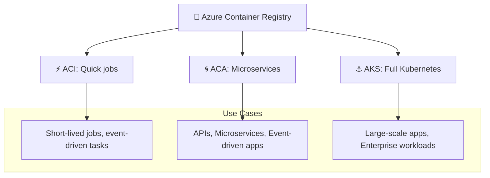

# 🐳 Azure Container Services — The Full Story

> 💭 Containers are package everything (code, runtime, dependencies) so you can run them anywhere, consistently.  
> But in Azure, you don’t just get _one_ way to run containers… you get multiple flavors, depending on how much control vs. simplicity you want.

Let’s break it down.

---

  

---

## 🏪 1. **Azure Container Registry (ACR)**

📌 **Definition:**

- A **private Docker registry** for storing and managing container images (like Docker Hub, but inside Azure).

📌 **Features:**

- Store images privately (secure, geo-replicated).
- Automate builds with ACR Tasks.
- Integrates with AKS, ACI, ACA seamlessly.

📌 **Example:**

- You build a .NET Core app → push it to ACR → deploy it to AKS nodes.

---

## ⚡ 2. **Azure Container Instances (ACI)**

📌 **Definition:**

- A **serverless container runtime** that lets you run containers directly, no VM, no cluster, no orchestration.

📌 **Features:**

- Fast spin-up (seconds).
- Pay-per-second billing.
- Great for short-lived tasks, batch jobs, event-driven workloads.

📌 **Example:**

- Run a container for image processing. A file lands in blob storage → trigger ACI → container runs, processes it, and exits.

---

## 🌀 3. **Azure Container Apps (ACA)**

📌 **Definition:**

- A **fully managed microservices platform** for containers, built on **Kubernetes and Dapr**, but without you managing Kubernetes.

📌 **Features:**

- Auto-scaling (incl. scale-to-zero).
- Built-in **Dapr** (service discovery, pub/sub, secrets, state).
- Ideal for **microservices, APIs, event-driven apps**.
- Supports revisions and traffic-splitting (blue/green).

📌 **Example:**

- Deploy a front-end container, API container, and worker container → Azure Container Apps scales them based on traffic/events automatically.

---

## ⚓ 4. **Azure Kubernetes Service (AKS)**

📌 **Definition:**

- A **fully managed Kubernetes orchestration platform** in Azure.
  - You control the Kubernetes cluster,
  - Azure manages the control plane.

📌 **Features:**

- Full Kubernetes (pods, services, ingress, Helm, etc.).
- Best for **large-scale, enterprise-grade apps**.
- Fine-grained control over networking, RBAC, secrets, and scaling.
- Integration with CI/CD pipelines.

📌 **Example:**

- Run a multinational e-commerce app with 50+ microservices that need advanced networking, custom scheduling, and multi-region scaling.

---

## 🕸️ Big Picture — Which Azure Container Service When?

---

## 🏆 Summary

- **ACR 🧊** → Store your images (like a fridge).
- **ACI ⚡** → Run one-off containers, no servers (like instant noodles).
- **ACA 🌀** → Build microservices without managing Kubernetes (like a food court).
- **AKS ⚓** → Enterprise-scale orchestration with full Kubernetes (like a restaurant kitchen).

👉 **Rule of thumb:**

- Start with **ACI** if you want _simple runs_.
- Use **ACA** for _modern microservices_.
- Choose **AKS** if you need _full Kubernetes power_.
- And keep **ACR** as your central image hub.
