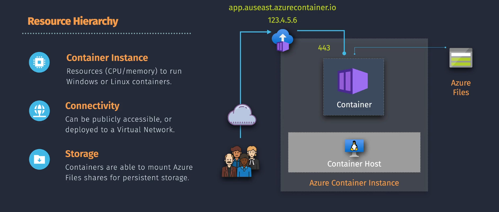

# Azure Container Instance

## What is Azure Container Instance (ACI)?

**Azure Container Instances (ACI)** is a serverless container service that allows you to run containers on-demand without managing the underlying infrastructure. It's ideal for scenarios where you need to quickly deploy containers without the overhead of managing virtual machines or orchestration platforms.

## Key Features

- **Fast Deployment:** Launch containers in seconds without provisioning VMs.
- **No Infrastructure Management:** Focus solely on your containers without worrying about the underlying servers.
- **Flexible Configuration:** Choose the number of CPUs, memory, and storage for each container.
- **Support for Linux and Windows Containers:** Run a wide range of applications.
- **Integration with Virtual Networks:** Securely connect containers to your existing Azure resources.

## Use Case

- **Simple Applications:** Deploy single-container applications without the need for orchestration.
- **Batch Jobs:** Run short-lived tasks and batch processing jobs.
- **Testing and Development:** Quickly spin up containers for testing purposes without infrastructure overhead.
- **Event-Driven Processing:** Handle events and triggers with containerized functions.

## Pricing and Plans

ACI charges based on the resources you allocate and the duration they run.

| **Resource**   | **Unit**                | **Approximate Cost**                   |
| -------------- | ----------------------- | -------------------------------------- |
| **CPU**        | Per vCPU per second     | **\$0.000016** per vCPU-second         |
| **Memory**     | Per GB per second       | **\$0.000004** per GB-second           |
| **Storage**    | Per GB per month        | **\$0.06** per GB-month (Standard HDD) |
| **Networking** | Per GB of outbound data | **\$0.087** per GB                     |

**Example:**

Running a container with 2 vCPUs and 4 GB memory for 24 hours:

- **CPU Cost:** 2 vCPUs × 24 × 3600 seconds × $0.000016 = **$2.7648\*\*
- **Memory Cost:** 4 GB × 24 × 3600 seconds × $0.000004 = **$1.3824\*\*
- **Total Cost:** Approximately **\$4.1472** (excluding storage and networking)

**Factors Affecting Cost:**

- **Resource Allocation:** Number of vCPUs and amount of memory allocated.
- **Runtime Duration:** Total time containers are running.
- **Data Transfer:** Amount of outbound data transferred.

**Note:** Prices are approximate and can vary based on the Azure region. For precise estimates, visit the [Azure Pricing Calculator](images/https://azure.microsoft.com/pricing/calculator/).

## Single Container Instance



- **Description:** Run individual containers independently, ideal for isolated tasks or simple applications.
- **Benefits:** Minimal setup, quick deployment, and cost-effective for short-lived containers.

**Example: Deploying a Simple Web Server:**

1. **Run a Docker Container:**

   ```bash
   az container create \
     --resource-group myResourceGroup \
     --name mycontainer \
     --image nginx \
     --cpu 1 \
     --memory 1.5 \
     --port 80 \
     --ip-address public
   ```

2. **Access the Web Server:**

   After deployment, retrieve the public IP address and navigate to it in your browser to see the Nginx welcome page.

## Group Container Instances


- **Description:** Run multiple containers together in a group, sharing resources and networking.
- **Benefits:** Enables multi-container applications, such as a web server and a database running side by side.

**Example: Deploying a Multi-Container Application:**

1. **Create a YAML Configuration File (`container-group.yaml`):**

   ```yaml
   apiVersion: 2018-10-01
   location: eastus
   name: mycontainergroup
   properties:
     containers:
       - name: webapp
         properties:
           image: nginx
           resources:
             requests:
               cpu: 1
               memoryInGB: 1.5
           ports:
             - port: 80
       - name: backend
         properties:
           image: busybox
           command: ["sh", "-c", "echo Hello from backend && sleep 3600"]
           resources:
             requests:
               cpu: 0.5
               memoryInGB: 1
     osType: Linux
     ipAddress:
       type: Public
       ports:
         - protocol: TCP
           port: 80
   ```

2. **Deploy the Container Group:**

   ```bash
   az container create --resource-group myResourceGroup --file container-group.yaml
   ```

3. **Access the Web Application:**

   Retrieve the public IP address and navigate to it in your browser to access the Nginx web server. The backend container runs alongside the web server, handling backend processes.
