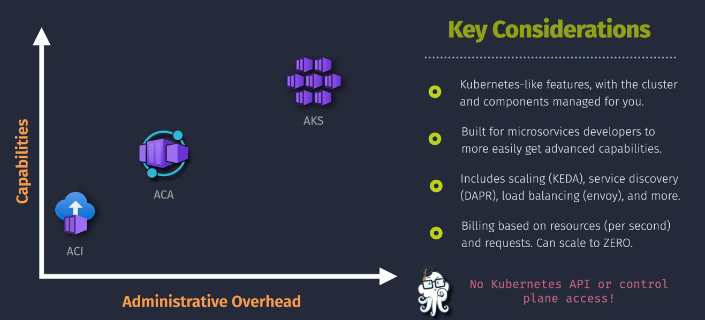
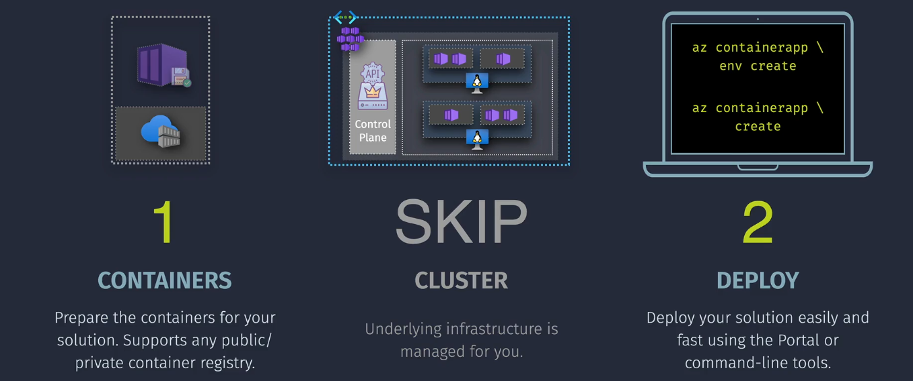

# Azure Container Apps





## What is Azure Container Apps (ACA)?

**Azure Container Apps (ACA)** is a serverless container service designed for running microservices and applications without managing the underlying infrastructure. It abstracts away the complexities of orchestrators like Kubernetes, allowing developers to focus on building scalable and event-driven applications.

## Key Features

- **Serverless Scaling:** Automatically scales your applications based on demand, including zero instances when idle.
- **Event-Driven Architecture:** Supports triggers from events such as HTTP requests, Azure Event Grid, and more.
- **Microservices Support:** Easily deploy and manage microservices architectures.
- **Integration with Dapr:** Leverage the Distributed Application Runtime (Dapr) for building resilient microservices.
- **Environment Management:** Organize your container apps into environments for better resource management and isolation.
- **Managed Infrastructure:** No need to manage servers or orchestrators, simplifying deployment and operations.

## Use Case

- **Microservices:** Deploy scalable microservices without managing infrastructure.
- **Event-Driven Applications:** Build applications that respond to events and triggers seamlessly.
- **Background Processing:** Run background tasks and workflows efficiently.
- **APIs and Webhooks:** Host APIs and webhooks with automatic scaling based on traffic.

## Pricing and Plans

ACA offers a serverless pricing model, charging based on the resources consumed during execution.

| **Resource**           | **Unit**                 | **Approximate Cost**            |
| ---------------------- | ------------------------ | ------------------------------- |
| **vCPU**               | Per vCPU-second          | **\$0.000013** per vCPU-second  |
| **Memory**             | Per GB-second            | **\$0.0000018** per GB-second   |
| **Environment**        | Per instance per hour    | **\$0.20** per environment-hour |
| **Ingress and Egress** | Per GB of data processed | **\$0.087** per GB              |

**Example:**

Running a container app with 1 vCPU and 2 GB memory for 1,000 seconds:

- **CPU Cost:** 1 vCPU × 1,000 seconds × $0.000013 = **$0.013\*\*
- **Memory Cost:** 2 GB × 1,000 seconds × $0.0000018 = **$0.0036\*\*
- **Total Cost:** Approximately **\$0.0166** (excluding environment and networking costs)

**Factors Affecting Cost:**

- **Resource Consumption:** Number of vCPUs and amount of memory used during execution.
- **Execution Time:** Duration of container execution.
- **Data Transfer:** Amount of data processed and transferred.

**Note:** Prices are approximate and can vary based on the Azure region. For precise estimates, visit the [Azure Pricing Calculator](images/https://azure.microsoft.com/pricing/calculator/).

## Examples

### Example 1: Deploying a Serverless Web Application with ACA

1. **Create an Environment:**

   ```bash
   az containerapp env create \
     --name myenvironment \
     --resource-group myResourceGroup \
     --location eastus
   ```

2. **Deploy a Container App:**

   ```bash
   az containerapp create \
     --name mywebapp \
     --resource-group myResourceGroup \
     --environment myenvironment \
     --image myacr.azurecr.io/myapp:v1 \
     --target-port 80 \
     --ingress 'external'
   ```

3. **Access the Web Application:**

   Retrieve the FQDN (Fully Qualified Domain Name) of the deployed container app.

   ```bash
   az containerapp show --name mywebapp --resource-group myResourceGroup --query properties.configuration.ingress.fqdn --output tsv
   ```

   Open the retrieved FQDN in your browser to access the web application.

### Example 2: Running an Event-Driven Function with ACA

1. **Create an Environment:**

   ```bash
   az containerapp env create \
     --name eventenv \
     --resource-group myResourceGroup \
     --location eastus
   ```

2. **Deploy a Container App Triggered by HTTP Requests:**

   ```bash
   az containerapp create \
     --name myeventapp \
     --resource-group myResourceGroup \
     --environment eventenv \
     --image myacr.azurecr.io/myeventapp:v1 \
     --target-port 8080 \
     --ingress 'external' \
     --min-replicas 0 \
     --max-replicas 10
   ```

3. **Trigger the Event:**

   Send an HTTP request to the app's FQDN to trigger the event-driven function.

   ```bash
   curl http://<YourAppFQDN>/trigger
   ```

4. **Scale Based on Demand:**

   ACA automatically scales the number of instances based on incoming requests.
