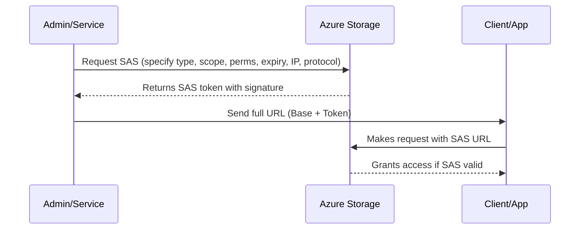

# 🔐 Azure Shared Access Signature (SAS) — Your Temporary Digital Pass

Think of **SAS** as a **concert backstage pass** — but for Azure Storage.
It’s **time-limited**, **permission-controlled**, and **revocable**.

Without SAS, you’d have to give someone your **Access Keys** (basically the keys to your storage kingdom 🏰), which is a big **NO** in security best practices.

---

## 🎯 **Layer 1 – The Purpose of SAS**

SAS defines:

1. **🎯 What you can access** — Scope of the resource (container, blob, file share, queue, or table).
2. **🛠 What you can do** — Read, Write, Delete, etc.
3. **⏳ For how long** — Start and expiry date/time.
4. **🌍 From where** — Restrict by IP and protocol (HTTPS recommended).

**Why it matters:**
This means you can give someone just enough access for just enough time — without giving them the master keys.

---

## 🧩 **Layer 2 – Types of SAS & Their Scope**

| 🚦 SAS Type             | 📦 Scope                                                                                     | 🔑 Signing Method                      | 💡 Best For                         |
| ----------------------- | -------------------------------------------------------------------------------------------- | -------------------------------------- | ----------------------------------- |
| **Service SAS**         | One **service** only (Blob, File, Queue, or Table) and its resources (container, blob, etc.) | Account Key **or** User Delegation Key | Fine-grained, single-service access |
| **Account SAS**         | Multiple **services** in the same storage account                                            | Account Key                            | Cross-service automation            |
| **User Delegation SAS** | Blob service only, scoped to **Azure AD identity**                                           | User Delegation Key from Azure AD      | Identity-based, secure scenarios    |

📌 **How they relate:**

- **Service SAS** → Precise access, one service.
- **Account SAS** → Multiple services, one signature.
- **User Delegation SAS** → Service SAS powered by Azure AD identity.

---

## 🏗 **Layer 3 – SAS Building Blocks**

Every SAS token (no matter the type) contains these components:

1. **📍 Resource scope** — Which container, blob, share, queue, or table.
2. **🔒 Permissions** — R (Read), W (Write), D (Delete), L (List), A (Add), U (Update), C (Create), P (Process).
3. **⏳ Validity window** — Start + expiry time.
4. **🔐 Protocol** — HTTPS only (recommended) or HTTPS+HTTP.
5. **🌐 IP restrictions** — Optional range limits.
6. **🖊 Signature** — Cryptographic proof it’s valid.

---

## ✍ **Layer 4 – Signing & Access Policies**

### **Signing Methods**

- **🔑 Account Key** — Directly signs the SAS with a **storage account key** (simple, but leaks are dangerous).
- **👤 User Delegation Key** — Issued by Azure AD for **Blob only**. Tied to identity and permissions.

---

### 📜 **Stored Access Policies**

Instead of defining expiry and permissions in each SAS manually:

- Create a **policy** once at the container/share/table/queue level.
- Reference the **policy name** in SAS tokens.
- Update/revoke the policy → **all linked SAS become updated instantly**.

---

<div align="center">

</div>

---

> 💡 **Pro Tip:** Great for revoking multiple SAS tokens at once without hunting them down.

---

## 🔍 **SAS Token Anatomy** – Dissecting the Beast

When you generate a SAS, you actually get **two parts**:

```ini
https://<account>.blob.core.windows.net/<resource-path>?<SAS-token>
```

- **Base URL** → Points to the actual Azure resource (container/blob/etc.).
- **Query String (SAS Token)** → The “magic pass” with all the rules encoded.

---

## 🧩 **SAS Query Parameters**

Here’s what you might see in a **Service SAS** for Blob:

```ini
?sv=2023-11-03&ss=b&srt=o&sp=rwdl&st=2025-08-13T07:00Z&se=2025-08-13T09:00Z&sip=192.168.1.0-192.168.1.255&spr=https&sig=<signature>
```

| Param             | Meaning                           | Example Value                                           | Applies To          |
| ----------------- | --------------------------------- | ------------------------------------------------------- | ------------------- |
| **sv**            | Storage Service Version           | `2023-11-03`                                            | All SAS types       |
| **ss**            | Service(s) allowed                | `b` (Blob), `f` (File), `q` (Queue), `t` (Table)        | Account SAS         |
| **srt**           | Resource Types                    | `o` (Object), `c` (Container), `s` (Service)            | Account SAS         |
| **sr**            | Resource                          | `b` (Blob), `c` (Container)                             | Service SAS         |
| **sp**            | Permissions                       | `r` (Read), `w` (Write), `d` (Delete), `l` (List), etc. | All SAS types       |
| **st**            | Start Time                        | `2025-08-13T07:00Z`                                     | All SAS types       |
| **se**            | Expiry Time                       | `2025-08-13T09:00Z`                                     | All SAS types       |
| **sip**           | Allowed IP Range                  | `192.168.1.0-192.168.1.255`                             | Optional            |
| **spr**           | Protocol                          | `https` or `https,http`                                 | Optional            |
| **skoid**         | Object ID (Azure AD user)         | GUID                                                    | User Delegation SAS |
| **sktid**         | Tenant ID (Azure AD tenant)       | GUID                                                    | User Delegation SAS |
| **skt** / **ske** | Start & Expiry for delegation key | ISO timestamp                                           | User Delegation SAS |
| **sig**           | Signature                         | Long Base64 hash                                        | All SAS types       |

---

## 🏗 **Relationship Between SAS Type & Parameters**

| SAS Type            | Unique Params                  | Why?                                               |
| ------------------- | ------------------------------ | -------------------------------------------------- |
| **Service SAS**     | `sr` only                      | You’re targeting a single resource.                |
| **Account SAS**     | `ss`, `srt`                    | Grants multiple services/resource types in one go. |
| **User Delegation** | `skoid`, `sktid`, `skt`, `ske` | Ties token to Azure AD-issued delegation key.      |

---

## 📜 **Stored Access Policy in URL**

When you use a **Stored Access Policy**, instead of `st` and `se` in the SAS, you may see:

```ini
?si=PolicyName
```

Where `si` = **Signed Identifier** (name of the policy).
The expiry and permissions are **looked up** in Azure instead of being embedded in the SAS.

---

## 🔄 **How SAS Gets Generated** (End-to-End)



---

## ✍🏻 **Example** – Breaking Down a SAS

**URL**:

```ini
https://myaccount.blob.core.windows.net/mycontainer/myfile.txt?sv=2023-11-03&sr=b&sp=rw&st=2025-08-13T07:00Z&se=2025-08-13T09:00Z&spr=https&sig=abcdef123456...
```

- `sv=2023-11-03` → API version.
- `sr=b` → Resource = Blob.
- `sp=rw` → Read + Write permissions.
- `st` / `se` → 2-hour validity window.
- `spr=https` → HTTPS only.
- `sig=...` → Signed with account key or user delegation key.

---

## 📚 **Example Scenarios**

1. **🎥 Temporary Media Upload Portal**

   - **Type:** Service SAS (Blob)
   - **Permission:** Write only
   - **Expiry:** 1 hour
   - **Use:** Client uploads directly, server never sees your keys.

2. **📦 Multi-Service Data Pipeline**

   - **Type:** Account SAS
   - **Permission:** Read + List
   - **Expiry:** 24 hours
   - **Use:** ETL job fetches from Blob & Queue in one go.

3. **🔐 Employee Access to Private Files**

   - **Type:** User Delegation SAS
   - **Permission:** Read
   - **Expiry:** Until end of shift
   - **Use:** Scoped to employee’s Azure AD identity.

---
