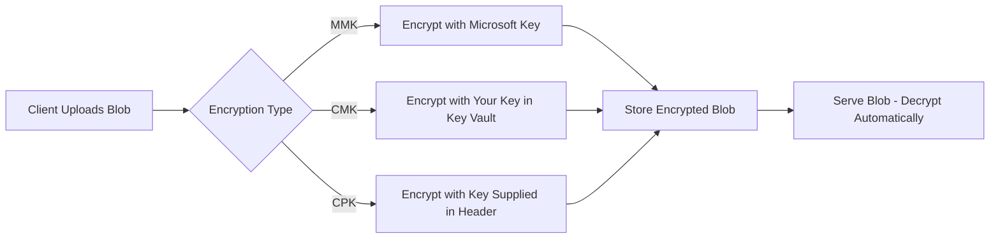
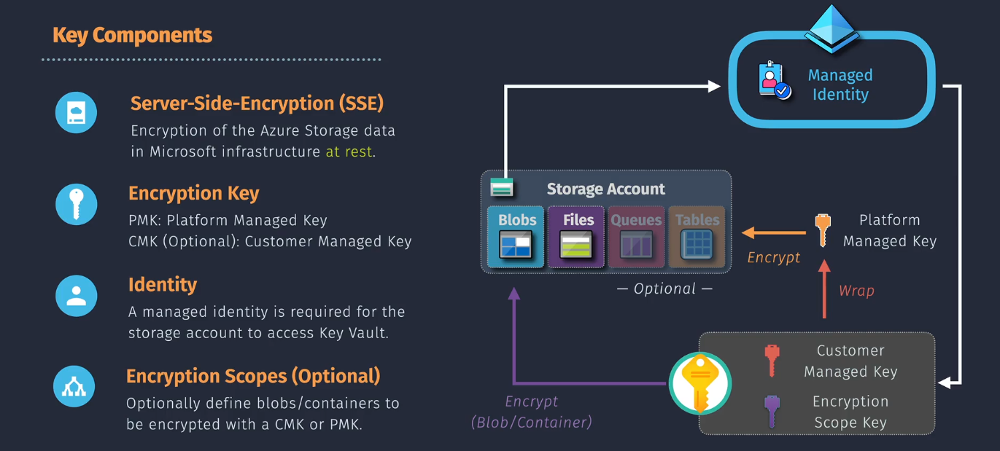

# 🔐 **Azure Storage Encryption**

## 📖 **What It Is**

> **Azure Storage Encryption** is Microsoft's way of making sure all your data in Azure Storage (Blob, File, Queue, Table) is **encrypted at rest** — meaning, before it’s written to the disk.
> Think of it like an automatic vault that locks your files **before** they leave your hands and unlocks them only when you access them.

---

<div align="center">
  
</div>

---

## 🎭 **Encryption Models**

### 🔹 **1. Server-Side Encryption (SSE)**

Azure encrypts the data **in the backend** as it writes to storage.

| **Mode**                                  | **Who Manages Keys**      | **Key Location**               | **Extra Notes**                         |
| ----------------------------------------- | ------------------------- | ------------------------------ | --------------------------------------- |
| **SSE with Microsoft-Managed Keys (MMK)** | Microsoft                 | Microsoft’s internal HSMs      | Default for all new accounts            |
| **SSE with Customer-Managed Keys (CMK)**  | You (via Azure Key Vault) | Your Key Vault                 | You can rotate, disable, or revoke keys |
| **SSE with Customer-Provided Keys (CPK)** | You provide per request   | Not stored in Azure            | Must supply key in request header       |
| **SSE with Double Encryption**            | Microsoft + You           | Microsoft HSM + Your Key Vault | Two independent encryption layers       |

💡 **Example:**

- **Default:** Upload a blob, Azure encrypts using MMK.
- **CMK:** You store the encryption key in your Key Vault, configure your Storage Account to use it, rotate it every 90 days.

---

### 🔹 **2. Client-Side Encryption**

You encrypt **before sending** the data to Azure — Azure just stores it as-is.
Here, **you control** encryption/decryption in your application.

💡 **Example:**
You use the Azure Storage Client Library with a local AES key to encrypt files before upload — Azure never sees unencrypted data.

---

## ⚙️ **How Encryption Keys Work**

Azure uses **envelope encryption**:

1. Data is encrypted with a **Data Encryption Key (DEK)** (symmetric key).
2. DEK is encrypted with a **Key Encryption Key (KEK)** (asymmetric key in HSM).
3. KEK can be **MMK** (Azure-managed) or **CMK** (your Key Vault).

---

## 🌆 **Encryption in Action**



---

## ✍🏻 **Real Examples**

### 📄 **Example 1 – Default Encryption**

```bash
# Create storage account with default Microsoft-managed encryption
az storage account create \
  --name mystorageaccount \
  --resource-group myrg \
  --location eastus
```

Result: **All data encrypted at rest using MMK**.

---

### 📄 **Example 2 – Customer-Managed Keys**

```bash
# Enable CMK
az storage account update \
  --name mystorageaccount \
  --resource-group myrg \
  --encryption-key-source Microsoft.Keyvault \
  --encryption-key-vault https://mykeyvault.vault.azure.net \
  --encryption-key-name mykey
```

Result: **Your Key Vault key controls encryption**. You can rotate or disable it anytime.

---

### 📄 **Example 3 – SSE with Customer-Provided Keys (CPK)**

Here, **you** (the customer) generate and manage your own encryption key, and pass it along **with each request** to Azure Storage.
Azure does **not** store this key — it uses it _only in-memory_ to encrypt/decrypt the specific blob during that operation.

This is **per request** encryption, not account-wide.

---

```python
from azure.storage.blob import BlobServiceClient, BlobClient
from azure.core.exceptions import ResourceExistsError
import os

# Azure Storage account connection string
connection_string = "<your-connection-string>"

# Your CPK key (must be 256-bit base64-encoded AES key)
from base64 import b64encode
from os import urandom

customer_key = urandom(32)  # 256-bit random key
customer_key_b64 = b64encode(customer_key).decode('utf-8')

# Create client
blob_service_client = BlobServiceClient.from_connection_string(connection_string)
blob_client = blob_service_client.get_blob_client(container="cpk-container", blob="secret.txt")

# Upload with customer-provided key
with open("secret.txt", "rb") as data:
    blob_client.upload_blob(
        data,
        overwrite=True,
        encryption_key=customer_key_b64,
        encryption_key_sha256=None,  # SDK can calculate automatically
        encryption_algorithm="AES256"
    )

print("Blob uploaded with customer-provided encryption key.")
```

✅ **Key points:**

- You are responsible for storing the encryption key securely (Azure can’t recover it if lost).
- You must supply the same key **for reads** as you did for writes.

---

### 📄 **Example 4 – Client-Side Encryption**

Here, **you encrypt data before sending it to Azure Storage**. Azure never sees plaintext — it only stores encrypted bytes.

You can use:

- Your own encryption library (AES, RSA, etc.)
- Azure’s **Client-Side Encryption SDK** (older .NET & Java SDKs support this natively; Python you handle manually or with Azure Key Vault for key management).

---

```python
from azure.storage.blob import BlobServiceClient
from cryptography.fernet import Fernet

# Generate symmetric key for encryption (store securely)
fernet_key = Fernet.generate_key()
cipher = Fernet(fernet_key)

# Encrypt local file before upload
with open("plaintext.txt", "rb") as f:
    encrypted_data = cipher.encrypt(f.read())

# Upload encrypted bytes
connection_string = "<your-connection-string>"
blob_client = BlobServiceClient.from_connection_string(connection_string)\
    .get_blob_client(container="client-side", blob="encrypted.bin")

blob_client.upload_blob(encrypted_data, overwrite=True)

print("Blob uploaded with client-side encryption.")
```

✅ **Key points:**

- Full control — you choose the encryption method & key storage.
- Azure can’t decrypt it without your key.
- Decryption must happen client-side before use.

---

## 🔎 **Encryption Scopes**

> An **Encryption Scope** is a named, logical container for encryption settings that you apply at the **container** or **blob** level, instead of using only account-wide encryption.

**You can:**

- Use Microsoft-managed keys.
- Use Customer-managed keys stored in Azure Key Vault.
- Apply **different encryption scopes to different containers** (or even individual blobs in the same container).

---

### 📄 **Example – Creating and Using an Encryption Scope**

1. **Create Encryption Scope in Azure Portal**

   - Go to **Storage Account → Encryption**
   - Add an Encryption Scope (choose Microsoft-managed or customer-managed in Key Vault).

2. **Apply Scope to a Container** (Portal or CLI)

   ```bash
   az storage container create \
       --account-name mystorage \
       --name secure-container \
       --default-encryption-scope "scope1" \
       --prevent-encryption-scope-override true
   ```

   This ensures **all blobs** in `secure-container` use `scope1`.

3. **Apply to a Single Blob** (SDK)

   ```python
   blob_client.upload_blob(
       b"My data",
       overwrite=True,
       encryption_scope="scope1"
   )
   ```

✅ **When to use**:

- Different datasets need different keys or compliance boundaries.
- Multi-tenant applications needing per-tenant encryption.

---

## ✅ **Best Practices**

- ✅ Use **CMK** for regulatory compliance (HIPAA, PCI DSS).
- ✅ Enable **Key Vault soft delete** to recover lost keys.
- ✅ Automate **key rotation**.
- ✅ For maximum protection, use **double encryption**.
- ✅ If using **CPK**, store keys securely — Azure doesn’t keep a backup.

---

## 🗝️ **Key Takeaways**

- **Always on**: Encryption at rest is enabled by default — no extra cost.
- **Choice of control**: You decide how much key control you want (MMK → CMK → CPK).
- **Compliance friendly**: Helps meet ISO, HIPAA, PCI DSS, FedRAMP, and more.
- **No performance hit**: Encryption/decryption is transparent.

## 🏁 **Summary**

<div align="center">
  
</div>
