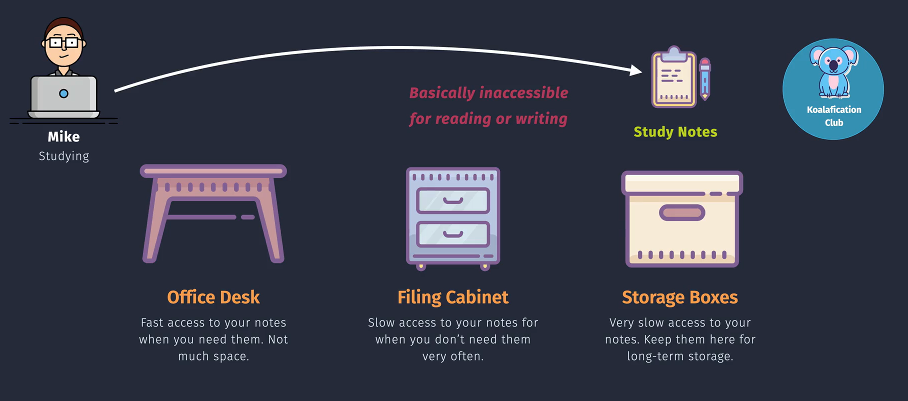
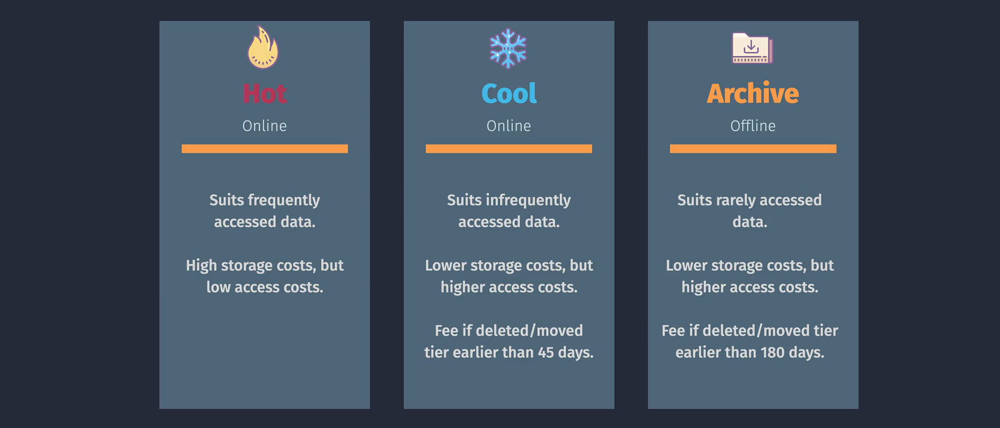
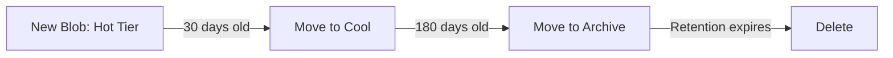
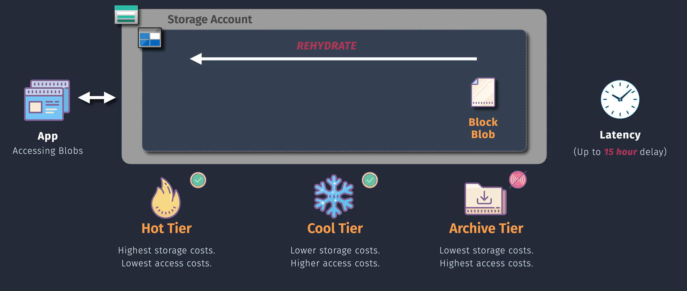

# 📦 **Azure Blob Storage Access Tiers**

📌 **Official Definition:**  
Azure Blob Storage **Access Tiers** let you store your blobs in different “temperature” levels — **Hot, Cool, and Archive** — based on how often you access them. This helps balance **cost** (storage vs. retrieval) with **performance**.

💡 **Human Translation:**  
Think of it like keeping snacks:

- 🍪 **Hot**: On the desk — grab anytime.
- 🥶 **Cool**: In the fridge — a bit slower to get.
- 🗄️ **Archive**: Sealed in the basement — cheap to keep, but you’ll work to get them out.

---

<div style="text-align:center;">

</div>

## 🪢 1. **Access Tier Types**

<div style="text-align:center;">

</div>

### 🔥 **Hot Tier**

- **For**: Frequently accessed data.
- **Storage cost**: Highest per GB.
- **Access cost**: Lowest (read/write is cheap).
- **Examples**:

  - Website images
  - Active business reports
  - App configuration files

---

### ❄️ **Cool Tier**

- **For**: Data accessed infrequently but still needs to be online.
- **Storage cost**: Lower than Hot.
- **Access cost**: Higher than Hot.
- **Minimum storage duration**: 30 days.
- **Examples**:

  - Seasonal sales data
  - Old but occasionally needed videos
  - Compliance documents under review

---

### 🗄️ **Archive Tier**

- **For**: Rarely accessed data, long-term retention.
- **Storage cost**: Cheapest.
- **Access cost**: Highest — data must be **rehydrated** before use (can take hours).
- **Minimum storage duration**: 180 days.
- **Examples**:

  - Legal archives
  - Historical backups
  - Old IoT telemetry

---

## 🔙 **Tier Switching (Lifecycle Management)**

You can **change the tier** of a blob at any time:

1. Manual via **Azure Portal, CLI, PowerShell, SDK**.
2. Automatic via **Lifecycle Management Policies**:

   - Move blobs from Hot → Cool → Archive as they age.
   - Delete after retention period.

---



---

### 📊 **Using Azure Portal**

1. **Navigate to Blob Storage:**

   - Go to the [Azure Portal](https://portal.azure.com/).
   - Select **"Storage Accounts"** and choose your storage account.
   - Navigate to **"Containers"** and select the desired container.

2. **Change Access Tier:**
   - Select the blob(s) you want to modify.
   - Click on **"Change tier"**.
   - Choose the desired tier (Hot, Cool, Archive).
   - Confirm the change.

### 🧑🏻‍💻 **Using Azure CLI**

```bash
# Change blob tier to Cool
az storage blob set-tier \
  --container-name <ContainerName> \
  --name <BlobName> \
  --tier Cool \
  --account-name <StorageAccount>

# Change blob tier to Archive
az storage blob set-tier \
  --container-name <ContainerName> \
  --name <BlobName> \
  --tier Archive \
  --account-name <StorageAccount>
```

**Example:**

```bash
az storage blob set-tier \
  --container-name mycontainer \
  --name myblob.txt \
  --tier Cool \
  --account-name mystorageaccount
```

---

## 🏁 **Cost & Performance Summary**

| Tier        | Storage Cost | Access Cost | Latency           | Min. Duration | Best For          |
| ----------- | ------------ | ----------- | ----------------- | ------------- | ----------------- |
| **Hot**     | 💰💰💰       | 💵          | Milliseconds      | None          | Active workloads  |
| **Cool**    | 💰💰         | 💵💵        | Milliseconds      | **30 days**   | Infrequent access |
| **Archive** | 💰           | 💵💵💵      | Hours (rehydrate) | **180 days**  | Long-term storage |

---

<div style="text-align:center;">

</div>

---

## 🧠 **Example Scenarios**

- **Hot Tier**: Your company’s web app stores **profile pictures** here so they load instantly for users.
- **Cool Tier**: Last quarter’s sales data — still occasionally queried by finance.
- **Archive Tier**: All invoices older than 7 years for audit compliance.

---

## 📒 **Pro Tips**

1. **Mix and match tiers** within the same storage account.
2. **Avoid tier flipping** too often — changing tiers incurs transaction costs.
3. Use **Blob Index tags** to help automate lifecycle transitions.
4. Only storage accounts that are configured for LRS, GRS, or RA-GRS support moving blobs to the archive tier. The archive tier isn't supported for ZRS, GZRS, or RA-GZRS accounts.
