# 🧬 **Connectivity & Access Control**

Azure Files is a **fully managed, cloud-native file service** that lets you mount **file shares** in the cloud, just like on-premises file servers. It supports **SMB, NFS, REST APIs**, and **hybrid sync**, while integrating tightly with **Microsoft Entra ID** for secure access control.

To use Azure Files effectively, you must understand:

- **Connectivity** → how clients connect.
- **Access control** → who can get in and what they can do.

---

## 🌐 **Connectivity Options**

Azure Files supports multiple ways to connect, making it flexible for both **cloud-first** and **hybrid** organizations.

  

---

### 1️⃣ SMB (Server Message Block)

- **Default protocol** for Azure Files.
- Supported by **Windows, Linux, macOS**.
- Versions:

  - **SMB 2.1** (legacy).
  - **SMB 3.0** (encryption + performance).

- **Port**: TCP **445**.
- **Use Cases**:

  - General-purpose file shares.
  - Lift-and-shift Windows workloads.
  - User home directories.

⚠️ **Important**: Some ISPs block **TCP 445**. If so → use **VPN, ExpressRoute, or Private Endpoints**.

---

### 2️⃣ NFS (Network File System)

- Targeted for **Linux/Unix workloads**.
- Versions:

  - **NFS v3** (basic).
  - **NFS v4.1** (POSIX ACLs, better performance).

- **Port**: TCP **2049**.
- **Restrictions**:

  - ❌ Not available over unrestricted public Internet.
  - ✅ Only supported with **Private/Restricted Endpoints**.

- **Use Cases**:

  - Linux workloads (databases, HPC).
  - Kubernetes persistent volumes.

---

### 3️⃣ REST API

- Access Azure Files over HTTPS/HTTP.
- **Ports**: 443 (HTTPS), 80 (HTTP).
- **Capabilities**:

  - Upload/download files programmatically.
  - Modify metadata, ACLs, and properties.

- **Use Cases**:

  - Application integration.
  - Automation scripts, DevOps pipelines.

---

## 📡 **Connectivity + Ports Table**

| Protocol     | Public Endpoint | Restricted Endpoint | Private Endpoint | Port(s)        |
| ------------ | --------------- | ------------------- | ---------------- | -------------- |
| **SMB**      | ✅              | ✅                  | ✅               | TCP **445**    |
| **NFS**      | ❌              | ✅                  | ✅               | TCP **2049**   |
| **REST API** | ✅              | ✅                  | ✅               | TCP **443/80** |

💡 Quick Memory Trick:

- **SMB → 445**, **NFS → 2049**, **REST → 443/80**.
- NFS is **private only**, SMB works on Internet (if 445 open).

---

## 🔑 **Authentication vs Authorization**

👉 Two often-confused but distinct concepts:

### 🟢 Authentication = "Who are you?"

- Verifies **identity** of the user/device.
- In Azure Files:

  - **Storage account key**
  - **SAS token**
  - **Microsoft Entra ID authentication** (Kerberos, AD DS, etc.)

### 🔵 Authorization = "What can you do?"

- Determines **permissions** after identity is confirmed.
- In Azure Files:

  - **RBAC roles** (portal-level access).
  - **NTFS-style ACLs** (file/folder permissions).

⚖️ **Example**:

- You authenticate with Entra ID as `Alice@company.com`.
- You are authorized to **read** from `\\storage\finance`, but **not write**.

---

## 🔐 Access Control Options with Microsoft Entra ID

Azure Files integrates with **Microsoft Entra ID** for identity-based access control.

### 1️⃣ Entra ID DS (On-Premises Domain Services)

  

- **Overview**:
  Authenticate Azure File Shares against **on-premises domain controllers**.

- **How It Works**:

  - User identities are managed in **on-prem Entra ID DS (classic AD DS)**.
  - Synced to **Microsoft Entra ID** using **Entra Connect**.
  - Authentication is routed back to **on-prem Entra ID DS**.

- **Use Cases**:

  - Hybrid enterprises with existing **legacy AD DS**.
  - Workloads needing **Kerberos/NTLM auth** from on-prem clients.

---

### 2️⃣ Microsoft Entra ID Domain Services (Managed AD DS in Azure)

    

- **Overview**:
  Managed domain controllers hosted inside Azure.

- **How It Works**:

  - Supports **cloud-only identities** in Entra ID.
  - Also works with **hybrid-synced identities**.
  - Provides **Kerberos/NTLM** authentication without deploying domain controllers manually.

- **Use Cases**:

  - Cloud-first organizations that don’t want to manage on-prem AD DS.
  - Scenarios requiring **domain-join capability in Azure VMs**.

---

### 3️⃣ Microsoft Entra ID Kerberos (Cloud-Native)

    

- **Overview**:
  Azure Files supports **direct authentication via Entra ID Kerberos** (no AD DS required).

- **How It Works**:

  - Devices must be **Entra ID-joined** or **Hybrid Entra ID-joined**.
  - Uses **Kerberos tickets** issued directly by Microsoft Entra ID.

- **Use Cases**:

  - Cloud-native environments (no legacy AD).
  - Hybrid orgs moving fully to Entra ID.
  - Scenarios requiring **SSO from Azure AD-joined devices**.

---

## 🎭 Role-Based Access Control (RBAC) in Azure Files

Access in Azure Files is a **two-layer system**:

### 1️⃣ Control Plane (Management via RBAC)

- Managed via Azure RBAC at **storage account** or **file share** scope.
- Roles:

  - **Storage File Data SMB Share Reader** → Read only.
  - **Storage File Data SMB Share Contributor** → Read + Write.
  - **Storage File Data SMB Share Elevated Contributor** → Full access, including setting ACLs.

### 2️⃣ Data Plane (File/Folder ACLs)

- NTFS-style **Access Control Lists (ACLs)** on files/folders.
- Enforced once user authenticated via Entra ID.
- Works similar to on-prem Windows File Servers.

⚠️ Both RBAC **and** ACLs must allow access for a user to succeed.

---

## ⚙️ Implementation Steps

1. **Create Storage Account** → GPv2 or Premium Files.
2. **Enable Protocol** → SMB or NFS.
3. **Configure Networking** → open ports (445 for SMB, 2049 for NFS, 443 for REST).
4. **Choose Identity Integration**:

   - Entra ID DS (on-prem).
   - Entra ID Domain Services.
   - Entra ID Kerberos.

5. **Assign RBAC Roles** (e.g., **Storage File Data SMB Share Contributor/Reader**).
6. **Mount File Share** from client (Windows/Linux).

---

    

---

## 🛡️ Best Practices

- **Prefer Entra ID authentication** over storage account keys.
- Use **RBAC + NTFS ACLs** for fine-grained control.
- Enable **Private Endpoints** → don’t expose over Internet.
- For hybrid, use **Azure File Sync**.
- Use **Azure Backup & Soft Delete** to protect against accidental deletion.
- Rotate **account keys** if you must use them (but avoid in production).
- Monitor **Azure Monitor logs** for access auditing.

---

## 📊 Decision Matrix

| Scenario                 | Recommended Protocol | Authentication Method        | Authorization Method |
| ------------------------ | -------------------- | ---------------------------- | -------------------- |
| Windows enterprise apps  | **SMB (445)**        | Entra ID DS / Entra Kerberos | RBAC + NTFS ACLs     |
| Linux workloads          | **NFS (2049)**       | POSIX UID/GID                | POSIX ACLs           |
| App integration          | **REST API (443)**   | SAS / Entra ID               | RBAC (storage roles) |
| Hybrid branch offices    | **File Sync (SMB)**  | Entra ID / Keys              | RBAC + ACLs          |
| Cloud-native org (no AD) | **SMB (445)**        | Entra ID Kerberos            | RBAC + NTFS ACLs     |

---

## 🌍 Visual Architecture

```mermaid
flowchart TD
    Client["👩‍💻 Client VM (Win/Linux/macOS)"] --> Conn[🌐 Connectivity Layer]
    Conn --> SMB["📁 SMB (445)"]
    Conn --> NFS["📁 NFS (2049)"]
    Conn --> REST["📁 REST API (443/80)"]

    SMB --> Auth[🔐 Authentication Layer]
    NFS --> Auth
    REST --> Auth

    Auth --> EntraID[🌐 Microsoft Entra ID]
    EntraID --> ADDS["🏢 Entra ID Domain Services (Cloud/On-Prem)"]
    EntraID --> Kerb[🎟️ Entra ID Kerberos Authentication]

    Auth --> RBAC["⚖️ Authorization (RBAC + ACLs)"]
```

---

## ✅ Final Recap

- **Connectivity**: SMB (445), NFS (2049), REST (443/80), File Sync.
- **Authentication**: Verify identity → Entra ID, keys, SAS.
- **Authorization**: Define permissions → RBAC + ACLs.
- **Identity Integration**:

  - Entra ID DS (on-prem).
  - Entra ID Domain Services (Azure).
  - Entra ID Kerberos (cloud-native).

- **Best Practices**: Use Entra ID + RBAC + Private Endpoints.

✨ Azure Files = **secure, enterprise-ready file service** combining **cloud flexibility** + **Entra ID identity control** + **protocol diversity**.
