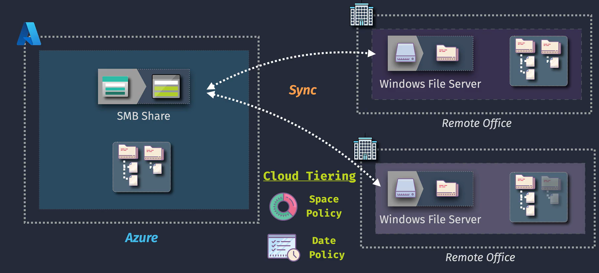

# 📁 **Azure File Sync** — Components, Architecture & Tiering

Azure File Sync allows you to **centralize file shares in Azure Files** while keeping the **flexibility, performance, and compatibility** of on-premises Windows Servers.

---

## 🏗️ **Core Components of Azure File Sync**

Azure File Sync is made up of **Azure resources** and **on-premises agents** that work together.

---

### 1️⃣ **Storage Account**

- The foundation service in Azure where your **Azure File Share** is hosted.
- Can use **Standard (HDD)** or **Premium (SSD)** tiers depending on performance needs.
- Supports **SMB, NFS, REST** access.

---

### 2️⃣ **Azure File Share**

- A file share created in the storage account (cloud-based "master copy").
- Can be mounted directly (SMB/NFS) or used with File Sync.
- This is the **authoritative source of truth** for your data.

---

### 3️⃣ **Storage Sync Service**

- An **Azure resource** that acts as the **control plane** for Azure File Sync.
- Manages relationships between file shares and registered servers.
- You can have multiple sync groups under one Storage Sync Service.

---

### 4️⃣ **Sync Group**

- A container that **ties one Azure File Share to one or more Windows Server folders** (server endpoints).
- Each sync group = **1 cloud endpoint (Azure file share)** + **N server endpoints (on-prem folders)**.
- Ensures bi-directional synchronization.

---

### 5️⃣ **Server Endpoint**

- A folder path on your **Windows Server** that you want to sync with Azure.
- Example: `D:\HRDocs` or `E:\SharedData`.
- Each server can have multiple endpoints.

---

### 6️⃣ **Azure File Sync Agent**

- Software installed on **Windows Server 2012R2+** (on-premises or in Azure VM).
- Handles **sync operations, change detection, cloud tiering, and authentication**.
- Registers the server with Azure Storage Sync Service.

---

---

## ⚙️ **How Azure File Sync Works**

1. **You create an Azure File Share** in the cloud.
2. **Install the AFS agent** on your on-premises or Azure Windows Server.
3. Register the server with the **Storage Sync Service** (resource in Azure).
4. Create a **Sync Group** → links one **cloud file share** with one or more **server endpoints**.
5. Files are **synchronized**:

   - Changes made **on-prem** replicate to Azure Files.
   - Changes made **in Azure Files** replicate down to servers.

---

## 🌀 **Cloud Tiering Explained**

Cloud tiering = **intelligent caching**.

- Instead of keeping **all files** on-premises, AFS stores:

  - **Hot files** locally (frequently accessed).
  - **Cold files** as **stubs** (small placeholder files).

When a user opens a stub:

- File is **recalled from Azure Files** automatically.
- File appears like it’s local, but actual data comes from the cloud.

---

---

### 📊 **Tiering Policies**

Cloud tiering is **configurable per server endpoint**:

- **Volume Free Space Policy**

  - Example: Keep **20% free space** → older/cold files get tiered to cloud first.

- **Date Policy**

  - Example: Tier files not accessed in **60 days**.

---

### 🗂️ **How Stubs Work**

- A stub contains:

  - File name.
  - Size.
  - Timestamps.
  - Security attributes (NTFS ACLs).

- Looks and feels like the real file → but data lives in Azure.
- Recall happens when:

  - File is opened by user/app.
  - Backup solution requests full file.

---

## ✅ **Key Benefits** of Cloud Tiering

- **Save on-premises disk space** → only cache hot data.
- **Unlimited growth** → share size is limited only by Azure Files (100 TiB per share).
- **Seamless experience** → users see all files, regardless of tiering.
- **Improved DR** → if a server fails, a new server can quickly resync stubs and recall files as needed.

---

## ⚠️ **Cloud Tiering Considerations**

- Requires **NTFS** (not ReFS).
- Stubs can break if **third-party tools** try to manipulate them (e.g., unsupported antivirus or backup).
- File recall consumes **bandwidth** → plan networking.
- Not suitable for apps requiring **low latency access** to all files (better to keep hot files pinned).

---

## 🏁 **Quick Recap**

- **Azure File Share** = central data store.
- **Storage Sync Service** = management layer.
- **Sync Group** = links cloud and servers.
- **Server Endpoint** = folder on local server.
- **AFS Agent** = engine that syncs and tiers files.
- **Cloud Tiering** = keeps hot files local, cold files in Azure.
