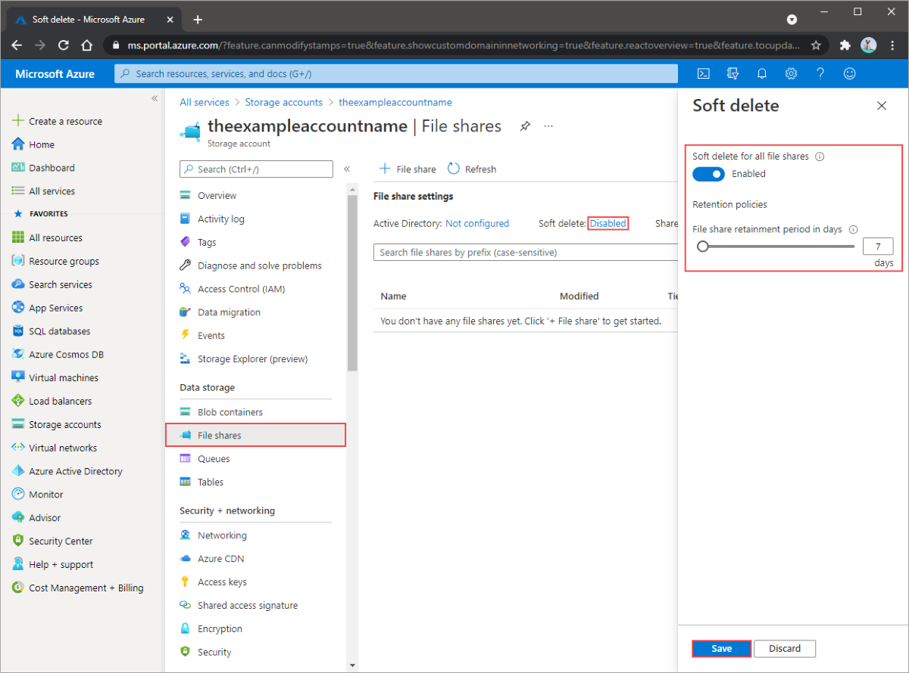

# Azure File Share Snapshot and Backups

## Soft Delete

Azure Files offers soft delete for file shares. Soft delete lets you recover deleted files and file shares.

### characteristics of soft delete for Azure Files.

- Soft delete for file shares is enabled at the file share level.

- Soft delete transitions content to a soft deleted state instead of being permanently erased.

- Soft delete lets you configure the retention period. The retention period is the amount of time that soft deleted file shares are stored and available for recovery.

- Soft delete provides a retention period between 1 and 365 days.

- Soft delete can be enabled on either new or existing file shares.
