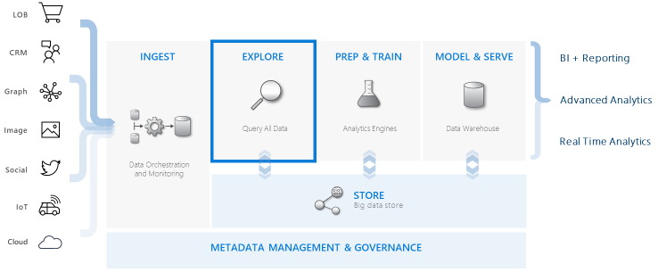

# 📊 **Azure Data Explorer (ADX)**

## 🌐 **What is ADX?**

**Azure Data Explorer (ADX)** is Microsoft’s **fast, fully managed, big data analytics platform**.
Think of it as the Formula 1 engine for querying **huge amounts of structured, semi-structured, and unstructured data** (telemetry, logs, IoT, time-series) at lightning speed.

- Built for **interactive queries** — response in seconds, not minutes.
- Scales to **billions of rows per second**.
- Uses **Kusto Query Language (KQL)** — a simple but powerful query language designed for exploration.

👉 Official definition:

> “Azure Data Explorer is a fully managed data analytics service for real-time analysis of large volumes of data streaming from applications, websites, IoT devices, and more.”

---

## 🏗️ **Core Architecture**

Here’s how ADX is structured:

<div align="center">
  
</div>

### 🔑 Components:

- **Cluster** → The main compute + storage unit.
- **Database** → Logical grouping of tables.
- **Tables** → Store data (rows = records, columns = fields).
- **Extents (Shards)** → Physical data chunks stored in compressed columnar format.
- **KQL Engine** → High-performance query processor.

---

## 📥 **Data Ingestion**

ADX is ingestion-optimized. You can pump data in **real time** or in **batch**.

### Supported Sources:

- Event Hubs / IoT Hub (real-time telemetry).
- Azure Blob / Data Lake (batch).
- Kafka / Logstash.
- APIs & SDKs (Python, .NET, Java, etc.).

### Steps:

1. **Connect a source** (e.g., Event Hub).
2. **Create a table** in ADX schema.
3. **Define ingestion mapping** (map JSON/CSV/Avro fields to table columns).
4. **Ingest data** automatically.

---

## 🔎 **Querying with KQL**

The **fun part** is KQL (Kusto Query Language). It’s **SQL-ish** but more powerful for analytics.

Example:

```kql
Events
| where Timestamp > ago(1h)
| where EventType == "Error"
| summarize Count = count() by AppName
| order by Count desc
```

- `ago(1h)` → built-in function for time filtering.
- `summarize` → grouping & aggregation.
- `order by` → ranking.

👉 Perfect for **log analysis**, **fraud detection**, **IoT telemetry exploration**, **time-series analysis**.

---

## 📊 **Integrations**

ADX doesn’t live alone. It connects with:

- **Power BI** (dashboards).
- **Azure Synapse** (data warehousing).
- **Azure Machine Learning** (predictive analytics).
- **Grafana** (monitoring dashboards).
- **Notebooks (Jupyter/Python)**.

---

## ⚡ **Performance Superpowers**

- **Columnar storage** → compressed, fast scans.
- **Distributed query engine** → runs queries across shards.
- **Cache layers** → hot data = instant queries.
- **Autoscaling clusters** → scale compute independently.

---

## 🔒 **Security**

- **Azure AD authentication**.
- **RBAC roles** (Admin, Viewer, Database Admin, Database Viewer).
- **Private Link, VNET injection** for network security.
- **CMK (Customer Managed Keys)** for encryption.

---

## 🪜 **Step-by-Step** — How to Use ADX

### 1. Create a Cluster

```bash
az kusto cluster create \
  --name myadxcluster \
  --resource-group myrg \
  --sku Standard_D13_v2
```

### 2. Create a Database

```bash
az kusto database create \
  --cluster-name myadxcluster \
  --name mydb \
  --resource-group myrg \
  --soft-delete-period P365D
```

### 3. Create a Table

```kql
.create table Events (Timestamp: datetime, EventType: string, AppName: string, Value: int)
```

### 4. Ingest Data

```kql
.ingest into table Events <|
datatable(Timestamp: datetime, EventType: string, AppName: string, Value: int)
[
    datetime(2025-08-31 12:00:00), "Error", "App1", 42,
    datetime(2025-08-31 12:05:00), "Info", "App2", 11
]
```

### 5. Query the Data

```kql
Events
| summarize avg(Value) by bin(Timestamp, 10m), AppName
```

---

## 👀 **ADX vs AWS Alternatives**

Here’s how ADX compares to AWS:

| Feature                             | **Azure Data Explorer (ADX)** | **AWS Alternative**                                  |
| ----------------------------------- | ----------------------------- | ---------------------------------------------------- |
| Interactive log/telemetry analytics | ✅                            | **Amazon Athena** (SQL on S3), **Amazon OpenSearch** |
| Time-series analytics               | ✅ (native)                   | **Timestream**                                       |
| High-speed ad-hoc queries           | ✅                            | **Redshift Spectrum** / **Athena**                   |
| Ingestion from IoT, Event Hubs      | Event Hub, IoT Hub            | **Kinesis**, **MSK**, **IoT Core**                   |
| Dashboard integration               | Power BI, Grafana             | QuickSight, Grafana                                  |
| Query language                      | KQL                           | SQL (Athena/Redshift), DSL (OpenSearch)              |

💡 **Closest AWS combo:**

- For log/telemetry: **Amazon OpenSearch + Kinesis**.
- For time-series: **Amazon Timestream**.
- For general queries: **Athena/Redshift Spectrum**.

But AWS doesn’t have **one single service** that equals ADX — you’d often need a mix.

---

## 🎯 **When to Use ADX**

- IoT telemetry pipelines (factories, wearables, cars).
- Application log analytics (massive logging platforms).
- Security/fraud analysis (detect anomalies fast).
- Real-time monitoring dashboards.
- Ad-hoc investigative queries.

---

## ✅ **Summary**

Azure Data Explorer (ADX) is:

- A **real-time big data analytics engine** for logs, telemetry, IoT, and time-series.
- Optimized for **fast ingestion + fast query**.
- Powered by **KQL** (super friendly + powerful).
- Best integrated with **Power BI, Synapse, ML**.
- The **AWS closest equivalents** = OpenSearch + Athena + Timestream, but ADX is more **unified and purpose-built**.
